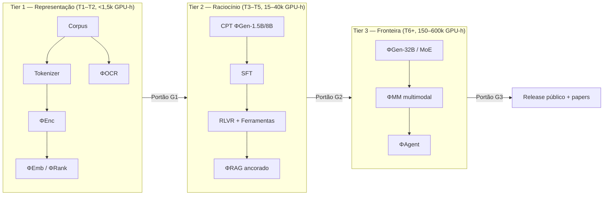

# DOC-00 — Carta do Projeto, Posicionamento Científico e Roteiro de Documentos

**Codinome do projeto:** ΦFM — *Phi Foundation Models* (família de foundation models para Física)
**Status:** `RASCUNHO v0.2` — decisões do Stage-Gate 0 resolvidas em 2026-08-03
**Autor:** Arquiteto-Chefe
**Data:** 2026-08-03
**Substitui:** v0.1
**Pré-requisito para:** todos os demais documentos do programa

> **Nota sobre convenções.** O texto é em português. Permanecem em inglês, por serem termos consagrados na literatura: *tokenizer, pretraining, fine-tuning, embedding, checkpoint, benchmark, pipeline, scaling law*. Identificadores de código, nomes de campos de schema e chaves de configuração são sempre em inglês.

---

## 1. Sumário executivo

Este programa projeta, a partir de primeiros princípios, uma **família de foundation models especializada exclusivamente em Física e na matemática aplicada que a sustenta**, junto com toda a infraestrutura de pesquisa necessária para construí-la, avaliá-la, servi-la e melhorá-la continuamente.

A tese central desta carta é estratégica, e precisa ser resolvida antes de qualquer engenharia:

> **Física é um domínio pobre em dados pelos padrões de LLMs de fronteira.** Toda a literatura de Física de alta qualidade legalmente adquirível está na ordem de **10¹⁰–10¹¹ tokens**, enquanto um modelo de fronteira é treinado com **10¹³–10¹⁴ tokens**. Portanto, *"treinar um LLM de Física do zero"* é, para todos os orçamentos exceto os maiores, **o padrão errado**. O padrão correto é uma **escada em três degraus**: treinar do zero apenas onde os dados sustentam isso (encoders/retrievers), e usar **continual pretraining + RL com recompensa verificável + aumento por ferramentas** onde não sustentam.

Isso não é um compromisso para economizar. É o que a literatura de fato mostra: todo modelo científico aberto de ponta dos últimos quatro anos — Minerva, Llemma, DeepSeekMath, Qwen-Math — foi produzido por *continual pretraining de uma base geral forte*, enquanto a única tentativa em larga escala de treinar um foundation model científico do zero, o **Galactica**, foi retirada do ar três dias após o lançamento. A Seção 4 desenvolve o argumento quantitativamente.

Uma segunda tese molda o roteiro:

> **"Superar SciBERT/INDUS" e "construir o melhor modelo de Física já feito" são dois projetos distintos, com orçamentos computacionais separados por três ordens de grandeza.** Ambos valem a pena, e devem ser *sequenciados* — não confundidos. O Tier 1 (encoders/retrievers) é atingível com **menos de 1.000 GPU-horas** e produz uma publicação defensável em um trimestre. O Tier 3 (raciocínio físico de fronteira) exige **10⁵–10⁶ GPU-horas**. A Seção 5 torna a escada explícita, com portões falseáveis.

---

## 2. Definição do problema: por que LLMs gerais falham em Física

LLMs de propósito geral falham em Física de maneiras *estruturalmente distintas* de como falham, digamos, em perguntas factuais. Nomear esses modos de falha com precisão é o que permite projetar intervenções, benchmarks e recompensas direcionadas.

| # | Modo de falha | Descrição | Por que acontece | Onde intervimos |
|---|---|---|---|---|
| F1 | **Deriva simbólica** | A derivação é plausível localmente em cada passo, mas globalmente errada; um sinal, um fator 2 ou um índice se inverte silenciosamente no meio do caminho. | O objetivo de próximo token premia plausibilidade *local*, não consistência algébrica *global*. Não há sinal de verificação. | RLVR com verificadores CAS (DOC-09), recompensas de processo passo a passo (DOC-10). |
| F2 | **Incoerência dimensional** | Produz equações cujas unidades não fecham. | Unidades não são representadas; `[L T⁻²]` não é uma feature do fluxo de tokens. | Tarefa de análise dimensional no pretraining + recompensa dura (DOC-06, DOC-09); benchmark `DimCheck` (DOC-11). |
| F3 | **Cegueira a casos-limite** | A resposta não reduz corretamente quando `v/c → 0`, `ℏ → 0`, `T → 0`, `r → ∞`. | Físicos verificam tomando limites; modelos nunca aprendem esse comportamento porque ele raramente é escrito. | Traços sintéticos de *verificação por limite* (DOC-06); `LimitBench` (DOC-11). |
| F4 | **Fragilidade numérica** | Erros de aritmética e conversão de unidades, sobretudo com expoentes e constantes físicas. | O tokenizer fragmenta números de forma inconsistente; não há calculadora. | Tokenização dígito-consciente (DOC-05); chamadas de ferramenta obrigatórias (DOC-14). |
| F5 | **Colapso de notação** | Confunde `∇×`, `∇·`, `∂_μ`, índices covariantes vs. contravariantes, bra-ket vs. função de onda. | A marcação LaTeX é destruída por BPE genérico; a estrutura de índices não tem viés indutivo. | Tokenizer consciente de Física + canonicalização LaTeX (DOC-03, DOC-05). |
| F6 | **Alucinação de citações** | Inventa referências, DOIs e resultados plausíveis. Foi o defeito fatal do Galactica. | A geração não é restringida por nenhuma verdade recuperada. | Geração ancorada em recuperação com atribuição em nível de span (DOC-13); precisão de citação como métrica *de portão* (DOC-11). |
| F7 | **Alucinação de convenção** | Mistura silenciosamente convenções de sinal (assinatura métrica `(+,−,−,−)` vs. `(−,+,+,+)`), eletromagnetismo gaussiano vs. SI, `ℏ = 1` vs. explícito. | Fontes diferentes usam convenções diferentes; o modelo tira a média. | Tagueamento de convenção no schema de documento (DOC-01 §6); SFT condicionado à convenção (DOC-09). |
| F8 | **Analfabetismo gráfico** | Não sabe ler um gráfico log-log, extrair uma inclinação ou interpretar barras de erro. | Treino apenas textual; figuras descartadas na ingestão. | Torre de visão + corpus de digitalização de gráficos (DOC-07, DOC-06). |
| F9 | **Ingenuidade experimental** | Não modela propagação de incertezas, erro sistemático vs. estatístico, ou resposta de detector. | A literatura reporta *resultados*, raramente o *raciocínio sobre erro*. | Dataset e benchmark dedicados a Física experimental (DOC-06, DOC-11). |
| F10 | **Extrapolação confiante** | Responde com confiança fora do regime de validade da teoria invocada. | Não há representação do domínio de aplicabilidade de uma teoria. | Treino de calibração + recompensa por abstenção (DOC-09); métricas de predição seletiva (DOC-12). |

**Consequência de projeto.** F1–F3, F7 e F10 **não** são corrigíveis adicionando mais texto de Física. Exigem (i) um **verificador** dentro do laço de treino, e (ii) dados **explicitamente construídos** que demonstrem o comportamento de checagem. É por isso que o plano de dados (DOC-06) aloca orçamento substancial a traços sintéticos *verificados*, e por isso que o plano de RL (DOC-09) se apoia em **RLVR** e não em RLHF puramente por preferência.

---

## 3. Estado da arte e cenário competitivo

Um projeto que não se situa contra o estado da arte não é um programa de pesquisa. Abaixo, o cenário que precisamos superar, organizado por tier.

### 3.1 Encoders científicos (a competição do Tier 1)

| Modelo | Params | Dados de treino | Realidade do domínio | Desempenho público em Física |
|---|---|---|---|---|
| **SciBERT** (Beltagy et al., EMNLP 2019) | 110M | 1,14M papers do Semantic Scholar | **82% biomédico, 18% CS** — praticamente *zero Física* | Fraco em Física; usado como baseline apenas por convenção |
| **SPECTER / SPECTER2** (Cohan et al., ACL 2020) | 110M | Triplas do grafo de citações | Multi-domínio, enviesado a biomédico | Baseline forte para recuperação em nível de documento |
| **INDUS** (NASA/IBM, arXiv:2405.10725, 2024) | 110M–368M + destilados | ~66B tokens; Ciências da Terra/espaciais/helio/planetárias/astro | Astro e Ciências da Terra; **não Física nuclear** (sem foco em hep, cond-mat, quant-ph) | Estado da arte nos seus próprios domínios |
| **PhysBERT** (Hellert et al., arXiv:2408.09574, 2024) | 110M | ~1,2M papers de Física do arXiv | **Competidor direto** — primeiro modelo de embedding específico de Física | É o número a bater em recuperação de Física |
| **E5 / BGE / GTE / Qwen3-Embedding** | 0,1–8B | Massivo geral + supervisão fraca | Geral | Surpreendentemente fortes em zero-shot; baseline **sério** que papers de domínio costumam omitir |

> **Avaliação honesta.** SciBERT é um baseline fraco para Física — ele mal viu Física. Superá-lo não é um resultado científico. As barras **reais** são o **PhysBERT** (mesmo domínio) e os **embedders gerais modernos** (ex.: Qwen3-Embedding-8B, BGE-M3), contra os quais muitos papers de domínio convenientemente deixam de comparar. Nossa alegação de Tier 1 só será crível se superarmos **os dois**.

### 3.2 Modelos generativos científicos/matemáticos (competição de Tier 2 e 3)

| Modelo | Receita | Escala | Resultado / lição |
|---|---|---|---|
| **Galactica** (Taylor et al., 2022) | **Do zero**, 106B tokens de ciência curada | 125M–120B | Retirado em 3 dias. Fluente, mas alucinava citações e ciência confiantemente errada. **Lição: pretraining científico do zero em escala de fronteira é faminto de dados e sem ancoragem.** |
| **Minerva** (Lewkowycz et al., NeurIPS 2022) | Base PaLM + **continual pretraining** com 38,5B tokens (LaTeX do arXiv + web matemática) | 8B / 62B / 540B | MATH 50,3% (maj@k, 540B). **Lição: a receita de CPT funciona; preservar LaTeX na ingestão é decisivo.** |
| **Llemma** (Azerbayev et al., ICLR 2024) | Code Llama + CPT no Proof-Pile-2 (55B tokens) | 7B / 34B | Estado da arte aberto em matemática no lançamento. **Lição: uma base de *código* é ponto de partida melhor que uma base de texto para raciocínio formal.** |
| **DeepSeekMath** (Shao et al., 2024) | DeepSeek-Coder-Base + 120B tokens matemáticos + **GRPO** | 7B | 51,7% em MATH — empatou com modelos muito maiores. **Lição: mineração agressiva de matemática em escala web + RL supera contagem de parâmetros.** |
| **Qwen2.5-Math / Qwen3** | CPT + auto-melhoria + tool-integrated reasoning | 1,5B–72B | Baselines abertos fortes. **Lição: raciocínio integrado a ferramentas (TIR) vale vários pontos de acurácia.** |
| **AstroLLaMA / AstroLLaMA-Chat** (2023–24) | LLaMA + CPT em astro-ph | 7B | Ganhos modestos; **lição cautelar:** CPT de pequena escala apenas sobre abstracts entrega pouco. |
| **DeepSeek-R1 / série o** | **RL em larga escala com recompensa verificável** | — | **Lição: RLVR é a técnica de pós-treino de maior alavancagem para raciocínio STEM.** É a nossa alavanca principal. |

### 3.3 Compreensão de documentos (apoio ao Tier 1)

**Nougat** (Blecher et al., 2023) — OCR de PDF acadêmico para markdown+LaTeX. É o estado da arte que precisamos igualar ou superar para os ~40% do corpus disponíveis apenas em PDF. Ver DOC-03.

### 3.4 Benchmarks de Física existentes (o que reaproveitar; onde estão as lacunas)

**Reaproveitáveis:** MMLU (subconjuntos de Física), GPQA-Diamond (Física), SciBench, OlympiadBench (Física, multimodal), JEEBench, TheoremQA, PHYBench, UGPhysics, PhysReason, HLE (fatia de Física).

**Lacunas que nenhum benchmark público cobre** — definem nossa contribuição em benchmarks (DOC-11):

1. **Verificação de derivação** — dada uma derivação de múltiplos passos, encontrar o primeiro passo incorreto. (Testa F1.)
2. **Consistência dimensional** — esta equação é dimensionalmente coerente? (Testa F2.)
3. **Redução em caso-limite** — o resultado reduz corretamente no limite indicado? (Testa F3.)
4. **Robustez a convenção** — mesma Física, assinatura métrica / sistema de unidades diferente. (Testa F7.)
5. **Interpretação de gráficos** — extrair inclinações, expoentes e barras de erro de figuras publicadas reais. (Testa F8.)
6. **Raciocínio experimental** — propagação de incerteza, sistemáticos, efeitos de detector. (Testa F9.)
7. **Recuperação ancorada na literatura** — responder com citações *verificáveis*; DOI alucinado conta como falha. (Testa F6.)
8. **Estimativa de Fermi** — raciocínio de ordem de grandeza com hipóteses explícitas.
9. **Correção por equivalência simbólica** — corrigir respostas por equivalência em CAS, não por casamento de string. *(É uma contribuição metodológica por si só: correção por string subestima sistematicamente a acurácia em Física.)*

---

## 4. A restrição central: o muro de tokens da Física

Esta seção é o coração quantitativo da carta.

### 4.1 Quanto texto de Física existe?

| Classe de fonte | Volume estimado | Tokens estimados | Confiança |
|---|---|---|---|
| Texto completo do arXiv, família Física (fonte LaTeX) | ~1,2M papers | **15–25 B** | Alta (verificável via OAI-PMH; ver DOC-02) |
| Teses de doutorado em Física (repositórios abertos) | ~200–400 mil | **8–16 B** | Média |
| Journals de acesso aberto + fatia de Física do PMC/DOAJ | ~200 mil artigos | **2–4 B** | Média |
| Notas de aula, OCW, livros abertos (licença CC) | — | **1–3 B** | Média |
| Clássicos em domínio público (pré-1931) | ~5–10 mil volumes | **1–2 B** | Alta |
| Relatórios técnicos de agências e laboratórios (NASA NTRS, CERN, DESY, LANL, NIST) | ~1M documentos | **5–15 B** | Média |
| Código científico e notebooks relevantes a Física | — | **5–20 B** | Média |
| Web de Física filtrada (StackExchange, fóruns, sites de disciplinas) | — | **10–30 B** | Baixa–Média |
| **Total, antes de deduplicação** | | **~50–110 B** | |
| **Após dedup, filtragem e triagem de licença** | | **~30–60 B** | |

> **Atualização medida (DOC-02, DOC-04).** A tabela acima é a estimativa de escopo amplo, incluindo fontes pagas e licenciadas. Restringindo ao que é **efetivamente adquirível a custo zero** e modelando o funil de filtragem estágio a estágio, o número real é **39–73 B brutos → 15–30 B de treino** ([DOC-04 §7](../01-data/DOC-04-filtragem-dedup-descontaminacao.md#7-o-funil-com-números)). Isso **fortalece** o argumento desta seção: a escassez em relação ao ótimo de Chinchilla passa de 3–5× para 5–10×, e a decisão **D-01** fica ainda mais firmemente sustentada.

### 4.2 O que as scaling laws exigem

Usando a relação de compute-ótimo de Chinchilla (Hoffmann et al., 2022), `D* ≈ 20N`, e `C ≈ 6ND`:

| Tamanho N | D ótimo (Chinchilla) | FLOPs | H100-horas @ 45% MFU | Custo estimado em nuvem @ US$ 2,50/h |
|---|---|---|---|---|
| 150 M (encoder) | 3 B | 2,7e18 | ~2 | < US$ 10 |
| 1,5 B | 30 B | 2,7e20 | ~190 | ~US$ 500 |
| 8 B | 160 B | 7,7e21 | **~5.300** | **~US$ 13 mil** |
| 32 B | 640 B | 1,2e23 | **~85.000** | **~US$ 215 mil** |
| 70 B | 1,4 T | 5,9e23 | ~410.000 | ~US$ 1,0 milhão |

*(Assume H100 SXM bf16 denso ≈ 990 TFLOP/s de pico, 45% de MFU → ≈ 445 TFLOP/s efetivos. Não inclui preparação de dados, runs perdidos e avaliação — orçar um **multiplicador de 1,6×** para isso; ver DOC-17.)*

### 4.3 A colisão

Compare §4.1 com §4.2:

- Um modelo **8B** do zero precisa de **160B tokens**. Temos ~30–60B. → **Falta um fator de 3 a 5×.**
- Um modelo **32B** precisa de **640B tokens**. → **Falta mais de 10×.**

Três saídas, com trade-offs honestos:

| Opção | Mecanismo | Evidência | Veredito |
|---|---|---|---|
| **A. Repetir os dados** | Treino multi-época | Muennighoff et al. (2023) mostram que até ~4 épocas é quase tão bom quanto dado novo; retorno colapsa além de ~16 | **Parcialmente viável.** 4 épocas × 40B = 160B efetivos → sustenta um modelo 8B, *não* um 32B. |
| **B. Continual pretraining (CPT)** | Partir de uma base geral forte; gastar nossos 30–60B tokens de Física como orçamento de *especialização* | Minerva, Llemma, DeepSeekMath, Qwen-Math — toda a linhagem bem-sucedida | **Estratégia primária.** Preserva capacidade geral de raciocínio, linguagem e código que não teríamos como reaprender. |
| **C. Dados sintéticos** | Problemas gerados por CAS, derivações verificadas, dados ancorados em simulação, reescrita em estilo de livro-texto | DeepSeekMath, série Phi, literatura de RLVR | **Multiplicador forte**, mas com risco de colapso de distribuição se dominar. Limitar a uma fração fixa; ver DOC-06. |

**Decisão D-01 (vinculante para todo o programa):**
> O tier generativo (**ΦGen**) será construído por **continual pretraining de um modelo base aberto e forte**, não do zero. Pretraining do zero é autorizado **apenas** para o tier de encoders/retrievers (**ΦEnc**), onde 30–60B tokens são um *excedente*, não uma escassez, e onde a liberdade arquitetural (tokenizer consciente de Física, contexto longo, objetivo casado ao domínio) produz uma contribuição científica defensável.

**Consequência.** Um run generativo do zero só se justifica no **Tier 3**, se e quando o corpus ultrapassar ~250B tokens (alcançável apenas com conteúdo licenciado de editoras somado a geração sintética verificada em larga escala) *e* o orçamento computacional ultrapassar ~10⁵ GPU-horas. Isso é uma decisão *sob portão*, revisitada no Stage-Gate 4, não uma premissa fundadora.

> **Dissenso registrado.** O contra-argumento mais forte a D-01: um modelo do zero, com tokenizer nativo de Física e arquitetura nativa de Física, poderia adquirir vieses indutivos que nenhum modelo por CPT consegue. É uma questão científica legítima. Nós a atacamos *no tier de encoders*, onde podemos pagar para respondê-la, e tratamos o resultado como evidência para a decisão do Stage-Gate 4. Ver DOC-05 §7 e DOC-07 §3.

---

## 5. Escada estratégica e critérios de sucesso falseáveis

O programa é estruturado em três tiers, cada um com um portão **falseável**. Um tier não começa antes do portão anterior ser vencido. Metas vagas ("estado da arte em Física") são explicitamente rejeitadas como portão.

### Tier 1 — Representação (Trimestres 1–2)

**Entregas:** ΦEnc (encoder de Física), ΦEmb (modelo de embedding), ΦRank (reranker), ΦOCR (documento→LaTeX), o corpus, o tokenizer e o PhysBench-Retrieval.

**Portão G1 — todos devem valer:**

| Critério | Limiar | Justificativa |
|---|---|---|
| G1.1 | ΦEmb supera o **PhysBERT** em ≥ 5 pontos de nDCG@10 em benchmark de recuperação de Física reservado | Competidor de mesmo domínio |
| G1.2 | ΦEmb supera o melhor embedder **geral** (ex.: Qwen3-Embedding-8B) com ≤ 1/10 dos parâmetros | A comparação que papers de domínio costumam pular |
| G1.3 | ΦEnc supera SciBERT e INDUS em ≥ 4 de 5 tarefas de classificação/NER em Física | Alegação padrão de encoder de domínio |
| G1.4 | ΦOCR ≥ 0,92 em recuperação de equações (métrica por distância de edição) em PDFs de Física reservados | O corpus inteiro depende disso |
| G1.5 | Construção completa do corpus reprodutível ponta a ponta a partir de um único hash de manifesto | Reprodutibilidade inegociável |

**Envelope de custo:** **US$ 35–120** de GPU alugada por hora, mais um disco externo. Ver [DOC-17A §8](../05-governance/DOC-17A-orcamento-gpu-runpod.md#8-escada-de-orçamento-mínimo) — o corpus é processado localmente e o ΦOCR é adiado, porque o arXiv fornece fonte LaTeX. **Este tier é praticamente gratuito e é de onde sai a primeira publicação.**

> **Degrau T0, anterior ao G1.** O corpus e o tokenizer sozinhos — publicados como `PhysCorpus-Open` (ADR-0001 §6) — constituem entrega citável **sem nenhum modelo treinado e a custo zero de GPU**. É o primeiro artefato do programa e não depende de nenhuma decisão de hardware.

### Tier 2 — Raciocínio (Trimestres 3–5)

**Entregas:** ΦGen-1.5B / ΦGen-8B via CPT + SFT + RLVR; ΦTool (raciocínio integrado a ferramentas); ΦRAG (geração ancorada); PhysBench completo.

**Portão G2 — todos devem valer:**

| Critério | Limiar |
|---|---|
| G2.1 | ΦGen-8B supera seu **próprio modelo base** em ≥ 10 pontos absolutos no agregado de benchmarks de Física — *é a única medição que isola a nossa contribuição* |
| G2.2 | ΦGen-8B supera todos os modelos abertos ≤ 32B em ≥ 3 de 5 benchmarks de Física (GPQA-física, OlympiadBench-física, PHYBench, SciBench-física, UGPhysics) |
| G2.3 | **Sem regressão** > 2 pontos em benchmarks gerais (MMLU, HumanEval, IFEval) — esquecimento catastrófico é falha **desclassificatória** |
| G2.4 | Precisão de citação ≥ 0,95 em modo RAG (DOI alucinado = falha) — a cláusula Galactica |
| G2.5 | Calibração: ECE ≤ 0,10 e mecanismo de abstenção funcional |

**Envelope de custo:** **US$ 300–600** para a rota ΦGen-1,5B (CPT + SFT + RLVR); **+US$ 850–1.700** se e quando o ΦGen-8B for justificado. Ver [DOC-17A §8.2](../05-governance/DOC-17A-orcamento-gpu-runpod.md#82-a-escada-degrau-a-degrau).

> **Nota de escopo.** O G2 é escrito em termos do ΦGen-8B, mas os critérios G2.1 e G2.3 — o delta contra o próprio modelo base e a ausência de regressão geral — são igualmente válidos e igualmente publicáveis no **1,5B**. Um ΦGen-1,5B que supere sua base em +10 pontos em Física sem regredir em capacidade geral é um resultado científico legítimo por US$ 440. O 8B é escala, não é a tese.

### Tier 3 — Fronteira (Trimestre 6+, condicional)

**Entregas:** ΦGen-32B (denso ou MoE), ΦMM (multimodal), ΦAgent (assistente autônomo de pesquisa).

**Portão G3:** competitivo com modelos fechados de fronteira em benchmarks específicos de Física, sendo aberto e auditável; assistência demonstrada a derivações inéditas, validada por físicos de domínio.

**Envelope de custo:** 150.000–600.000 GPU-horas. **Exige financiamento externo ou concessão de compute** (ex.: alocação em HPC nacional, EuroHPC, INCITE, ou programa de créditos de pesquisa em nuvem).

---

## 6. Protocolo de integridade científica

Como este programa faz alegações comparativas contra modelos publicados, os itens abaixo são **obrigatórios** e verificados em CI (DOC-12):

1. **Descontaminação antes de qualquer alegação.** Todo benchmark é casado por n-gramas e por embedding contra o corpus de treino; as taxas de contaminação são *publicadas junto com os resultados*. Um benchmark contaminado é reportado como contaminado, não silenciosamente descartado.
2. **O delta contra o modelo base é o número de manchete.** Para modelos por CPT, escores absolutos são confundidos pela base. G2.1 existe porque é a única medição honesta da *nossa* contribuição.
3. **Baselines fortes, não convenientes.** Toda comparação inclui o modelo **geral** mais forte na faixa de tamanho, não apenas modelos de domínio.
4. **Rigor estatístico.** Todos os números vêm com IC bootstrap de 95% sobre ≥ 3 sementes. Diferenças com intervalos sobrepostos são reportadas como *não significativas*, nunca como vitórias.
5. **Resultados negativos são entregáveis.** Ablações fracassadas são documentadas no DOC-19 e publicadas.
6. **Físico no laço.** Nenhuma alegação de capacidade em Física é publicada sem avaliação humana especialista sobre amostra estratificada (protocolo no DOC-12).

---

## 7. Perfis de computação

A arquitetura é parametrizada sobre três perfis de infraestrutura.

| | **Perfil A — Acadêmico** | **Perfil B — Laboratório** | **Perfil C — Fronteira** |
|---|---|---|---|
| GPUs | 8× H100/A100 (1 nó) | 32–128× H100 (multi-nó, IB) | 512–2048× H100/GB200 |
| Interconexão | NVLink intra-nó | InfiniBand NDR | NVLink + IB fat-tree |
| Armazenamento | 50–200 TB NVMe/objeto | 0,5–2 PB FS paralelo | 5–20 PB Lustre/GPFS |
| Alcança | **Tier 1 completo; Tier 2 até 8B (lento)** | **Tier 1 + Tier 2 completos** | **Todos os tiers, incl. 32B+** |
| Stack de treino | TorchTitan / FSDP2 | TorchTitan + TP/PP | Megatron-Core / NeMo |
| Custo anual | ~US$ 50–150 mil | ~US$ 0,5–2 milhões | ~US$ 10–40 milhões |

**Decisão do sponsor (2026-08-03):** perfil **não definido**; a arquitetura será escrita tendo o **Perfil A como alvo de projeto**, com portabilidade para B e C garantida por configuração (princípio P5 do DOC-01). A escolha de escala é adiada para depois do Portão G1. Consequência aceita: o cronograma do Tier 2 permanece em aberto até lá; nenhuma outra decisão é bloqueada.

---

## 8. Roteiro de documentos

Vinte documentos em cinco fases, cobrindo os vinte pipelines solicitados. Cada um é revisado em um stage-gate antes do próximo começar.

| # | Documento | Cobre | Fase | Status |
|---|---|---|---|---|
| **00** | **Carta do Projeto e Roteiro** *(este doc)* | Posicionamento, escada, portões | 0 | 🟡 **Em revisão** |
| **01** | **Arquitetura do Sistema e Organização do Repositório** | Pipelines 1–2; modelo de camadas, DAG, stack, contratos de dados | 0 | 🟡 **Em revisão** |
| **02** | **Plano Mestre de Aquisição de Corpus** | Pipeline 3; todas as fontes, postura legal, volumes | 1 | 🟡 **Em revisão** |
| **03** | **Ingestão, Parsing e Normalização** | Pipeline 4; LaTeX/PDF/OCR, projeto do ΦOCR | 1 | 🟡 **Em revisão** |
| **04** | **Filtragem de Qualidade, Deduplicação e Descontaminação** | Pipelines 5, 16 (parte) | 1 | 🟡 **Em revisão** |
| **05** | **Projeto do Tokenizer e Vocabulário Físico-Matemático** | Pipeline 6; BPE/Unigram/WordPiece, vocab, LaTeX e dígitos | 1 | 🟡 **Em revisão** |
| **06** | **Mistura de Dados, Currículo e Motor de Dados Sintéticos** | Curriculum learning, geração sintética | 1 | 🟡 **Em revisão** |
| **07** | **Especificação da Família de Modelos** | ΦEnc/ΦEmb/ΦRank/ΦGen/ΦMath/ΦVis/ΦOCR/ΦCode/ΦAgent; MoE | 2 | 🟡 **Em revisão** |
| **08** | **Infraestrutura de Pretraining e Continual Pretraining** | Pipelines 7, 9; paralelismo, replay, estabilidade | 2 | 🟡 **Em revisão** |
| **09** | **Pós-treino: SFT, DPO, RLVR, Destilação** | Pipelines 8, 10 | 2 | 🟡 **Em revisão** |
| **10** | **Raciocínio, Verificação e Treino Integrado a Ferramentas** | CoT longo, recompensas de processo, projeto de verificadores | 2 | 🟡 **Em revisão** |
| **11** | **PhysBench — Projeto da Suíte de Benchmarks** | Pipelines 11, 16 | 3 | 🟡 **Em revisão** |
| 12 | Harness de Avaliação e Protocolo Estatístico | Pipeline 11; correção por CAS, descontaminação, avaliação humana | 3 | ⚪ |
| 13 | Recuperação, Embeddings e Stack de RAG | Pipelines 17, 18 | 4 | ⚪ |
| 14 | Framework de Agentes e Ferramentas Matemáticas/Científicas | Pipelines 19, 20 (SymPy…COMSOL) | 4 | ⚪ |
| 15 | Inferência e Serving | Pipeline 12; quantização, decodificação especulativa | 4 | ⚪ |
| 16 | Deployment, MLOps, Monitoramento e Versionamento | Pipelines 13, 14, 15 | 4 | ⚪ |
| 17 | Orçamento Computacional, Modelo de Custos e Cronograma Mestre | Modelo financeiro e de prazos completo | 5 | ⚪ |
| 18 | Licenciamento, Segurança, Ética e Estratégia de Release | Postura legal, uso dual, model cards | 5 | ⚪ |
| 19 | Registro de Riscos e Protocolo de Validade Científica | Modos de falha, resultados negativos, mitigações | 5 | ⚪ |

---

## 9. Stage-Gate 0 — decisões do sponsor (RESOLVIDAS em 2026-08-03)

| ID | Decisão | Resolução | Consequência |
|---|---|---|---|
| **Q1** | Perfil de computação | **Indefinido — projetar portátil**, com Perfil A como alvo | Tier 1 é executável imediatamente; escala revisitada no Portão G1 |
| **Q2** | Postura sobre livros sob copyright | **Domínio público + licença aberta para treino; obras sob copyright apenas em avaliação** (`train_ok=False`) | Livros canônicos entram no corpus de avaliação, fisicamente impedidos de chegar aos pesos pelo schema |
| **Q3** | Intenção de release | **Pesos abertos sob licença permissiva** (Apache-2.0/MIT) | Triagem de licença estritíssima em todas as fontes; **fontes CC BY-NC ficam fora do treino** |
| **Q4** | Modelo base para CPT | **Qwen3-8B-Base**, provisório | Confirmar por bake-off empírico no Portão G1; define a estratégia de extensão de tokenizer no DOC-05 |

O detalhamento jurídico dessas escolhas, incluindo a distinção crítica entre *direito de acesso*, *direito de treinar* e *direito de redistribuir o corpus*, está registrado em **[ADR-0001](../adr/ADR-0001-decisoes-stage-gate-0.md)**. Esse ADR é pré-requisito de leitura para o DOC-02.

---

## 10. Referências

1. Beltagy, I., Lo, K., Cohan, A. (2019). *SciBERT: A Pretrained Language Model for Scientific Text.* EMNLP.
2. Cohan, A. et al. (2020). *SPECTER: Document-level Representation Learning using Citation-informed Transformers.* ACL.
3. Bhattacharjee, A. et al. (2024). *INDUS: Effective and Efficient Language Models for Scientific Applications.* arXiv:2405.10725.
4. Hellert, T., Montenegro, J., Pollastro, A. (2024). *PhysBERT: A Text Embedding Model for Physics Scientific Literature.* arXiv:2408.09574.
5. Taylor, R. et al. (2022). *Galactica: A Large Language Model for Science.* arXiv:2211.09085.
6. Lewkowycz, A. et al. (2022). *Solving Quantitative Reasoning Problems with Language Models* (Minerva). NeurIPS.
7. Azerbayev, Z. et al. (2024). *Llemma: An Open Language Model For Mathematics.* ICLR.
8. Shao, Z. et al. (2024). *DeepSeekMath: Pushing the Limits of Mathematical Reasoning in Open Language Models.* arXiv:2402.03300.
9. Hoffmann, J. et al. (2022). *Training Compute-Optimal Large Language Models* (Chinchilla). NeurIPS.
10. Muennighoff, N. et al. (2023). *Scaling Data-Constrained Language Models.* NeurIPS.
11. Blecher, L. et al. (2023). *Nougat: Neural Optical Understanding for Academic Documents.* arXiv:2308.13418.
12. Rein, D. et al. (2023). *GPQA: A Graduate-Level Google-Proof Q&A Benchmark.* arXiv:2311.12022.
13. Warner, B. et al. (2024). *Smarter, Better, Faster, Longer: A Modern Bidirectional Encoder* (ModernBERT). arXiv:2412.13663.
14. He, C. et al. (2024). *OlympiadBench: A Challenging Benchmark for Promoting AGI with Olympiad-Level Bilingual Multimodal Scientific Problems.* ACL.
15. Kusupati, A. et al. (2022). *Matryoshka Representation Learning.* NeurIPS.

---

**Fim do DOC-00.** Revisão necessária antes do início do DOC-02.
