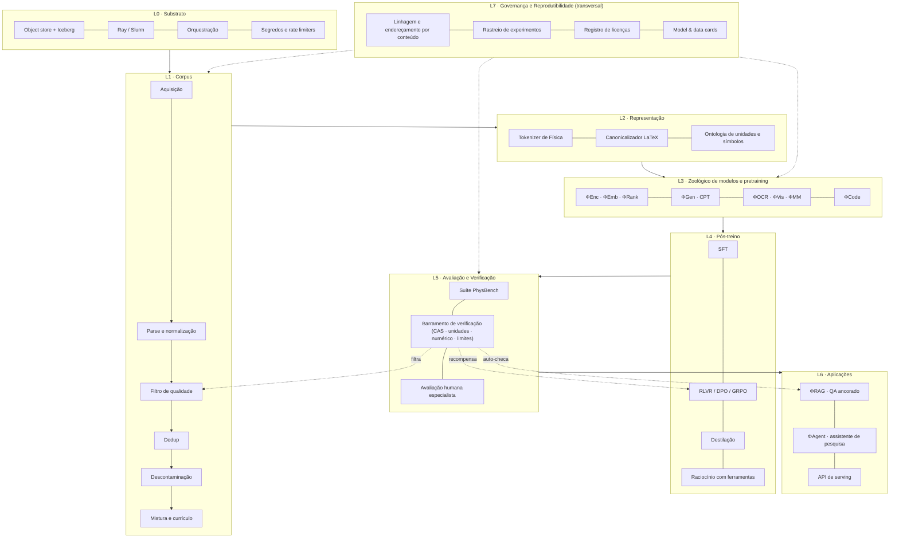
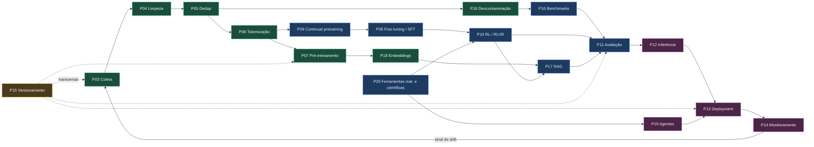
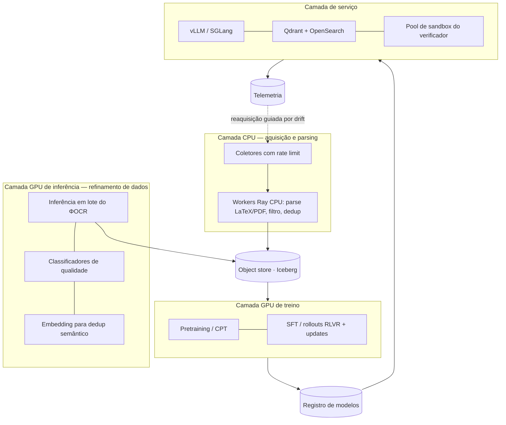

# DOC-01 — Arquitetura do Sistema e Organização do Repositório

**Projeto:** ΦFM — Phi Foundation Models para Física
**Status:** `RASCUNHO v0.2` — aguardando revisão do Stage-Gate 0
**Cobre:** entregáveis solicitados **1** (arquitetura completa do projeto) e **2** (organização de diretórios); estabelece o arcabouço para os pipelines 3–20.
**Depende de:** [DOC-00](DOC-00-project-charter.md)
**Data:** 2026-08-03

---

## 1. Princípios arquiteturais

Sete princípios. Toda decisão de projeto a jusante precisa ser rastreável a pelo menos um deles; quando dois conflitam, vence o de número menor.

**P1 — Proveniência é cidadã de primeira classe, não metadado.**
Todo token que chega a um modelo precisa ser rastreável até um documento de origem, uma licença, um timestamp de coleta e uma linhagem de processamento. É isso que torna as alegações auditáveis, torna a descontaminação possível, torna a recuperação citável, e torna a postura legal (DOC-00 §9, Q2/Q3) executável em vez de aspiracional. Custo: ~15–25% de sobrecarga de armazenamento e disciplina não trivial de schema. **Aceito.**

**P2 — A semântica sobrevive à ingestão.**
LaTeX, estrutura de equações, figuras, tabelas, unidades e convenções físicas são *preservados*, não achatados em texto puro. A descoberta empírica central do Minerva foi que preservar a formatação matemática melhora materialmente o raciocínio quantitativo. Um pipeline que transforma `$\nabla \times \mathbf{B} = \mu_0 \mathbf{J} + \mu_0\epsilon_0 \partial_t \mathbf{E}$` em `∇ × B = μ0 J + μ0ε0 ∂t E` — ou pior, em `B = J + E` — destruiu o sinal de treino.

**P3 — Tudo é verificável, ou é hipótese.**
A Física tem uma vantagem que quase nenhum outro domínio tem: **respostas podem ser conferidas mecanicamente.** Análise dimensional, equivalência simbólica, avaliação numérica, casos-limite, leis de conservação e simulação são todos verificadores executáveis. A arquitetura coloca um **barramento de verificação** no centro — usado para filtragem de dados, para cálculo de recompensa em RL, para correção de benchmarks e para auto-checagem em inferência. *A mesma implementação de verificador serve aos quatro*, o que garante consistência entre treino e avaliação.

**P4 — Reprodutibilidade é imposta por construção, não por disciplina.**
Todo artefato (shard de dataset, tokenizer, checkpoint, resultado de avaliação) é endereçado por conteúdo e carrega o hash de suas entradas e o SHA do git do código que o produziu. "Funcionou na minha máquina" torna-se arquiteturalmente impossível.

**P5 — Portabilidade entre perfis de computação.**
O mesmo código roda em 1 nó e em 256, diferindo apenas em configuração. Sem forks por perfil. É isso que permite o programa começar no Perfil A e escalar até C sem reescrita (DOC-00 §7).

**P6 — Comprar o commodity, construir o diferencial.**
Nós construímos: o corpus, o tokenizer de Física, o barramento de verificação, a suíte de benchmarks, as receitas de modelo. Nós *não* construímos: framework de treino, banco vetorial, servidor de inferência, orquestrador ou rastreador de experimentos. Reinventar isso é como programas de pesquisa morrem.

**P7 — Toda alegação vem com seu kit de refutação.**
Cada resultado é acompanhado do comando exato, do hash de configuração e do manifesto de dados necessários para um terceiro reproduzi-lo ou refutá-lo.

---

## 2. Arquitetura em camadas



**Por que camadas e não microsserviços.** Neste estágio o gargalo é *velocidade de iteração científica*, não independência de deploy. Um monorepo em camadas com contratos de interface estritos nos dá liberdade de refatoração; uma malha de serviços prematura nos daria depuração de version skew. Serviços só aparecem em L6, onde existem consumidores externos (DOC-16).

**O barramento de verificação (E2) é a assinatura arquitetural deste projeto.** Note as três arestas pontilhadas: ele filtra dados, calcula recompensas de RL e auto-checa na inferência. A maioria das arquiteturas de LLM tem três implementações separadas e silenciosamente divergentes de "esta resposta está certa". Nós temos uma. Consequência: um bug no verificador é um bug *global* — razão pela qual o barramento carrega o requisito de cobertura de testes mais estrito do repositório (DOC-12).

---

## 3. Os vinte pipelines: DAG de dependências

Todos os pipelines solicitados no briefing, posicionados no modelo de camadas com dependências explícitas. As cores indicam o tier (DOC-00 §5).



**Caminho crítico até o Portão G1:** `P03 → P04 → P05 → P06 → P07 → P18` — seis pipelines. Todo o resto está fora do caminho crítico e pode ser paralelizado ou adiado. **Este é o fato de cronograma mais importante do programa** e comanda o plano de alocação de esforço dos trimestres 1–2 no DOC-17.

**Duas arestas de realimentação merecem comentário:**
- `P14 → P03` (monitoramento → coleta): consultas em produção que o modelo responde mal são uma *distribuição amostral para a próxima rodada de aquisição de corpus*. Isso fecha o volante de dados e é o que faz o sistema melhorar depois do deploy em vez de apodrecer.
- `P15` (versionamento) é desenhado como transversal, não sequencial, porque não é um estágio — é uma propriedade imposta em todos os estágios (P4).

---

## 4. Organização do repositório

### 4.1 Decisão: monorepo

| Opção | Prós | Contras | Veredito |
|---|---|---|---|
| **Monorepo** | Mudanças transversais atômicas; um único CI; schemas compartilhados não podem divergir; fonte única de verdade para configs | Clone grande; exige CI filtrado por caminho; exige disciplina de fronteiras de módulo | ✅ **Selecionado** |
| Polirrepo (um por pipeline) | Cadência de release independente; superfície menor por repo | Divergência de schema entre o repo de dados e o de treino é *a* falha clássica de plataformas de ML; refatorações entre repos são dolorosas | ❌ |
| Híbrido (core mono + repos de modelo) | Pesos fora do git (correto) | — | ✅ **Parcialmente adotado**: pesos e dados vivem em object storage + HF Hub, nunca no git |

**Selecionado: monorepo para código + configs + docs; object storage endereçado por conteúdo para dados e pesos; HF Hub (privado) como registro de modelos.**

### 4.2 Árvore de diretórios

```
LLM_fisica/
├── README.md
├── pyproject.toml                  # uv/hatch; raiz única de dependências com extras opcionais
├── uv.lock
├── Makefile                        # pontos de entrada canônicos: make corpus | train | eval
├── .env.example
│
├── docs/                           # ← os 20 documentos de projeto (nível de publicação)
│   ├── 00-foundations/             #    DOC-00 carta, DOC-01 arquitetura
│   ├── 01-data/                    #    DOC-02..06
│   ├── 02-models/                  #    DOC-07..10
│   ├── 03-evaluation/              #    DOC-11..12
│   ├── 04-systems/                 #    DOC-13..16
│   ├── 05-governance/              #    DOC-17..19
│   ├── adr/                        #    Architecture Decision Records (um arquivo por decisão)
│   ├── figures/
│   └── papers/                     #    manuscritos redigidos a partir deste trabalho
│
├── configs/                        # árvore Hydra — TODOS os hiperparâmetros aqui, nenhum no código
│   ├── data/{sources,filters,mixtures,curricula}/
│   ├── tokenizer/
│   ├── model/{enc,gen,ocr,vis,code}/
│   ├── train/{pretrain,cpt,sft,dpo,grpo}/
│   ├── eval/{benchmarks,harness,judges}/
│   ├── serve/
│   ├── compute/{profile_a,profile_b,profile_c}.yaml   # P5: portabilidade mora aqui
│   └── experiment/                 # configs compostas, imutáveis, nomeadas por hash
│
├── src/phifm/
│   ├── core/                       # primitivas transversais — sem dependências ascendentes
│   │   ├── schema/                 # ★ PhysicsDocumentRecord e correlatos (§6). O contrato.
│   │   ├── lineage/                # endereçamento por conteúdo, manifestos, grafo de proveniência
│   │   ├── licensing/              # registro SPDX, resolvedor de redistribuibilidade
│   │   ├── units/                  # álgebra dimensional (SI + gaussiano + unidades naturais)
│   │   ├── latex/                  # canonicalizador, AST, normalização de símbolos
│   │   └── io/                     # leitores/escritores Parquet/Iceberg/WebDataset
│   │
│   ├── corpus/                     # P03–P06, P16b
│   │   ├── acquire/                #   um módulo por fonte: arxiv, ads, ntrs, cern, doaj, oer…
│   │   ├── parse/                  #   latex_source, pdf_layout, html, notebook, ocr_bridge
│   │   ├── normalize/              #   seccionamento, extração de equações, vínculo figura/tabela
│   │   ├── filter/                 #   heurístico, qualidade por modelo, idioma, relevância física
│   │   ├── dedup/                  #   exato (hash), aproximado (MinHash-LSH), semântico (embedding)
│   │   ├── decontaminate/          #   casamento por n-grama + embedding contra todo benchmark
│   │   └── mixture/                #   pesos de amostragem, currículos, política de épocas
│   │
│   ├── tokenizer/                  # P06 — treino, avaliação (fertilidade/compressão), extensão
│   ├── models/                     # P07, P09 — só definições de arquitetura, sem laços de treino
│   │   ├── encoder/ retriever/ reranker/ generator/ ocr/ vision/ multimodal/ code/
│   │   └── layers/                 #   compartilhado: variantes de RoPE, atenção, roteadores MoE, norms
│   │
│   ├── training/                   # P07–P10
│   │   ├── pretrain/ cpt/ sft/ preference/ rl/ distill/
│   │   ├── parallel/               #   wrappers FSDP2 / TP / PP / CP — a costura de portabilidade P5
│   │   └── callbacks/              #   checkpointing, detecção de spikes, auto-resume, throughput
│   │
│   ├── verify/                     # ★ O BARRAMENTO DE VERIFICAÇÃO (P3) — usado por filtro, RL, eval, inferência
│   │   ├── symbolic/               #   equivalência SymPy, simplificação, formas canônicas
│   │   ├── dimensional/            #   checagem de balanço de unidades
│   │   ├── numeric/                #   equivalência por substituição aleatória, política de tolerância
│   │   ├── limits/                 #   checagem de redução em casos-limite
│   │   ├── conservation/           #   invariantes de energia/momento/carga/probabilidade
│   │   ├── sandbox/                #   execução isolada de código (gVisor/Firecracker)
│   │   └── bus.py                  #   protocolo Verifier unificado + álgebra de resultados
│   │
│   ├── eval/                       # P11, P16 — PhysBench + harness + estatística
│   │   ├── benchmarks/ harness/ grading/ statistics/ human/ contamination/
│   ├── retrieval/                  # P17, P18 — chunking, indexação, busca híbrida, rerank, citação
│   ├── agents/                     # P19 — planejador, roteador de ferramentas, memória, log de traços
│   ├── tools/                      # P20 — SymPy, NumPy/SciPy, JAX, Wolfram, FEniCS, CEA, GMAT…
│   ├── serving/                    # P12, P13 — adaptadores vLLM/SGLang, batching, guardrails
│   └── monitoring/                 # P14 — drift, telemetria de qualidade, custo, ganchos de incidente
│
├── pipelines/                      # definições de assets Dagster — SÓ orquestração, lógica em src/
│   ├── corpus_assets.py  training_assets.py  eval_assets.py  serving_assets.py
│
├── scripts/                        # CLIs finas; toda uma invocável por `make`
├── tests/
│   ├── unit/ integration/ regression/
│   └── golden/                     # ★ casos de Física congelados que o verificador nunca pode quebrar
├── notebooks/                      # só exploração — nunca importado por src/
├── infra/
│   ├── docker/ slurm/ terraform/ k8s/ monitoring/
├── benchmarks/                     # dados e definições de tarefa do PhysBench (versionado por DVC)
└── .github/workflows/              # CI filtrado por caminho; jobs de GPU em runners próprios
```

### 4.3 Fronteiras de módulo impostas

Violação de camadas é o padrão de apodrecimento clássico em repositórios de ML. O DAG é imposto com `import-linter` no CI:

```
core   ←  corpus, tokenizer, models, verify, eval, retrieval, tools
verify ←  corpus.filter, training.rl, eval.grading, serving
models ←  training, serving
(nenhum módulo importa de `training`, exceto `pipelines` e `scripts`)
(nenhum módulo importa de `notebooks`)
```

**Justificativa da regra mais importante:** `verify` fica *abaixo* de `corpus.filter`, `training.rl` e `eval.grading` e é importado pelos três. Essa é a imposição mecânica de P3 — torna-se estruturalmente impossível a recompensa de treino divergir do corretor de avaliação, porque são o mesmo caminho de código.

---

## 5. Stack tecnológico: decisões e alternativas

Conforme o briefing, toda escolha vem com alternativas e trade-offs.

### 5.1 Orquestração

| Opção | Prós | Contras | Custo |
|---|---|---|---|
| **Dagster** ✅ | Centrado em assets (modela *artefatos de dados*, não tarefas) — casa exatamente com um pipeline de corpus; linhagem e partições nativas; tipagem forte; backfills excelentes | Comunidade menor que Airflow; opinativo | OSS gratuito; ~1 VM pequena |
| Airflow | Ubíquo; ecossistema enorme | Centrado em tarefas, não em assets — linhagem precisa ser aparafusada; scheduler pesado | Gratuito; ops mais pesada |
| Prefect | Pythônico, pouca cerimônia | História de linhagem/partições mais fraca | Gratuito |
| Flyte | Tipagem forte + nativo em k8s | Exige k8s; curva íngreme | Ops mais cara |
| Slurm + Make puro | Zero infra nova | Sem linhagem, sem backfill, sem observabilidade — viola P1 e P4 | Gratuito |

**Selecionado: Dagster.** Fator decisivo: um corpus *é* um grafo de assets particionado (por fonte × tempo × estágio de processamento). O Dagster modela isso nativamente; com Airflow reconstruiríamos metade do Dagster. No Perfil C, o Dagster orquestra e *submete* ao Slurm, em vez de substituí-lo.

### 5.2 Processamento distribuído de dados

| Opção | Prós | Contras |
|---|---|---|
| **Ray Data** ✅ (primário) | Mesmo cluster para parsing em CPU e inferência em GPU (filtragem por modelo, OCR, embedding); nativo em Python; escalonamento heterogêneo | Mais fraco que Spark em shuffles muito grandes |
| **Spark** ✅ (só para MinHash) | Shuffle de primeira linha — dedup MinHash-LSH em escala de 10⁸ documentos é um problema de shuffle | Sobrecarga de ops da JVM; desajeitado para estágios em GPU |
| Dask | Pythônico, familiar | História de GPU e desempenho de shuffle mais fracos |
| DuckDB + Polars | Velocíssimo em nó único; ideal abaixo de ~1 TB | Não escala horizontalmente |

**Selecionado: Ray Data como espinha dorsal; Spark invocado apenas no shuffle de dedup aproximado; DuckDB/Polars para toda análise e QA.** No Perfil A (nó único), DuckDB+Polars resolve quase tudo e o Spark é dispensado — o caminho de código é idêntico, só muda a configuração de executor (P5).

### 5.3 Armazenamento e formato de tabela

**Selecionado: object store (S3/R2/MinIO) + Parquet + Apache Iceberg; shards WebDataset/Mosaic-MDS no caminho quente de treino.**

O Iceberg dá isolamento por snapshot, viagem no tempo e evolução de schema — o que *é* o nosso mecanismo de versionamento de datasets (P4, e pipeline 15). Alternativas: Delta Lake (equivalente, mais acoplado a Spark), Hudi (otimizado para upsert, que não precisamos), Parquet puro + manifestos manuais (sem atomicidade — rejeitado). O treino lê shards sequenciais, não Iceberg, porque formatos de tabela com acesso aleatório são a forma errada para um dataloader; a construção dos shards é um asset derivado, fixado a um snapshot Iceberg.

### 5.4 Framework de treino

| Opção | Prós | Contras | Melhor encaixe |
|---|---|---|---|
| **TorchTitan** ✅ | PyTorch nativo; FSDP2 + TP + PP + CP; legível e modificável; evolução rápida | Mais novo; menos recursos exóticos | **Perfis A/B** |
| **Megatron-Core / NeMo** ✅ | Eficiência de ponta em larga escala; testado em 10³ GPUs | Pesado; curva íngreme; difícil de modificar | **Perfil C** |
| DeepSpeed | ZeRO maduro; bom offload para CPU/NVMe em orçamentos pequenos | Progressivamente superado pelo FSDP2; ZeRO-3 é pesado em comunicação | Fallback no Perfil A |
| HF Trainer / Accelerate | Mais rápido de começar | Não competitivo em multi-nó | Só encoders e ablações |
| Levanter (JAX) | Determinismo bit a bit; excelente em TPU | Lock-in de ecossistema; comunidade menor | Só se houver concessão de TPU |

**Selecionado: TorchTitan como primário, com caminho Megatron-Core reservado ao Perfil C.** A costura de paralelismo (`src/phifm/training/parallel/`) existe exatamente para que essa troca seja uma mudança de configuração (P5). Encoders (≤ 400M) usam HF Trainer — maquinário multi-nó ali é sobrecarga pura.

### 5.5 Pós-treino / RL

**Selecionado: TRL para SFT e DPO; veRL (HybridFlow) para RLVR/GRPO.**
RLVR exige colocalizar um motor de *geração* rápido com o motor de *treino*; o controlador híbrido do veRL faz isso bem e integra rollouts com vLLM/SGLang. Alternativas: OpenRLHF (mais simples, colocação menos flexível), NeMo-Aligner (Perfil C, acoplado a Megatron), laço próprio (rejeitado — P6).

### 5.6 Inferência

**Selecionado: vLLM como motor padrão; SGLang para cargas agênticas/estruturadas; TensorRT-LLM apenas se um SLA de latência em produção exigir.**
O prefix-caching por RadixAttention do SGLang é um ganho grande em laços de agente que reutilizam prompts de sistema longos e schemas de ferramentas — exatamente o perfil do ΦAgent. TensorRT-LLM é o mais rápido, mas seu ciclo de build/quantização é lento e preso ao hardware; não compensa o custo de iteração durante a pesquisa.

### 5.7 Recuperação

**Selecionado: Qdrant (vetorial) + OpenSearch/BM25 (lexical) + ranqueamento híbrido fundido; LanceDB para desenvolvimento local.**
Recuperação em Física *não* é um problema puramente vetorial: casamento exato de `\Lambda`CDM, `SU(3)`, nomes de detectores e formas de equação importa enormemente, e recuperação densa é notoriamente fraca em tokens simbólicos raros. Híbrido não é opcional aqui. Alternativas: Milvus (melhor em escala de 10⁹, ops mais pesada), Weaviate (boa DX, filtragem menos performática), pgvector (adequado abaixo de ~10⁷ vetores, ops mais simples — a escolha certa no Perfil A). Projeto completo no DOC-13.

### 5.8 Stack de apoio

| Preocupação | Selecionado | Alternativas consideradas |
|---|---|---|
| Configuração | **Hydra + OmegaConf**, todas as configs hasheadas nos IDs de experimento | pydantic-settings, YAML puro, gin |
| Rastreio de experimentos | **Weights & Biases** (MLflow se auto-hospedagem for obrigatória) | Aim, Neptune, TensorBoard |
| Registro de modelos | **HF Hub (privado)** + metadados vinculados ao Iceberg | Registro MLflow, convenções em S3 |
| Versionamento de dados/benchmarks | **Snapshots Iceberg** (corpus) + **DVC** (benchmarks) | LakeFS, git-annex |
| Harness de avaliação | **lm-evaluation-harness** estendido com nossos corretores | HELM, OpenCompass, próprio |
| Execução em sandbox | **gVisor / microVM Firecracker** | Docker puro (isolamento insuficiente para código gerado por modelo), Pyodide (limitado demais) |
| Orquestração de serving | **Ray Serve** (Perfis A/B) → **KServe** (Perfil C) | BentoML, FastAPI puro |
| Observabilidade | **OpenTelemetry + Prometheus + Grafana**; **Evidently** para drift | Datadog (custo), próprio |
| CI | **GitHub Actions**, filtrado por caminho, com runners de GPU próprios | GitLab CI, Buildkite |
| Gestão de pacotes | **uv** | poetry, pip-tools, conda |

---

## 6. O contrato de dados central: `PhysicsDocumentRecord`

Tudo em L1 produz ou consome este schema. É o artefato mais consequente do repositório: ele codifica P1 (proveniência), P2 (semântica sobrevive) e P7 (tagueamento de convenção) mecanicamente. Definido uma única vez em `src/phifm/core/schema/`, imposto por Pydantic em toda fronteira, materializado como Parquet/Iceberg.

```python
# src/phifm/core/schema/document.py  (especificação — implementação na Fase 1)

class PhysicsDocumentRecord(BaseModel):
    # ─── Identidade (P4: endereçado por conteúdo) ───────────────────────
    doc_id: str                    # BLAKE3 do conteúdo canônico — a chave primária
    schema_version: str

    # ─── Proveniência (P1) ──────────────────────────────────────────────
    provenance: Provenance         # source_name, source_url, harvest_method,
                                   # retrieved_at, raw_blob_uri, raw_checksum,
                                   # pipeline_git_sha, parent_doc_id | None

    # ─── Licenciamento (P1; regula DOC-00 Q2/Q3) ────────────────────────
    license: LicenseRecord         # spdx_id, license_url, redistributable: bool,
                                   # commercial_ok: bool, train_ok: bool,
                                   # attribution_required: bool, evidence_uri
                                   # ── train_ok=False ⇒ partição só de avaliação, imposta em código

    # ─── Bibliografia ───────────────────────────────────────────────────
    biblio: Biblio                 # title, authors[], affiliations[], date,
                                   # venue, doi, arxiv_id, ads_bibcode,
                                   # references[] (DOIs resolvidos), cited_by_count

    # ─── Taxonomia ──────────────────────────────────────────────────────
    taxonomy: Taxonomy             # arxiv_categories[], pacs[], msc[],
                                   # subfield[] (nossa ontologia de 23 subáreas),
                                   # level: {highschool|undergrad|grad|research},
                                   # doc_type: {paper|thesis|book|lecture|report|
                                   #            problemset|dataset|code|forum}

    # ─── Conteúdo (P2: estrutura preservada) ────────────────────────────
    content: Content               # format: {latex|markdown|html|text},
                                   # body, sections[] (hierárquico),
                                   # equations[], figures[], tables[],
                                   # citations_inline[] (span → índice de referência)

    # ─── Estrutura específica de Física (P2, P7) ────────────────────────
    physics: PhysicsAnnotations
    #   equations[]:      eq_id, latex, canonical_latex, is_display, label,
    #                     symbols[], dimensions | None, verified_dimensionally: bool
    #   conventions:      metric_signature, unit_system {SI|Gaussian|natural|HEP},
    #                     hbar_c_set: bool, index_convention
    #   quantities[]:     value, uncertainty, unit, quantity_kind
    #   entities[]:       NER — partículas, detectores, materiais, métodos, constantes

    # ─── Sinais de qualidade (alimenta P04/P05) ─────────────────────────
    quality: QualitySignals        # lang, perplexity_score, edu_value_score,
                                   # math_density, latex_validity,
                                   # ocr_confidence | None, heuristic_flags[]

    # ─── Dedup e contaminação (P05, P16b) ───────────────────────────────
    dedup: DedupSignals            # exact_hash, minhash_signature,
                                   # near_dup_cluster_id, semantic_cluster_id,
                                   # is_cluster_representative: bool
    contamination: ContaminationFlags   # benchmark_hits[], ngram_overlap_max
```

**Quatro decisões de projeto que merecem defesa:**

1. **`license.train_ok` é um booleano que o *loader* respeita, não uma nota em planilha.** Documentos com `train_ok=False` são fisicamente roteados para uma partição exclusiva de avaliação. Isso torna a resolução de Q2 (livros sob copyright) *arquiteturalmente* segura: podemos ingerir esses livros para avaliação e análise sem qualquer possibilidade de vazamento para os pesos.
2. **`physics.conventions` ataca diretamente o modo de falha F7.** Uma vez tagueadas a assinatura métrica e o sistema de unidades, podemos (a) filtrar batches de treino consistentes em convenção, (b) treinar geração condicionada à convenção, e (c) construir o benchmark de robustez a convenção. Nada disso é possível se as convenções ficarem implícitas na prosa.
3. **`equations[].canonical_latex`** — produzido pelo nosso canonicalizador — é o que torna possível dedup simbólico, recuperação de fórmulas e descontaminação em nível de equação. LaTeX bruto não é comparável entre fontes; a forma canônica é.
4. **`parent_doc_id`** faz do registro um *nó em um DAG de linhagem*, não uma linha achatada. Um documento limpo aponta para seu ancestral bruto; um chunk aponta para seu documento. Rastreabilidade completa de um token de treino de volta até uma URL coletada.

---

## 7. Topologia de computação e portabilidade



Os arquivos `configs/compute/profile_*.yaml` são o único lugar onde valores específicos de perfil aparecem:

```yaml
# configs/compute/profile_a.yaml  (ilustrativo)
cluster: {launcher: local, nodes: 1, gpus_per_node: 8, interconnect: nvlink}
parallelism: {dp_shard: 8, tp: 1, pp: 1, cp: 1, strategy: fsdp2}
data: {executor: ray_local, dedup_backend: duckdb, shard_store: local_nvme}
training: {micro_bsz: 4, grad_accum: 16, activation_ckpt: full, precision: bf16}

# configs/compute/profile_c.yaml
cluster: {launcher: slurm, nodes: 128, gpus_per_node: 8, interconnect: ib_ndr}
parallelism: {dp_shard: 128, tp: 8, pp: 4, cp: 2, strategy: megatron}
data: {executor: ray_cluster, dedup_backend: spark, shard_store: lustre}
training: {micro_bsz: 1, grad_accum: 8, activation_ckpt: selective, precision: bf16}
```

**Objeção antecipada:** "paralelismo parametrizado por perfil vaza para o código do modelo." Não pode vazar. O contrato é que `src/phifm/models/` define `nn.Module`s *puros*, sem consciência de distribuição; todo sharding é aplicado por `src/phifm/training/parallel/` no momento do wrap. É a fronteira mais importante para P5, e é testada por um job de CI que constrói todos os modelos sob os planos de paralelismo dos três perfis.

---

## 8. Espinha dorsal de reprodutibilidade (pipeline 15)

Quatro mecanismos, em camadas:

| Nível | Mecanismo | Garante |
|---|---|---|
| **Código** | SHA do git embutido em todo artefato; `import-linter` + `ruff` + `mypy --strict` em `core/` e `verify/` | Identidade exata do código |
| **Configuração** | Composição Hydra → JSON canônico → BLAKE3 → **ID de experimento** | Dois runs com o mesmo ID tiveram hiperparâmetros idênticos, por construção |
| **Dados** | ID de snapshot Iceberg fixado na config do run; manifestos de shard endereçados por conteúdo | Identidade exata do dataset, incluindo decisões de filtro e dedup |
| **Ambiente** | `uv.lock` + digest do container (não a tag) + versões de CUDA/driver registradas | Numérica reprodutível até o não-determinismo de GPU |

**Convenção de nomes de artefato:**
```
phifm-{model}-{size}-{stage}-{data_snapshot[:8]}-{config_hash[:8]}-{step}
ex.:  phifm-gen-8b-cpt-a3f21c04-9b7e0d12-060000
```
O nome de cada checkpoint é um ponteiro completo para o código, a configuração e os dados que o produziram. Um revisor consegue reconstruir qualquer resultado só a partir do nome.

**Limitação honesta.** Reprodutibilidade bit a bit **não** é garantida sob não-determinismo de CUDA, ordem de redução do FSDP e preempção/retomada. Garantimos **reprodutibilidade estatística**: ≥ 3 sementes, resultados com IC, e todo efeito alegado precisa exceder a variância entre sementes (DOC-00 §6.4). Alegar reprodutibilidade bit a bit em treino de larga escala em GPU seria falso, e é melhor declarar a garantia real.

---

## 9. Construir vs. comprar (P6)

| Nós **construímos** (diferencial) | Nós **compramos/adotamos** (commodity) |
|---|---|
| O corpus de Física e seu pipeline de aquisição/filtro | Framework de treino (TorchTitan / Megatron) |
| O tokenizer consciente de Física | Orquestrador (Dagster), executor (Ray/Spark) |
| **O barramento de verificação** — nosso ativo científico central | Banco vetorial (Qdrant), índice lexical (OpenSearch) |
| PhysBench (benchmarks + correção por CAS) | Servidor de inferência (vLLM/SGLang) |
| As *receitas* de modelo (misturas, currículos, desenho de recompensa RLVR) | Arquiteturas base (variantes de transformer) |
| A ontologia de Física, a álgebra de unidades, o canonicalizador LaTeX | Rastreio de experimentos, registro, monitoramento |
| Fine-tune do ΦOCR para documentos de Física | Arquitetura base de OCR (família Nougat) |

**Leitura estratégica:** nosso fosso defensável é a tríade **corpus + barramento de verificação + benchmark**, não os pesos. Pesos depreciam a cada seis meses conforme surgem bases melhores; um corpus de Física rigorosamente construído, com proveniência completa e uma camada mecânica de verificação, *aprecia* — todo novo modelo base pode ser reespecializado sobre ele em dias. **É por isso que o investimento do Tier 1 é antecipado e por isso que o Portão G1 regula todo o resto.**

---

## 10. Checklist do Stage-Gate 0

Antes de o DOC-02 (Aquisição de Corpus) começar, este documento exige aprovação de:

- [ ] **A1** — Modelo de camadas e o princípio do barramento de verificação no centro (P3) aceitos
- [ ] **A2** — Topologia monorepo + object-store-para-dados aceita
- [ ] **A3** — Schema `PhysicsDocumentRecord` aceito em princípio (revisão campo a campo ocorre no DOC-03)
- [ ] **A4** — Escolhas tecnológicas aceitas, ou substituições específicas nomeadas
- [x] **A5** — Perfil de computação escolhido — *resolvido: portátil, alvo Perfil A (DOC-00 §7)*
- [x] **A6** — Postura legal escolhida — *resolvido: PD/aberto para treino, copyright só em avaliação, pesos abertos permissivos*
- [x] **A7** — Modelo base para CPT escolhido — *resolvido: Qwen3-8B-Base, provisório, a confirmar por bake-off no G1*

---

## 11. Questões arquiteturais em aberto (adiadas, com destino)

| ID | Questão | Adiada para | Por que não agora |
|---|---|---|---|
| OQ-1 | Denso vs. MoE para o ΦGen-32B | DOC-07 | Exige dados de escala dos nossos próprios runs de Tier 2 |
| OQ-2 | Estender o tokenizer da base vs. treinar um novo para CPT | DOC-05 | Depende de A7 (resolvido: Qwen3 → estender é o caminho provável) |
| OQ-3 | Modelo multimodal unificado vs. ΦVis + ΦGen separados | DOC-07 | Depende dos resultados do Tier 2 e do rendimento do corpus de figuras |
| OQ-4 | Se um run generativo do zero chega a se justificar | Stage-Gate 4 | Depende do tamanho final do corpus e dos resultados de G2 (DOC-00 §4.3) |
| OQ-5 | Verificação formal (Lean/Isabelle) para checagem de derivações | DOC-10 | Alto valor, alto custo; exige um spike de viabilidade em Física (vs. matemática pura) |

---

**Fim do DOC-01.** Aprovação da §10 necessária antes de o DOC-02 começar.
