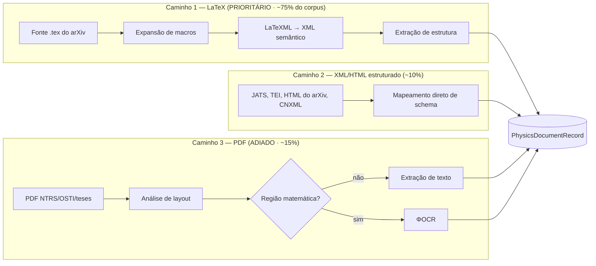

# DOC-03 — Ingestão, Parsing e Normalização

**Projeto:** ΦFM — Phi Foundation Models para Física
**Status:** `RASCUNHO v0.1` — aguardando revisão do Stage-Gate 2
**Cobre:** entregável solicitado **4** (pipeline de limpeza); projeto do **ΦOCR**
**Depende de:** [DOC-01 §1 (P2), §6](../00-foundations/DOC-01-system-architecture.md), [DOC-02](DOC-02-aquisicao-corpus.md)
**Data:** 2026-08-03

---

## 1. O problema central

Este é o documento onde o princípio **P2** — *"a semântica sobrevive à ingestão"* — deixa de ser slogan.

A descoberta empírica central do Minerva (Lewkowycz et al., 2022) não foi arquitetural: foi que **preservar a formatação matemática no pré-processamento melhora materialmente o raciocínio quantitativo.** Pipelines de texto genéricos destroem exatamente o sinal que queremos aprender. Considere o mesmo conteúdo em quatro níveis de degradação:

| Nível | Resultado | Utilidade |
|---|---|---|
| **Fonte LaTeX preservada** | `\nabla \times \mathbf{B} = \mu_0 \mathbf{J} + \mu_0\epsilon_0 \frac{\partial \mathbf{E}}{\partial t}` | ✅ Estrutura completa: operadores, índices, derivadas |
| Unicode achatado | `∇ × B = μ₀J + μ₀ε₀ ∂E/∂t` | ⚠️ Legível, mas a estrutura de derivada e a distinção vetor/escalar se perdem |
| Texto puro de PDF | `∇ × B = µ0J + µ0ǫ0 ∂E ∂t` | ❌ Glifos corrompidos, agrupamento perdido |
| Extração ingênua | `B = J + E` | ❌ Ruído. Pior que não ter o documento. |

O terceiro caso não é hipotético: é o que extração ingênua de PDF produz com fontes matemáticas, e é a razão de tantos "corpora científicos" serem inúteis para Física.

**Consequência de arquitetura:** o pipeline tem **três caminhos de ingestão** com prioridades muito diferentes, e o mais importante deles não precisa de OCR nenhum.



> **Decisão de sequenciamento (confirma DOC-17A §8.1):** os Caminhos 1 e 2 cobrem toda a Camada A do DOC-02 e sozinhos entregam 22–35 B tokens. **O Caminho 3 e o ΦOCR ficam para depois do Portão G1.** Construir OCR antes de precisar dele é a forma mais comum de queimar um trimestre num projeto destes.

---

## 2. Caminho 1 — LaTeX: o problema difícil é expansão de macros

### 2.1 Por que este é o caminho privilegiado

O arXiv distribui a **fonte LaTeX** da esmagadora maioria dos papers, não apenas o PDF. Isso significa que temos a intenção do autor em forma simbólica exata — sem perda, sem OCR, sem ambiguidade de glifo. É a diferença entre ler o código-fonte e fazer engenharia reversa do binário.

### 2.2 O obstáculo que quase todo mundo subestima

Autores de Física definem macros pessoais. Um paper típico de teoria contém:

```latex
\newcommand{\eps}{\epsilon}
\newcommand{\bra}[1]{\langle #1|}
\newcommand{\ket}[1]{|#1\rangle}
\def\dd{\mathrm{d}}
\newcommand{\Tr}{\mathrm{Tr}\,}
\renewcommand{\vec}[1]{\mathbf{#1}}
```

E depois escreve `\bra{\psi} \hat{H} \ket{\phi}`. Sem expansão, essa string é **opaca**: o tokenizer verá uma macro privada que aparece em um único documento do corpus inteiro, sem qualquer relação aprendível com a notação de Dirac que aparece em outros 200 mil papers escritos de outra forma.

**Isto não é detalhe de implementação — é o que determina se o corpus de LaTeX é utilizável.** Estimativa: 60–80% dos papers de Física definem ao menos uma macro; papers de `hep-th` e `gr-qc` frequentemente definem dezenas.

### 2.3 Estratégias de expansão

| Estratégia | Como funciona | Cobertura | Velocidade | Risco |
|---|---|---|---|---|
| **Motor TeX real** (`pdflatex`, `lualatex`) | Compila de verdade | ~100% | ~2–10 s/doc | **TeX é Turing-completo.** `\write18` permite execução arbitrária de comandos. Exige sandbox obrigatório |
| **LaTeXML** ✅ | Reimplementação em Perl que faz conversão *semântica* LaTeX → XML/MathML | ~90–95% | ~1–5 s/doc | Baixo; sem execução de shell |
| **Expansão estática** (parse de `\newcommand`/`\def` + substituição) | Análise sintática, sem executar TeX | ~85–92% | ~10 ms/doc | Falha em macros recursivas e condicionais |
| **Sem expansão** | Passa o LaTeX cru | — | instantâneo | ❌ Rejeitado — §2.2 |

**Selecionado: LaTeXML como caminho principal, com expansão estática como fallback rápido.**

Justificativa decisiva: **o próprio arXiv adotou o LaTeXML** para gerar as versões HTML dos papers a partir de dezembro de 2023. É a ferramenta com mais quilometragem em LaTeX científico real e suas patologias. Alternativas consideradas e descartadas: `pandoc` (não entende macros arbitrárias nem semântica matemática), `plasTeX` (menos mantido), `TexSoup` (parser sintático, não expande), engine real (o risco de `\write18` não compensa quando o LaTeXML cobre 90–95%).

**Atalhos que reduzem o trabalho substancialmente:**
- **HTML do arXiv** — papers a partir de dez/2023 já têm versão HTML gerada por LaTeXML, obtível diretamente. Caminho 2, custo quase zero.
- **arXMLiv / unarXiv** — corpora públicos de arXiv já convertidos por LaTeXML. Verificar cobertura e licença durante a execução; se servirem, eliminam meses de processamento.

**Orçamento de processamento.** 1,2 M documentos × ~3 s/doc ÷ 8 processos paralelos ≈ **125 horas de CPU**, ou ~5 dias contínuos numa máquina doméstica. Aceitável, roda em segundo plano. Documentos que o LaTeXML reprovar caem no fallback estático; os que reprovarem nos dois vão para a fila de falhas (§9), **nunca são descartados em silêncio**.

### 2.4 O que é extraído

De cada documento, para o `PhysicsDocumentRecord` (DOC-01 §6):

| Elemento | Extração | Observação |
|---|---|---|
| **Seções** | Árvore hierárquica com títulos e níveis | Permite currículo por tipo de seção (introdução vs. derivação) no DOC-06 |
| **Equações** | LaTeX original + rótulo + numeração + `is_display` | **Com contexto** — ver §2.5 |
| **Figuras** | Legenda + referência ao arquivo de imagem + menções no texto | Insumo do ΦVis (DOC-07) |
| **Tabelas** | Estrutura de células, não texto achatado | Tabelas de Física carregam dados experimentais |
| **Citações inline** | Mapeamento span → índice de referência | Base da atribuição de citação do ΦRAG (DOC-13) |
| **Referências** | Lista com DOIs resolvidos via junção com a espinha de metadados (DOC-02 §3.1) | Grafo de citações |
| **Macros do autor** | Dicionário preservado em `provenance` | Permite reprocessar sem reparsear |

### 2.5 Equação sem contexto é ruído

Uma equação isolada tem valor de treino baixíssimo. `E = mc^2` sozinho ensina pouco; `E = mc^2` precedido de *"a energia de repouso de uma partícula de massa m é"* e seguido de *"onde c é a velocidade da luz no vácuo"* ensina a relação entre linguagem natural e formalismo — que é precisamente a capacidade que queremos.

**Regra:** toda equação extraída carrega `context_before` e `context_after` (janela de ~200 tokens cada, cortada em fronteira de sentença). A extração de equações "pura" existe apenas para o índice de recuperação de fórmulas (DOC-13), nunca como unidade de pretraining.

---

## 3. O canonicalizador LaTeX

Módulo `src/phifm/core/latex/`. É consumido por deduplicação (DOC-04), recuperação de fórmulas (DOC-13) e descontaminação por equação (DOC-12).

### 3.1 A distinção que evita destruir o corpus

> **Canonicalização serve para COMPARAR, nunca para TREINAR.**
> O modelo treina no LaTeX **original** do autor — porque a diversidade notacional é sinal, não ruído, e um físico real encontra todas essas variantes. A forma canônica existe apenas para responder *"estas duas equações são a mesma?"*.

Ambas são gravadas: `equations[].latex` (original, vai para o treino) e `equations[].canonical_latex` (derivado, vai para os índices). Confundir as duas produziria um modelo que só entende a nossa normalização — inútil diante da literatura real.

### 3.2 Transformações aplicadas

**Seguras (aplicadas):**

| Transformação | Exemplo |
|---|---|
| Expansão de macros | `\bra{\psi}` → `\langle \psi\|` |
| Normalização de delimitadores de modo matemático | `$...$`, `\(...\)`, `\begin{math}` → forma única |
| Normalização de espaçamento | `\,` `\;` `\!` `\quad` → removidos da forma canônica |
| Unificação de construtos equivalentes | `\dfrac`, `\tfrac` → `\frac`; `\left(...\right)` → `(...)` |
| Normalização de ambientes | `equation*`, `displaymath`, `\[...\]` → forma única |
| Remoção de rótulos e numeração | `\label{eq:1}` removido da forma canônica |

**Rejeitadas (perigosas em Física):**

| Transformação tentadora | Por que é rejeitada |
|---|---|
| Unificar `\epsilon` ↔ `\varepsilon`, `\phi` ↔ `\varphi` | **Em Física são grandezas diferentes.** É comum `\epsilon` ser permissividade e `\varepsilon` ser deformação, no mesmo paper. Unificar destrói informação |
| Ordenar operandos de produtos | **Operadores não comutam.** `\hat{A}\hat{B} \neq \hat{B}\hat{A}` — todo o conteúdo da Mecânica Quântica está nessa distinção |
| Simplificar via CAS antes de comparar | O SymPy não sabe o que é operador, o que é matriz e o que é escalar sem anotação de tipo. Simplificação cega inventa igualdades falsas |
| Normalizar posição de índices | `T^{\mu}_{\ \nu}` vs `T_{\nu}^{\ \mu}` diferem em Relatividade Geral |
| Unificar `\mathbf{B}` ↔ `B` | A distinção vetor/escalar é semântica |

**Princípio geral: na dúvida, não canonicalize.** Um falso negativo de deduplicação custa um documento duplicado. Um falso positivo destrói distinção física real em todo o corpus. A assimetria de custo é enorme.

---

## 4. Detecção de convenções físicas

Ataque direto ao modo de falha **F7** (DOC-00 §2), e um dos poucos lugares onde uma heurística barata produz um campo de schema de alto valor.

| Convenção | Sinais detectáveis | Método |
|---|---|---|
| **Assinatura métrica** | `(+,-,-,-)`, `(-,+,+,+)`, `\eta_{\mu\nu} = \mathrm{diag}(...)`, "mostly plus", "mostly minus", `\mathrm{diag}(1,-1,-1,-1)` | Regex + classificador sobre a janela de contexto |
| **Sistema de unidades** | Presença de `\epsilon_0`/`\mu_0` → SI; fator `4\pi` na lei de Coulomb → Gaussiano; declaração `\hbar = c = 1` → naturais; `G = c = 1` → geometrizadas | Regex + contagem de frequência no documento |
| **`ℏ = c = 1`** | Frases "we set", "in natural units", "throughout we use" + ausência sistemática de `\hbar` | Regex + verificação de consistência |
| **Convenção de índices** | Einstein implícito vs. somatório explícito; posição de covariante/contravariante | Análise estrutural das equações |
| **Convenção de sinal de Fourier** | `e^{i k x}` vs `e^{-i k x}` na definição da transformada | Regex na seção de definições |

**Valor gerado.** Uma vez tagueado, isso habilita três coisas impossíveis de outro modo: (a) montar batches de treino consistentes em convenção, (b) treinar geração **condicionada** à convenção — o modelo aprende a declarar e respeitar a convenção que lhe for pedida, (c) construir o benchmark de robustez a convenção do DOC-11.

**Custo: baixo.** São expressões regulares e um classificador leve sobre texto já parseado. **Cobertura esperada: 60–75%** dos documentos de teoria; o resto fica `null`, o que é uma resposta honesta e utilizável. Nunca adivinhar: `null` é preferível a um rótulo errado, porque um rótulo errado envenena o condicionamento.

---

## 5. Extração de grandezas e unidades

Ataque ao modo de falha **F2**. Módulo `src/phifm/core/units/`.

1. **Reconhecimento** de padrões numéricos com unidade e incerteza: `(1.602\pm0.001)\times10^{-19}\,\mathrm{C}`, `13.6\ \mathrm{eV}`, `2.7\,\mathrm{K}`.
2. **Parsing dimensional** para a forma canônica `[M L T⁻² ...]` usando uma álgebra de unidades própria — SI, Gaussiano, natural e unidades de HEP (GeV como unidade-mestra).
3. **Verificação dimensional das equações extraídas**, quando os símbolos são resolvíveis. Grava `verified_dimensionally: bool`.
4. **Extração de constantes físicas** com casamento contra os valores de referência do CODATA/NIST.

**Retorno duplo.** Além de enriquecer o schema, o item 3 é o **primeiro cliente do barramento de verificação** (`src/phifm/verify/dimensional/`) — o mesmo código que depois calcula recompensa de RLVR e corrige benchmark. Ou seja: o pipeline de dados já exercita e valida a peça central do projeto, meses antes de haver qualquer modelo. Erros no verificador aparecem cedo e barato.

> **Expectativa calibrada:** a resolução completa de símbolos é difícil — um `E` pode ser energia, campo elétrico ou módulo de Young no mesmo documento. Meta realista: **verificar dimensionalmente 20–35% das equações**, não 100%. Ainda assim são milhões de equações verificadas, e a *taxa de sucesso da verificação* vira, ela própria, um sinal de qualidade de documento no DOC-04.

---

## 6. Caminho 3 — PDF (adiado até depois do G1)

Necessário apenas para NTRS, OSTI e teses (Camadas A-parcial e B do DOC-02).

### 6.1 Comparação de ferramentas

| Ferramenta | Tipo | Velocidade | Qualidade em matemática | Licença | Veredito |
|---|---|---|---|---|---|
| **PyMuPDF** | Extração de texto | Muito rápida | ✗ Ruim | AGPL / comercial | Só triagem e contagem de páginas |
| **pdfplumber** | Texto + layout | Lenta | ✗ Ruim | MIT | Tabelas simples |
| **GROBID** ✅ | Extração estrutural por ML | Média | Média | **Apache-2.0** | ★ Melhor para referências, cabeçalho e estrutura |
| **Docling** (IBM) ✅ | Pipeline de ML | Média | Boa | **MIT** | ★ Melhor combinação geral licença/qualidade |
| **Marker** | Pipeline de ML (Surya) | Média | Boa | Termos restritivos acima de certa receita | ⚠️ Verificar licença antes de adotar |
| **MinerU** | Pipeline de ML | Média | Boa | AGPL | ⚠️ AGPL contamina |
| **Nougat** | VLM ponta a ponta | Lenta | ★ Excelente em matemática | Código MIT, **pesos CC BY-NC-4.0** | ⚠️ **Ver §6.2** |

### 6.2 ⚠️ A armadilha de licença do Nougat

O Nougat é tecnicamente o melhor OCR acadêmico disponível, e a escolha óbvia — **exceto que seus pesos são CC BY-NC-4.0**. Um ΦOCR obtido por fine-tuning do Nougat seria obra derivada de material não-comercial, incompatível com o release Apache-2.0 decidido em ADR-0001 §4.

É exatamente a mesma classe de conflito que excluiu o MIT OCW, e é fácil de não perceber até tarde demais — quando o modelo já está treinado.

**Alternativas permissivas para a base do ΦOCR:**

| Base | Licença | Comentário |
|---|---|---|
| **Qwen2.5-VL-3B** | Apache-2.0 *(confirmar na execução)* | VLM moderno e capaz; melhor ponto de partida |
| **Donut** | MIT | Encoder-decoder visual sem OCR; arquitetura que inspirou o Nougat |
| **Do zero** | — | Viável — ver §6.3 |

### 6.3 O dado de treino do ΦOCR é infinito e gratuito

O achado que torna o ΦOCR barato:

> Temos a **fonte LaTeX** e o **PDF compilado** dos mesmos ~1,2 M papers de Física. Isso é um conjunto supervisionado PDF→LaTeX perfeitamente alinhado, gratuito e praticamente ilimitado.

E dá para ampliá-lo de graça: recompilar a mesma fonte variando classe de documento (`revtex`, `article`, `elsarticle`), fonte tipográfica, tamanho, número de colunas e resolução gera múltiplos pares por paper, ensinando invariância a estilo de diagramação. Adicionar degradações realistas (ruído de digitalização, inclinação, compressão JPEG) cobre teses escaneadas.

É exatamente assim que o Nougat foi treinado, e não há barreira nenhuma para reproduzir o método com base permissiva. **Custo de dados: US$ 0. Custo de treino: dentro do envelope do DOC-17A.**

### 6.4 Meta de qualidade

Critério **G1.4** do DOC-00 §5: ≥ 0,92 de recuperação de equações por distância de edição normalizada, em conjunto reservado de PDFs de Física. Métricas secundárias: acurácia de ordem de leitura em documentos de duas colunas (RevTeX é padrão em Física e quebra extração ingênua), fidelidade de estrutura de tabelas, taxa de recuperação de legendas.

---

## 7. Normalização de texto

Conservadora por princípio — cada normalização é uma perda potencial de informação.

**Aplicadas:**

| Operação | Detalhe |
|---|---|
| Codificação | Tudo para UTF-8; normalização Unicode **NFC** |
| Ligaduras de PDF | `fi`→`fi`, `fl`→`fl` — artefato tipográfico, sem valor semântico |
| Hifenização de quebra de linha | `electro-\nmagnetic` → `electromagnetic`, com dicionário para não juntar hífens legítimos (`spin-orbit`) |
| Aspas e travessões | Normalização tipográfica |
| Espaço em branco | Colapso de espaços múltiplos **fora** de ambientes matemáticos |
| Idioma | Detecção e marcação; **sem tradução** |

**Rejeitadas:** conversão de LaTeX para Unicode (P2), *lowercasing* (`\Gamma` ≠ `\gamma`, e a distinção é física), remoção de pontuação, *stemming*, remoção de *stopwords* — todas herdadas de NLP clássico e todas destrutivas aqui.

> **Nota sobre idioma.** O corpus é predominantemente inglês. Há material relevante em alemão (literatura histórica), francês, russo e português. **Decisão: preservar e marcar, não traduzir nem descartar.** A decisão de incluir ou não no mix é do DOC-06, e é reversível; descartar na ingestão não é.

---

## 8. Arquitetura de execução

Restrição operante (DOC-17A §6.1): **isto roda na máquina local, por semanas, sem GPU.**

| Requisito | Mecanismo |
|---|---|
| **Retomável** | Cursor persistido a cada N documentos; interrupção nunca custa mais que N |
| **Idempotente** | Saída endereçada por conteúdo; reprocessar o mesmo insumo produz o mesmo `doc_id` |
| **Streaming** | PDFs grandes: baixa → extrai → **descarta o binário**, guardando só o hash. Evita o pico de disco do DOC-02 §10 |
| **Paralelo** | Ray local ou `multiprocessing`; LaTeXML é ligado a CPU e paraleliza linearmente |
| **Observável** | Contagens por estágio, taxa de falha por fonte, histograma de tempo por documento |
| **Sem GPU** | Nenhum estágio do Caminho 1 ou 2 exige GPU |

**Vazão esperada:** ~8 documentos/s com 8 processos (LaTeXML domina). 1,2 M documentos ≈ **42 horas de relógio**, executáveis em fundo ao longo de alguns dias.

---

## 9. Taxonomia de falhas — nada é descartado em silêncio

Todo documento que falha é registrado com causa. A distribuição de falhas é, ela própria, um resultado de pesquisa: diz onde o pipeline é fraco.

| Código | Causa | Ação |
|---|---|---|
| `F-SRC-MISSING` | Sem fonte LaTeX no arXiv | Fila do Caminho 3 |
| `F-TEX-TIMEOUT` | LaTeXML excedeu o tempo | Fallback estático |
| `F-TEX-FATAL` | Erro irrecuperável de parsing | Fallback; se falhar, quarentena |
| `F-MACRO-UNRESOLVED` | Macros não expandidas acima do limiar | Marcado com `latex_validity` baixo; decisão no DOC-04 |
| `F-ENC` | Codificação irrecuperável | Quarentena |
| `F-PDF-SCANNED` | PDF só de imagem, sem camada de texto | Fila do ΦOCR (pós-G1) |
| `F-PDF-ENCRYPTED` | Protegido | Descartado, registrado |
| `F-LANG-UNSUPPORTED` | Idioma fora do escopo | Preservado e marcado (§7) |
| `F-EMPTY` | Sem conteúdo aproveitável | Descartado, registrado |

**Meta: taxa agregada de falha < 8% no Caminho 1.** Acima disso, o pipeline é revisado antes de prosseguir — não se compensa um parser ruim com mais dados.

---

## 10. Métricas de qualidade

Medidas em conjunto reservado de 2.000 documentos anotados manualmente. São elas que fecham a **auditoria S3b** do DOC-02 §9 — a medição que decide se os US$ 100–180 do bulk do arXiv se justificam.

| Métrica | Meta | Como medir |
|---|---|---|
| **Taxa de preservação de equações** | ≥ 0,95 | Equações recuperadas ÷ equações presentes na fonte |
| **Cobertura de expansão de macros** | ≥ 0,92 | Macros expandidas ÷ macros definidas |
| **Fidelidade de estrutura** | F1 ≥ 0,90 | Detecção de fronteiras de seção vs. anotação humana |
| **Vínculo figura↔legenda** | ≥ 0,95 | Pares corretos ÷ figuras presentes |
| **Detecção de convenção** | Precisão ≥ 0,90 | Sobre o subconjunto onde o rótulo não é `null` |
| **Verificação dimensional** | 20–35% das equações | Taxa de sucesso — expectativa calibrada, não meta a maximizar |
| **Taxa de falha** | < 8% | §9 |

> **Comparação obrigatória.** Estas métricas são calculadas **também** sobre a mesma amostra no RedPajama-arXiv. A diferença entre as duas colunas é a resposta da questão OQ-6 do DOC-02, e é o único fundamento aceitável para decidir gastar no bulk pago.

---

## 11. Riscos

| Risco | Prob. | Impacto | Mitigação |
|---|---|---|---|
| Cobertura de expansão de macros abaixo de 0,92 | Média | **Alto** — ataca P2 diretamente | Cascata em três níveis (LaTeXML → estático → quarentena); medir antes de escalar |
| LaTeXML lento demais em máquina doméstica | Média | Médio | Avaliar arXMLiv/unarXiv (já convertidos) antes de processar do zero |
| Regressão silenciosa no canonicalizador | Baixa | **Alto** — corromperia dedup e descontaminação | `tests/golden/` com casos congelados; qualquer mudança de forma canônica quebra o CI |
| Detecção de convenção com viés sistemático por subárea | Média | Médio | Precisão medida **por subárea**, não agregada; `null` é resposta aceitável |
| Licença do Nougat percebida tarde demais | *(mitigado)* | Alto | Registrado no §6.2; base permissiva definida antes de qualquer treino |
| PDFs excedem o disco | Média | Médio | Processamento em fluxo (§8) |

---

## 12. Critérios de aceite do Stage-Gate 2

- [ ] **C1** — Todas as metas do §10 atingidas no conjunto reservado de 2.000 documentos
- [ ] **C2** — Auditoria S3b concluída, com decisão registrada e justificada sobre o bulk pago do arXiv (OQ-6)
- [ ] **C3** — Casos golden do canonicalizador congelados e verificados em CI
- [ ] **C4** — Verificador dimensional exercitado em ≥ 10⁶ equações reais, com taxa de falso positivo medida
- [ ] **C5** — Taxonomia de falhas completa; distribuição publicada; nenhuma categoria de descarte silencioso
- [ ] **C6** — Pipeline retomável comprovado: matar e retomar em ponto arbitrário produz saída idêntica bit a bit
- [ ] **C7** — ΦOCR **não** iniciado — confirmação explícita de que o Caminho 3 continua adiado

---

## 13. Questões em aberto

| ID | Questão | Destino |
|---|---|---|
| OQ-10 | arXMLiv/unarXiv têm cobertura e licença adequadas para substituir nosso processamento? | Verificação na primeira semana — pode economizar meses |
| OQ-11 | Qwen2.5-VL-3B é de fato Apache-2.0 e adequado como base do ΦOCR? | DOC-07, antes do Caminho 3 |
| OQ-12 | Resolução de símbolos merece um modelo dedicado, ou heurística basta? | DOC-04, à luz da taxa real de verificação dimensional |
| OQ-13 | Material em alemão/russo/francês entra no mix de treino? | DOC-06 — preservado agora, decidido depois |

---

## 14. Referências

1. Lewkowycz, A. et al. (2022). *Solving Quantitative Reasoning Problems with Language Models* (Minerva). NeurIPS.
2. Blecher, L. et al. (2023). *Nougat: Neural Optical Understanding for Academic Documents.* arXiv:2308.13418.
3. Miller, B. (2007–). *LaTeXML: A LaTeX to XML/HTML/MathML Converter.* NIST.
4. Ginev, D. et al. (2018). *arXMLiv: An Ongoing Corpus Conversion of arXiv.* CICM.
5. Kim, G. et al. (2022). *OCR-free Document Understanding Transformer* (Donut). ECCV.
6. Lopez, P. (2009–). *GROBID: GeneRation Of BIbliographic Data.*
7. Saier, T., Färber, M. (2020). *unarXive: A Large Scholarly Data Set with Publications' Full-Text.* Scientometrics.

---

**Fim do DOC-03.** Revisão da §12 necessária antes do DOC-04 (Filtragem, Deduplicação e Descontaminação).
