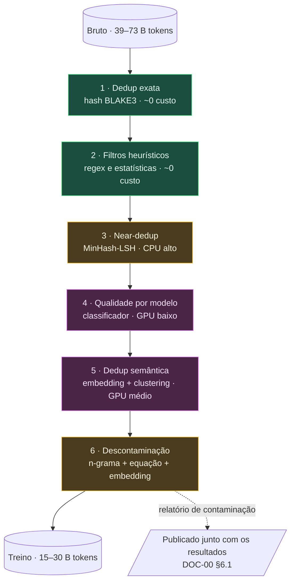

# DOC-04 — Filtragem de Qualidade, Deduplicação e Descontaminação

**Projeto:** ΦFM — Phi Foundation Models para Física
**Status:** `RASCUNHO v0.1` — aguardando revisão do Stage-Gate 3
**Cobre:** entregável solicitado **5** (pipeline de deduplicação) e a parte de descontaminação do **16**
**Depende de:** [DOC-02](DOC-02-aquisicao-corpus.md), [DOC-03](DOC-03-ingestao-parsing-normalizacao.md), [DOC-00 §6](../00-foundations/DOC-00-project-charter.md)
**Data:** 2026-08-03

---

## 1. Objetivo e a tese deste documento

Transformar o corpus bruto em corpus de treino, e — igualmente importante — **estabelecer se os benchmarks do projeto são honestos**.

A tese que organiza tudo o que segue:

> **Os filtros de qualidade padrão da literatura de LLM são ativamente prejudiciais em Física.** Eles foram calibrados em corpora web (C4, Gopher, RefinedWeb, FineWeb) onde alta densidade de símbolos, palavras curtas e ausência de pontuação final indicam lixo. Em Física, esses mesmos sinais indicam **equações** — exatamente o conteúdo mais valioso do corpus.

Importar limiares da literatura web sem recalibrar destruiria sistematicamente os melhores documentos. A §3.2 quantifica isso e define o protocolo de calibração.

Segunda tese, sobre descontaminação:

> **Não temos como descontaminar o modelo base.** Fazemos continual pretraining sobre Qwen3-8B-Base, cujos dados de treino não são públicos. Qualquer contaminação já presente ali é irremovível e invisível. **É precisamente por isso que o critério G2.1 — delta contra o próprio modelo base — é a métrica de manchete**: a contaminação herdada afeta igualmente os dois lados da comparação e se cancela. Escores absolutos não têm essa proteção.

---

## 2. Ordem das operações

A ordem não é arbitrária. Cada estágio tem um custo por documento e uma fração removida; o ordenamento correto é por **custo crescente**, para que os estágios caros processem o menor conjunto possível.



**Três decisões de ordenação que merecem defesa:**

1. **Dedup exata vem primeiro.** Custa quase nada e remove 15–25%. Todo estágio seguinte fica proporcionalmente mais barato. Fazer isso depois seria pagar filtragem cara sobre cópias.
2. **Near-dedup vem antes do filtro por modelo.** O filtro por modelo exige GPU; o near-dedup, não. Rodar o caro sobre o conjunto já reduzido economiza ~30% de GPU.
3. **Descontaminação vem por último, sempre.** Precisa operar sobre o conjunto **final**, porque o near-dedup pode escolher como representante justamente a cópia contaminada de um cluster. Além disso, é barata e precisa ser reexecutada toda vez que um benchmark novo entra no projeto.

---

## 3. Estágio 2 — Filtros heurísticos

### 3.1 O que é filtrado

| Filtro | Sinal | Observação |
|---|---|---|
| Comprimento do documento | Mín. ~50 palavras, máx. configurável | Descarta fragmentos e artefatos de parsing |
| Fração de caracteres alfabéticos | Limiar **recalibrado** | ⚠️ Ver §3.2 |
| Razão símbolo/palavra | Limiar **recalibrado** | ⚠️ Ver §3.2 |
| Comprimento médio de palavra | Limiar **recalibrado** | ⚠️ Ver §3.2 |
| Repetição de linhas | Fração de linhas duplicadas (Gopher) | Pega boilerplate e loops de parsing |
| Repetição de n-gramas | Fração do documento em n-gramas repetidos | Pega texto gerado e degradado |
| Boilerplate | Cabeçalhos do arXiv, rodapés de revista, blocos de licença, avisos de copyright | Remoção por padrão conhecido, não por heurística estatística |
| Idioma | Detecção; documentos marcados, **não descartados** | DOC-03 §7 |
| Validade de LaTeX | `latex_validity` do DOC-03 | Documentos com expansão de macros incompleta são rebaixados, não eliminados |

### 3.2 ⚠️ Por que os limiares da literatura destruiriam o corpus

Considere um documento excelente — a seção de derivação de um paper de Teoria Quântica de Campos:

```latex
\begin{align}
  \mathcal{L} &= \bar{\psi}(i\gamma^\mu D_\mu - m)\psi
                 - \tfrac{1}{4}F_{\mu\nu}F^{\mu\nu} \\
  D_\mu &= \partial_\mu - ieA_\mu \\
  F_{\mu\nu} &= \partial_\mu A_\nu - \partial_\nu A_\mu
\end{align}
```

Como os filtros web clássicos o julgam:

| Filtro web padrão | Julgamento | Realidade |
|---|---|---|
| Razão símbolo/palavra > 0,1 → lixo | **Rejeita** | É a Lagrangiana da QED |
| Comprimento médio de palavra < 3 → lixo | **Rejeita** | Tokens LaTeX são curtos por natureza |
| "Deve terminar em pontuação" (C4) | **Rejeita** | Equações em display não terminam em ponto |
| Mínimo de *stopwords* (C4) | **Rejeita** | Blocos de equação não têm "the", "of", "and" |
| Fração alfabética < 0,8 → lixo | **Rejeita** | Notação matemática não é alfabética |

**Cinco de cinco filtros padrão rejeitam o melhor conteúdo do corpus.** Não é um caso extremo construído: é o perfil típico de qualquer seção de derivação, que é justamente o material que ataca os modos de falha F1–F3 do DOC-00 §2.

### 3.3 Protocolo de calibração

Nenhum limiar é importado da literatura. Todos são derivados de dois conjuntos construídos para este fim:

| Conjunto | Composição | Critério |
|---|---|---|
| **`GOLD-PASS`** | 1.000 documentos sabidamente bons: papers com `journal-ref` em PRL, PRD, Nature Physics, JHEP; capítulos do OpenStax; posts de alta pontuação do Physics StackExchange. Estratificado pelas 23 subáreas | **≥ 99% devem passar** |
| **`GOLD-FAIL`** | 1.000 documentos sabidamente ruins: saídas corrompidas de parsing, documentos só de boilerplate, spam, lixo de OCR, fragmentos vazios | **≥ 90% devem ser rejeitados** |

Os limiares são otimizados conjuntamente para satisfazer as duas restrições. **Se nenhum conjunto de limiares as satisfizer simultaneamente, o filtro está mal especificado e é reprojetado** — não se afrouxa a meta.

`GOLD-PASS` é estratificado por subárea porque a densidade simbólica varia enormemente: `hep-th` e `gr-qc` são muito mais densos em equações que `physics.hist-ph` ou `astro-ph` observacional. Um limiar global calibrado na média rejeitaria sistematicamente a Física teórica — introduzindo um viés de subárea silencioso e devastador.

**Custo: US$ 0.** É estatística sobre texto já parseado. O trabalho está na construção dos dois conjuntos, que é manual e leva ~2 dias.

---

## 4. Estágio 4 — Filtro de qualidade por modelo

Heurísticas pegam lixo evidente. Não distinguem um paper medíocre de um excelente, nem material pedagógico de burocracia técnica.

### 4.1 Sinais gratuitos vindos de metadados

Antes de treinar qualquer classificador, a espinha de metadados do DOC-02 §3.1 já fornece sinais de qualidade **de graça**:

| Sinal | Fonte | O que indica |
|---|---|---|
| `journal-ref` presente | arXiv | Passou por revisão por pares |
| Contagem de citações | OpenAlex | Impacto na comunidade |
| Número de versões | arXiv | Revisão substantiva (mas v11 também pode indicar problemas) |
| Cross-listing de categorias | arXiv | Relevância interdisciplinar |
| DOI resolvido | Crossref | Publicação formal |
| Prestígio do *venue* | OpenAlex | Proxy imperfeito, mas informativo |

> **Advertência importante:** esses sinais medem **impacto de pesquisa**, não **valor pedagógico**. São coisas diferentes e frequentemente anticorrelacionadas — um paper de PRL com 3.000 citações pode ser denso, elíptico e péssimo para aprender; um capítulo do OpenStax tem zero citações e é excelente para ensinar. Usar citações como proxy de qualidade produziria um modelo que escreve como um paper de fronteira e não sabe explicar nada. **Os dois eixos são gravados separadamente e usados para propósitos distintos no currículo do DOC-06.**

### 4.2 Classificador de valor pedagógico

Segue o método do FineWeb-Edu, adaptado:

1. **Anotação.** ~50.000 documentos amostrados de forma estratificada, pontuados de 0 a 5 quanto a *valor pedagógico em Física* — quão bem o texto **ensina** Física a alguém que está aprendendo. Rubrica explícita, com âncoras por nota.
2. **Anotador.** Um LLM forte via API. **Este é o único gasto de API justificado em todo o programa:** ~50 M tokens de entrada, **US$ 5–50** conforme o modelo. Fora isso, tudo é local.
3. **Destilação.** Treinar um classificador leve (regressão sobre embeddings do ΦEnc, ou fastText) sobre os rótulos. Inferência sobre 30 M documentos: ~18 h numa RTX 4090, **~US$ 6**.
4. **Uso.** O escore é gravado, **não é um corte binário**. Vira peso de amostragem no DOC-06. Um documento de nota 2 não é lixo — é material de contexto que deve aparecer com menor frequência.

**Por que não cortar em um limiar:** cortar destrói a cauda longa. Física tem subáreas onde todo o material disponível é de qualidade média; cortar em 3,5 eliminaria a subárea inteira em vez de rebaixá-la. Amostragem ponderada preserva cobertura e ajusta ênfase — é estritamente mais expressivo que um corte.

---

## 5. Deduplicação

### 5.1 Exata

BLAKE3 sobre o conteúdo normalizado (após a normalização do DOC-03 §7, antes da canonicalização de LaTeX). Remove versões idênticas e espelhos entre agregadores.

**Remoção esperada: 15–25%.** Custo: uma varredura, ~US$ 0.

### 5.2 Aproximada — MinHash-LSH

| Parâmetro | Valor | Justificativa |
|---|---|---|
| Shingles | 5-gramas de palavras | Padrão consolidado |
| Permutações | 128 | Equilíbrio erro/memória; 256 se a memória permitir |
| Limiar de Jaccard | **0,85** | ⚠️ Mais alto que o 0,8 típico de web — ver abaixo |
| Bandas × linhas | Ajustado para o limiar | |

> **Por que 0,85 e não 0,8.** Papers de Física **legitimamente compartilham** trechos longos: seções de método padronizadas, derivações canônicas, descrições do mesmo detector, condições experimentais idênticas. Dois papers distintos do ATLAS descrevendo análises diferentes compartilham páginas de descrição do aparato. Com limiar 0,8, near-dedup agressivo removeria conteúdo genuíno. Física exige limiar mais conservador que corpus web.

**Remoção esperada: 20–35%.** É onde a sobreposição entre agregadores do DOC-02 §7 é efetivamente capturada — cópias do mesmo paper vindas do RedPajama, do peS2o e do SCOAP³ **não** são byte-idênticas (pipelines diferentes produzem texto diferente), então escapam da dedup exata e caem aqui.

**Memória:** 30 M documentos × 128 permutações × 4 bytes ≈ **15 GB de assinaturas**. Cabe em RAM numa máquina bem equipada; se não couber, LSH em disco. Não exige Spark nesta escala — a previsão do DOC-01 §5.2 de usar Spark só se aplica acima de ~10⁸ documentos.

### 5.3 Escolha do representante do cluster

Dado um cluster de quase-duplicatas, **qual cópia sobrevive?** É uma decisão de projeto com consequências reais, não um detalhe.

Ordem de precedência:

| # | Critério | Justificativa |
|---|---|---|
| 1 | **Licença mais permissiva** | ★ Se o mesmo paper existe via arXiv (licença padrão) e via SCOAP³ (CC BY), **manter o CC BY** |
| 2 | Tem `journal-ref` / DOI | Versão revisada por pares |
| 3 | Versão mais recente do arXiv | Correções incorporadas |
| 4 | Melhor escore de parsing (DOC-03 §10) | Menos degradação de LaTeX |
| 5 | Mais longo | Desempate; provavelmente mais completo |

**O critério 1 é o não óbvio e o mais valioso.** Ele aumenta diretamente o tamanho do `PhysCorpus-Open` — o subconjunto redistribuível do ADR-0001 §6 — sem custo algum e sem perda de conteúdo. É uma escolha que só aparece se a licença for cidadã de primeira classe do schema (princípio P1), e é um bom exemplo de por que P1 vale a sobrecarga que impõe.

### 5.4 Semântica

Método SemDeDup (Abbas et al., 2023): embeddar com o ΦEnc, agrupar em k-médias, remover pares acima de um limiar de similaridade de cosseno dentro de cada cluster. Pega paráfrases, traduções e reescritas que o MinHash não alcança.

**Custo:** 30 M documentos × 512 tokens = 15,4 B tokens de inferência de encoder. Numa RTX 4090: ~18 h, **~US$ 6**.
**Remoção esperada: 3–8%.**

> **Dependência circular resolvida:** a dedup semântica usa o ΦEnc, que é treinado sobre o corpus. Solução padrão: usar um embedder geral pronto (BGE, E5) na primeira passada, e reexecutar com o ΦEnc quando ele existir. A diferença entre as duas passadas é, ela própria, uma medição interessante da especialização do encoder.

### 5.5 O que NÃO se deduplica

| Não deduplicar | Por quê |
|---|---|
| **Equações fundamentais repetidas** | As equações de Maxwell aparecem em dezenas de milhares de documentos. Isso é **sinal**, não redundância. A frequência de uma equação codifica sua centralidade na Física |
| **Enunciados de problemas com soluções distintas** | O mesmo problema resolvido por caminhos diferentes é material de treino de altíssimo valor para raciocínio |
| **Derivações padrão em contextos diferentes** | A mesma derivação aplicada a sistemas físicos distintos ensina transferência |

**Dedup em nível de equação existe, mas só para o índice de recuperação de fórmulas (DOC-13) — nunca para o corpus de treino.** Confundir os dois empobreceria o modelo exatamente onde queremos que ele seja denso.

---

## 6. Estágio 6 — Descontaminação

### 6.1 Contra o que descontaminar

Todos os benchmarks que o projeto usará para alegar qualquer coisa (DOC-00 §3.4):

MMLU (subconjuntos de Física) · GPQA-Diamond · SciBench · OlympiadBench · PHYBench · UGPhysics · PhysReason · JEEBench · TheoremQA · HLE (fatia de Física) · **e todo o PhysBench**, à medida que for construído (DOC-11).

### 6.2 Três vetores de contaminação

| Vetor | Método | Observação |
|---|---|---|
| **Textual** | Sobreposição de n-gramas (13-gramas de palavras, seguindo GPT-3) entre item de benchmark e documento de treino | Padrão da literatura |
| **Semântico** | Similaridade de embedding acima de limiar | Pega paráfrases e traduções |
| **Por equação** ★ | Casamento da **forma canônica** (DOC-03 §3) da equação-resposta do benchmark contra as equações do documento | **Vetor específico de Física que nenhum trabalho publicado trata** |

O terceiro vetor é uma contribuição metodológica própria. Um problema de benchmark cuja resposta é $T = 2\pi\sqrt{L/g}$ está contaminado por qualquer documento que contenha essa equação — mas nenhum casamento de string a encontra, porque o autor escreveu `T = 2\pi \sqrt{\frac{L}{g}}` e o benchmark escreveu `T=2\pi(L/g)^{1/2}`. **A forma canônica encontra; a string não.** É exatamente aqui que o investimento do canonicalizador do DOC-03 se paga.

### 6.3 O que fazer com o que for encontrado

Não remover automaticamente. **Marcar, quantificar e reportar.**

1. Documentos contaminados recebem `contamination.benchmark_hits[]`.
2. Contaminação acima do limiar → removidos do treino.
3. **A taxa de contaminação por benchmark é publicada junto com todo resultado** (DOC-00 §6.1).
4. Benchmarks com contaminação irredutível alta são reportados como tal, **não descartados em silêncio**.

### 6.4 A limitação honesta

Duas verdades desconfortáveis que precisam ficar escritas:

**Primeira: parte da contaminação é irredutível por construção.** GPQA, OlympiadBench e SciBench extraem problemas de livros-texto e da literatura. Nosso corpus *é* a literatura. Um problema de olimpíada baseado num resultado clássico está "contaminado" por qualquer bom paper sobre esse resultado. Remover tudo isso significaria remover a Física.

**Segunda: não podemos descontaminar o modelo base.** Fazemos CPT sobre Qwen3-8B-Base, cujo corpus é desconhecido. Qualquer contaminação lá dentro é invisível e irremovível.

**Consequência arquitetural, não lamento:** é por isso que o critério **G2.1** (delta contra o próprio modelo base) é a métrica de manchete do projeto, e não o escore absoluto. A contaminação herdada eleva igualmente o modelo base e o nosso modelo, e se cancela na diferença. **A limitação é real; o desenho de avaliação já a neutraliza.** Qualquer trabalho que reporte apenas escores absolutos de um modelo por CPT está reportando um número confundido — e a maioria reporta.

---

## 7. O funil, com números

| Estágio | Remove | Restante (de 39 B) | Restante (de 73 B) |
|---|---|---|---|
| Bruto (DOC-02 §7) | — | 39,0 B | 73,0 B |
| 1 · Dedup exata | 20% | 31,2 B | 58,4 B |
| 2 · Filtros heurísticos | 10% | 28,1 B | 52,6 B |
| 3 · Near-dedup MinHash | 28% | 20,2 B | 37,8 B |
| 4 · Qualidade por modelo | 15% | 17,2 B | 32,2 B |
| 5 · Dedup semântica | 5% | 16,3 B | 30,6 B |
| 6 · Descontaminação | < 0,5% | **16,2 B** | **30,5 B** |

> **Correção ao DOC-02 §7.** Aquele documento estimou **22–42 B** após dedup e filtragem. Modelado estágio a estágio, o número correto é **15–30 B**. A diferença vem de dois estágios que o DOC-02 não contabilizou separadamente: a dedup semântica e o filtro de qualidade por modelo. O DOC-02 §7 será corrigido.

**Implicação para o programa — e ela é confortável:**

| Modelo | Tokens necessários | Situação com 15–30 B |
|---|---|---|
| ΦEnc-150M | ~3 B (Chinchilla) | ✅ Excedente de 5–10× |
| ΦEmb / ΦRank | subconjunto | ✅ Folgado |
| ΦGen-1,5B (CPT) | 15–20 B | ✅ Suficiente em 1 época |
| ΦGen-8B (CPT) | 40–60 B desejáveis | ⚠️ Exige 2–4 épocas — dentro da zona segura de Muennighoff et al. (2023), mas sem folga |

**Nenhum degrau do DOC-17A §8.2 é inviabilizado.** O 8 B fica apertado, o que já era esperado e é exatamente o que a decisão D-01 (CPT em vez de treino do zero) existe para resolver.

---

## 8. Arquitetura de execução

Roda na máquina local (DOC-17A §6.1), exceto dois estágios de GPU curtos.

| Estágio | Recurso | Tempo | Custo |
|---|---|---|---|
| 1 · Dedup exata | CPU, DuckDB | ~2 h | US$ 0 |
| 2 · Heurísticos | CPU, paralelo | ~6 h | US$ 0 |
| 3 · Near-dedup | CPU + 15 GB RAM | ~12–24 h | US$ 0 |
| 4 · Anotação por LLM | API externa | ~1 dia | **US$ 5–50** |
| 4 · Inferência do classificador | **GPU** (1× 4090) | ~10 h | **~US$ 4** |
| 5 · Dedup semântica | **GPU** (1× 4090) | ~18 h | **~US$ 6** |
| 6 · Descontaminação | CPU | ~4 h | US$ 0 |
| **Total** | | **~3–4 dias** | **US$ 15–60** |

Requisitos transversais idênticos aos do DOC-03 §8: retomável, idempotente, endereçado por conteúdo, observável.

**Toda decisão de filtragem é gravada, nunca apenas aplicada.** Cada documento removido carrega o estágio e o motivo. Isso permite reconstruir qualquer variante do corpus sem reprocessar, e é o que satisfaz o critério G1.5 (corpus reconstruível a partir de um único hash de manifesto).

---

## 9. Métricas e observabilidade do funil

| Métrica | Meta | Por quê |
|---|---|---|
| `GOLD-PASS` aprovado | ≥ 99% | §3.3 — bloqueante |
| `GOLD-FAIL` rejeitado | ≥ 90% | §3.3 — bloqueante |
| Distribuição de remoção **por subárea** | Desvio < 1,5× da média | ★ Detecta viés sistemático contra Física teórica |
| Distribuição de remoção **por fonte** | Reportada | Fonte com remoção anômala indica bug de parsing a montante |
| Falso positivo de near-dedup | < 2% | Amostra de 200 pares avaliada manualmente |
| Cobertura de descontaminação | 100% dos benchmarks | Nenhum benchmark sem verificação |
| Taxa de contaminação por benchmark | Reportada, não limitada | §6.3 |

> **A métrica por subárea é a mais importante da tabela.** Um filtro que remove 40% de `hep-th` e 8% de `astro-ph` está silenciosamente decidindo que o modelo saberá menos Teoria de Campos. Esse tipo de viés é invisível em métricas agregadas e é irreversível depois do treino.

---

## 10. Riscos

| Risco | Prob. | Impacto | Mitigação |
|---|---|---|---|
| Limiares heurísticos enviesados contra Física teórica | **Alta** | **Alto** | `GOLD-PASS` estratificado por subárea; métrica de remoção por subárea é bloqueante |
| Near-dedup remove conteúdo genuíno compartilhado | Média | Médio | Limiar 0,85 (mais conservador que web); auditoria manual de 200 pares |
| Escore de citações usado como proxy de qualidade pedagógica | Média | Médio | Eixos separados no schema (§4.1); explicitado no DOC-06 |
| Contaminação irredutível invalida alegações | Média | **Alto** | G2.1 como métrica de manchete; taxas publicadas (§6.4) |
| Corpus final abaixo de 15 B | Baixa | Médio | Camada B do DOC-02 (teses, código) ainda não contabilizada; é a reserva |
| Anotação por LLM introduz o viés do anotador | Média | Médio | Rubrica explícita com âncoras; concordância humana medida em 200 itens |

---

## 11. Critérios de aceite do Stage-Gate 3

- [ ] **D1** — `GOLD-PASS` ≥ 99% e `GOLD-FAIL` ≥ 90%, com limiares derivados e não importados
- [ ] **D2** — Remoção por subárea dentro de 1,5× da média; desvios investigados e explicados
- [ ] **D3** — Falso positivo de near-dedup < 2% em auditoria manual de 200 pares
- [ ] **D4** — Descontaminação executada contra **todos** os benchmarks do DOC-00 §3.4, pelos três vetores
- [ ] **D5** — Descontaminação por equação canônica demonstrada em ≥ 100 casos reais
- [ ] **D6** — Relatório de contaminação por benchmark gerado e versionado
- [ ] **D7** — Toda decisão de remoção gravada com estágio e motivo; corpus reconstruível a partir do manifesto (G1.5)
- [ ] **D8** — Contagem final de tokens medida; DOC-02 §7 corrigido com o número real

---

## 12. Questões em aberto

| ID | Questão | Destino |
|---|---|---|
| OQ-14 | Limiar de Jaccard 0,85 é o certo para Física, ou deveria variar por subárea? | Medir na auditoria D3 |
| OQ-15 | Qual LLM anotador dá melhor relação custo/concordância na rubrica pedagógica? | Testar 3 candidatos em 200 itens antes de anotar os 50 mil |
| OQ-16 | Vale reexecutar a dedup semântica com o ΦEnc depois de treiná-lo? | Depois do G1; a diferença entre passadas é medição interessante |
| OQ-17 | Documentos com `latex_validity` baixo devem ser rebaixados ou removidos? | Ablação no DOC-06, com o modelo pequeno |

---

## 13. Referências

1. Lee, K. et al. (2022). *Deduplicating Training Data Makes Language Models Better.* ACL.
2. Abbas, A. et al. (2023). *SemDeDup: Data-efficient Learning at Web-Scale through Semantic Deduplication.* arXiv:2303.09540.
3. Rae, J. et al. (2021). *Scaling Language Models: Methods, Analysis & Insights from Training Gopher.* arXiv:2112.11446.
4. Penedo, G. et al. (2023). *The RefinedWeb Dataset for Falcon LLM.* NeurIPS.
5. Penedo, G. et al. (2024). *The FineWeb Datasets: Decanting the Web for the Finest Text Data at Scale.* NeurIPS.
6. Soldaini, L. et al. (2024). *Dolma: an Open Corpus of Three Trillion Tokens for Language Model Pretraining Research.* ACL.
7. Muennighoff, N. et al. (2023). *Scaling Data-Constrained Language Models.* NeurIPS.
8. Broder, A. (1997). *On the Resemblance and Containment of Documents.* SEQUENCES.

---

**Fim do DOC-04.** Revisão da §11 necessária antes do DOC-05 (Projeto do Tokenizer).
