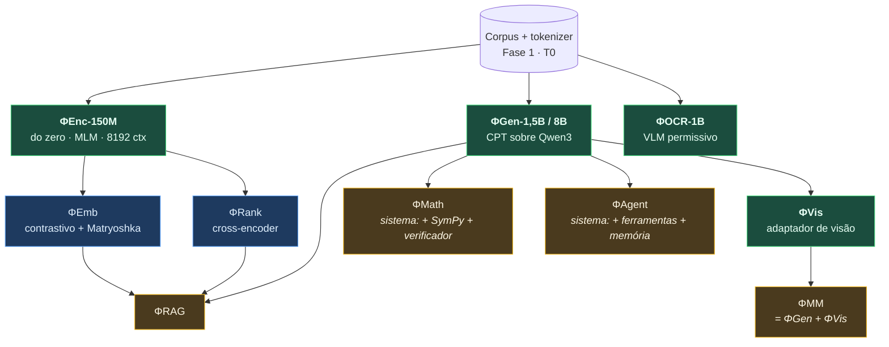

# DOC-07 — Especificação da Família de Modelos

**Projeto:** ΦFM — Phi Foundation Models para Física
**Status:** `RASCUNHO v0.1` — aguardando revisão do Stage-Gate 6
**Cobre:** especificação de toda a família de modelos; resolve **OQ-1** (denso vs. MoE), **OQ-3** (multimodal unificado vs. separado) e **OQ-4** (treino do zero); abre a **Fase 2**
**Depende de:** [DOC-00 §4](../00-foundations/DOC-00-project-charter.md), [DOC-05](../01-data/DOC-05-tokenizer.md), [DOC-06](../01-data/DOC-06-mistura-curriculo-dados-sinteticos.md), [DOC-17A §8](../05-governance/DOC-17A-orcamento-gpu-runpod.md)
**Data:** 2026-08-03

---

## 1. O princípio organizador: nomear não é construir

O briefing lista dez modelos: Physics Encoder, Retriever, Embedding, Generator, Math Solver, Vision, OCR, Multimodal, Code, Agent. A tentação é tratar isso como dez treinos independentes.

**Seria erro de projeto, e caro.** Vários itens da lista não são modelos — são **sistemas construídos em volta de um modelo**, e implementá-los como pesos separados produziria dez artefatos medíocres em vez de quatro bons.

| Item do briefing | O que realmente é | Por quê |
|---|---|---|
| Physics Encoder | ✅ **Modelo próprio** (ΦEnc) | Objetivo, arquitetura e tokenizer distintos justificam treino do zero |
| Physics Embedding | ✅ **Cabeça sobre o ΦEnc** (ΦEmb) | Mesmo tronco, fine-tune contrastivo |
| Physics Retriever | ⚠️ **Não é um terceiro modelo** | Recuperação = ΦEmb + ΦRank. Nomear como modelo separado convida a treinar um redundante |
| Physics Generator | ✅ **Modelo próprio** (ΦGen) | CPT sobre Qwen3, dois tamanhos |
| Physics OCR | ✅ **Modelo próprio** (ΦOCR) | Modalidade e tarefa genuinamente distintas |
| Physics Vision | ✅ **Adaptador sobre o ΦGen** (ΦVis) | Precisa do raciocínio do ΦGen; treinar do zero seria desperdício |
| Physics Multimodal | ⚠️ **É o ΦGen + ΦVis** | Não é um quarto tronco — ver **OQ-3**, §11 |
| **Physics Math Solver** | ❌ **Sistema, não modelo** | ΦGen + SymPy + barramento de verificação + RLVR. Nenhum peso novo — §9 |
| **Physics Code** | ❌ **Não existe separadamente** | O Qwen3 já é forte em código, e a mistura do DOC-06 inclui 5% de código científico. Um modelo de código dedicado seria dinheiro queimado — §10 |
| **Physics Agent** | ❌ **Camada de orquestração** | ΦGen + roteador de ferramentas + memória. Nenhum peso novo — §12 |

**Contagem real de artefatos treinados: quatro troncos** (ΦEnc, ΦGen, ΦOCR, adaptador ΦVis) **e três cabeças** (ΦEmb, ΦRank, e a cabeça de MLM). Tudo o mais é composição.

Essa clareza vale dinheiro: reduz o orçamento da Fase 2 por um fator próximo de três e elimina três projetos que estariam condenados a ser piores que a alternativa composta.



---

## 2. ΦEnc — o encoder de Física

**O único modelo do programa treinado do zero.** A decisão D-01 autoriza justamente aqui, porque 15–30 B tokens são um *excedente* de 5–10× para um modelo de 150 M.

### 2.1 Arquitetura

Base **ModernBERT** (Warner et al., 2024), não BERT/RoBERTa clássico. A diferença é grande e vale enumerar:

| Componente | Escolha | Por que não o clássico |
|---|---|---|
| Posição | **RoPE** | Embeddings absolutos não extrapolam em comprimento |
| **Contexto** | **8.192 tokens** | ★ SciBERT e PhysBERT operam em **512**. Um paper de Física não cabe em 512 tokens — nem a seção de introdução cabe. É a vantagem estrutural mais óbvia sobre os competidores |
| Atenção | Alternada local (janela 128) / global | Atenção global em 8.192 é quadrática e desnecessária na maioria das camadas |
| Ativação | GeGLU | Melhor que GELU a paridade de parâmetros |
| Normalização | Pre-norm, sem termos de bias | Estabilidade de treino |
| Eficiência | Unpadding + sequence packing + FlashAttention-2 | Ganho de vazão de 2–3× — dinheiro direto |

### 2.2 Dimensionamento

| | ΦEnc-150M (principal) | ΦEnc-400M (extensão) |
|---|---|---|
| Camadas | 22 | 28 |
| `d_model` | 768 | 1024 |
| Cabeças | 12 | 16 |
| Vocabulário | **40.960** (DOC-05 §7) | 40.960 |
| Contexto | 8.192 | 8.192 |
| Embedding como % do modelo | 16% | 10% |

O ΦEnc-400M só é treinado se o 150M passar o Portão G1 — não se gasta em escala antes de a receita estar validada.

### 2.3 Objetivo de treino

MLM com taxa de mascaramento de **30%** (o ModernBERT mostra que 15%, do BERT original, é subótimo). Sem NSP — comprovadamente inútil desde o RoBERTa.

**Adição específica de Física, a ser ablacionada:**

> **Mascaramento consciente de equações.** Em uma fração dos exemplos, mascarar uma **equação inteira** em vez de tokens aleatórios, forçando a reconstrução a partir do contexto em prosa.
>
> Hipótese: ensina a relação entre a descrição verbal de um fenômeno e sua expressão formal — exatamente a competência que a recuperação de Física exige. Custo da ablação: **~US$ 5** na escala de 50 M. Se não ajudar, é descartado e o negativo é publicado.

### 2.4 Custo

`C = 6 × 1,5e8 × 3e10 ≈ 2,7e19` FLOPs → ~17 h numa H100 ou ~129 h numa RTX 4090 → **US$ 25–90**.

---

## 3. ΦEmb — embeddings de Física

Fine-tune contrastivo do ΦEnc. É o modelo que decide o Portão **G1** (bater PhysBERT e os embedders gerais).

### 3.1 Dados de treino — o par de citação é gratuito

| Fonte de pares | Volume | Custo | Observação |
|---|---|---|---|
| **Pares de citação** (paper → paper citado) | Dezenas de milhões | **US$ 0** | ★ Já temos o grafo do OpenAlex (DOC-02 §3.1). É a intuição do SPECTER, e o insumo já está no disco |
| Título ↔ resumo | ~1,2 M | US$ 0 | Sinal fraco mas abundante |
| Equação ↔ contexto | Dezenas de milhões | US$ 0 | ★ Específico de Física — habilita busca por fórmula |
| Pergunta ↔ resposta (StackExchange) | ~1 M | US$ 0 | Alinha com intenção de consulta real |
| Seção ↔ seção do mesmo paper | Muitos | US$ 0 | Coerência de documento |

**Nenhum par de treino precisa ser comprado ou anotado.** O grafo de citações resolve o problema de supervisão que normalmente é o gargalo de modelos de embedding.

### 3.2 Arquitetura e técnicas

| Decisão | Escolha | Justificativa |
|---|---|---|
| Objetivo | InfoNCE com negativos in-batch + negativos difíceis minerados | Padrão consolidado |
| **Batch efetivo** | ≥ 8.192 via **GradCache** | Qualidade contrastiva escala com número de negativos; GradCache troca computação por memória e viabiliza batch grande em 24 GB |
| **Dimensão** | **Matryoshka** (Kusupati et al., 2022): 768 / 512 / 256 / 128 / 64 | ★ Um único modelo serve todos os orçamentos de índice. Reduz custo de armazenamento vetorial em até 12× sem retreinar |
| Variante de alta precisão | **Interação tardia** estilo ColBERT | Recuperação densa é fraca em tokens simbólicos raros (`SU(3)`, nomes de detector). Multi-vetor preserva casamento em nível de token |

A escolha Matryoshka é a de melhor relação custo/benefício da família inteira: custa quase nada em treino e dá flexibilidade de implantação que, de outro modo, exigiria treinar cinco modelos.

**Custo: US$ 10–20.**

---

## 4. ΦRank — reranking

Cross-encoder inicializado do ΦEnc. Concatena consulta e documento e pontua conjuntamente — muito mais preciso que similaridade de vetores, e muito mais caro, portanto só reordena o top-100 do ΦEmb.

Treinado com negativos difíceis minerados pelo próprio ΦEmb (o clássico laço recuperador→reranqueador). **Custo: US$ 5–10.**

---

## 5. ΦGen — o modelo generativo

### 5.1 O que controlamos e o que não

Arquitetura **herdada** do Qwen3. Não a redesenhamos — redesenhar significaria treinar do zero, que D-01 proíbe. O que controlamos:

| Sob nosso controle | Herdado |
|---|---|
| Extensão de tokenizer (DOC-05 §9) | Número de camadas, `d_model`, cabeças |
| Mistura e currículo de dados (DOC-06) | Tipo de atenção, ativação, normalização |
| **Extensão de contexto longo** | Esquema de tokenização de números |
| Receita de pós-treino (DOC-09) | Representações pré-existentes |

### 5.2 Extensão de contexto — necessidade, não luxo

Derivações de Física são longas. Um cálculo completo de teoria de perturbação, com preâmbulo e verificação, ultrapassa facilmente 16 k tokens. Truncar significa nunca ver uma derivação inteira.

**Plano:** CPT principal em 4.096 (barato), seguido de fase curta de extensão de contexto via **YaRN** ou interpolação de RoPE até **32.768**, com dados de contexto longo selecionados (papers completos, teses, derivações sintéticas longas do G2).

O custo da fase de extensão é pequeno — tipicamente 1–3% dos tokens totais — porque a atenção em contexto longo é cara e a fase é curta por desenho.

### 5.3 Dimensionamento e custo

| | ΦGen-1,5B | ΦGen-8B |
|---|---|---|
| Origem | Qwen3-1,7B-Base *(confirmar nomenclatura)* | Qwen3-8B-Base |
| Tokens de CPT | 15 B (1 época) | 20 B (2–3 épocas) |
| Memória de treino (AdamW) | ~24 GB | ~128 GB |
| Hardware | 1× H100 | 4× H100 ou 1× MI300X |
| Tempo | ~84 h | ~150 h |
| **Custo** | **US$ 120–240** | **US$ 850–1.700** |

O ΦGen-1,5B é o cavalo de batalha do programa: entrega um modelo generativo de Física real por menos de US$ 250, e os critérios G2.1 e G2.3 são plenamente avaliáveis nele (DOC-00 §5).

---

## 6. ΦOCR — documento para LaTeX

**Adiado até depois do Portão G1** (DOC-03 §1).

| Decisão | Escolha | Justificativa |
|---|---|---|
| Base | **VLM permissivo** (Qwen2.5-VL-3B, Apache-2.0 — confirmar) ou Donut (MIT) | ⚠️ **Não Nougat**: pesos CC BY-NC-4.0, incompatíveis com release Apache-2.0 (DOC-03 §6.2) |
| Tarefa | Imagem de página → Markdown + LaTeX | |
| Dados | **Infinitos e gratuitos** — fonte LaTeX + PDF compilado dos mesmos 1,2 M papers, com recompilação variando classe, fonte, colunas e resolução | DOC-03 §6.3 |
| Meta | ≥ 0,92 de recuperação de equações (critério G1.4) | |
| Custo | **US$ 50–150** | |

---

## 7. ΦVis — leitura de gráficos e figuras

Ataca o modo de falha **F8**. Adaptador de visão sobre o ΦGen, estilo LLaVA: encoder de visão congelado + projetor treinado + fine-tune conjunto leve.

### 7.1 O mesmo truque do ΦOCR, aplicado a gráficos

> **Gerar o gráfico e o rótulo ao mesmo tempo.** Um script matplotlib que plota `y = A x^{-2,3}` com barras de erro **sabe** o expoente, o coeficiente, as barras e as escalas. Perguntar ao modelo "qual é o expoente da lei de potência?" tem gabarito exato, por construção.
>
> Variando tipo de gráfico (log-log, semi-log, dispersão com erro, contorno, mapa de calor, histograma), estilo, densidade de pontos e ruído, o conjunto é **infinito, gratuito e perfeitamente rotulado**.

Complementado por figuras reais de papers pareadas com suas legendas (extraídas no DOC-03 §2.4), que ensinam o vocabulário visual real da literatura.

**Custo: US$ 80–200.** Fica no Tier 2 tardio ou Tier 3.

---

## 8. ΦMM — o multimodal

**Não é um quarto tronco.** É ΦGen + ΦVis operando juntos. Ver **OQ-3**, §11.

---

## 9. ΦMath — por que não é um modelo

O briefing pede um "Physics Math Solver". A implementação correta **não tem pesos próprios**:

```
ΦMath  =  ΦGen
        + SymPy / SciPy / NumPy            (ferramentas — DOC-14)
        + barramento de verificação        (verify/ — DOC-01 §2)
        + treino RLVR com recompensa verificável   (DOC-09, DOC-10)
```

**O argumento.** Um modelo treinado para "resolver matemática de cabeça" compete diretamente com um CAS — e perde, sempre, em qualquer problema algébrico não trivial. O caminho produtivo é o oposto: treinar o modelo a **formular o problema, chamar a ferramenta certa, interpretar o resultado e verificá-lo**. É a lição do raciocínio integrado a ferramentas (TIR) do Qwen-Math e do DeepSeekMath.

Treinar um "ΦMath" separado significaria pagar por pesos que reproduzem mal o que o SymPy faz perfeitamente. **Custo em pesos novos: US$ 0.** O investimento está no RLVR do DOC-09, que serve a todas as capacidades ao mesmo tempo.

---

## 10. ΦCode — por que não existe

O briefing pede um "Physics Code". Três fatos decidem contra:

1. O **Qwen3 já é forte em código** — herdamos isso de graça.
2. A mistura do DOC-06 já inclui **5% de código científico** (SymPy, NumPy, astropy, FEniCS, GEANT4).
3. Um modelo de código dedicado exigiria seu próprio CPT (**+US$ 850–1.700**) para entregar o que o ΦGen já faz.

**Decisão: não existe ΦCode separado.** A capacidade de código vive no ΦGen e é avaliada como dimensão do PhysBench (DOC-11), não como modelo à parte.

> Gatilho de revisão: se a avaliação mostrar que o ΦGen é significativamente pior em código numérico de Física do que o Qwen3 base — ou seja, se o CPT **degradar** código —, isso é uma violação de G2.3 e exige correção na mistura, não um modelo novo.

---

## 11. ΦAgent — camada de orquestração

Planejador, roteador de ferramentas, memória e registro de traços sobre o ΦGen. Nenhum peso novo no Tier 2.

O ΦGen é *treinado* para chamar ferramentas (DOC-10), mas a orquestração — decompor uma tarefa de pesquisa, escolher ferramentas, gerenciar contexto longo, registrar traços auditáveis — é engenharia de sistema, especificada no DOC-14.

**Eventual fine-tune agêntico do ΦGen é decisão de Tier 3**, condicionada a evidência de que a orquestração via prompt é insuficiente.

---

## 12. OQ-1 — denso ou MoE?

### 12.1 O trade-off

Mixture-of-Experts entrega mais parâmetros pelo mesmo custo de FLOPs de treino: só uma fração dos especialistas é ativada por token. É por isso que domina o topo da tabela em modelos de fronteira.

### 12.2 Por que está errado para nós

| Fator | Análise |
|---|---|
| **Nosso gargalo é dado, não computação** | ★ Temos 15–30 B tokens (DOC-04 §7). MoE adiciona parâmetros que **precisam de dados para serem preenchidos**. Adicionar capacidade a um regime já faminto de dados piora, não melhora |
| **Diluição por especialista** | Com 8 especialistas, cada um vê ~1/8 dos tokens. Sobre 20 B tokens, cada especialista é treinado efetivamente com 2,5 B — insuficiente |
| **Memória de inferência** | Todos os especialistas precisam residir em VRAM. Um MoE 8×7B ocupa ~56 B de parâmetros para ativar 13 B. **Inviável no orçamento do DOC-17A** |
| **Complexidade de treino** | Balanceamento de carga, colapso de roteador, instabilidade. Custo de engenharia real sem compensação aqui |
| **CPT sobre base densa** | Q4 escolheu Qwen3 denso. Converter denso→MoE em CPT (*upcycling*) é possível mas exige dados adicionais que não temos |

### 12.3 Decisão

> **Denso, em toda a família, nos Tiers 1 e 2.**
>
> MoE é reconsiderado **apenas no Tier 3**, e sob duas condições simultâneas: corpus acima de ~150 B tokens (exigindo licenciamento ou geração sintética massiva) **e** financiamento externo que cubra a memória de inferência.

MoE é a resposta certa para quem tem excesso de dados e escassez de computação. Nós temos exatamente o inverso.

---

## 13. OQ-3 — multimodal unificado ou separado?

| Opção | Prós | Contras |
|---|---|---|
| **Unificado** (um modelo, todas as modalidades) | Elegante; transferência entre modalidades | Modelos unificados são treinados em escala de fronteira. Na nossa escala, capacidade multitarefa **compete** com capacidade especializada e ambas pioram |
| **Separado + adaptador** ✅ | Cada componente otimizado para sua tarefa; ΦOCR pequeno e rápido; ΦVis herda o raciocínio do ΦGen | Dois artefatos a manter |

**Decisão: separado.**

- **ΦOCR** é modelo próprio, pequeno (~1 B), alta resolução, saída em sequência. É uma tarefa de *transcrição*, não de raciocínio — pagar o preço de um LLM grande nela seria desperdício, e a vazão importa (milhões de páginas).
- **ΦVis** é adaptador sobre o ΦGen. Ler um gráfico *é* uma tarefa de raciocínio — precisa do modelo de mundo do ΦGen.
- **ΦMM** é a composição dos dois, não um terceiro treino.

A distinção de fundo: **transcrição e raciocínio têm requisitos opostos.** Transcrição quer resolução alta e modelo pequeno; raciocínio quer modelo grande e resolução moderada. Um modelo unificado precisa comprometer os dois.

---

## 14. OQ-4 — treino do zero chega a se justificar?

Reavaliação com os números medidos, não com os estimados do DOC-00.

| | DOC-00 (estimativa) | Medido (DOC-04 §7) |
|---|---|---|
| Corpus de treino | 30–60 B | **15–30 B** |
| Necessário para 8 B (Chinchilla) | 160 B | 160 B |
| **Déficit** | 3–5× | **5–10×** |
| Épocas necessárias | 3–5 | **5–10** |
| Zona segura (Muennighoff et al.) | ≤ 4 | ≤ 4 |

**Decisão: D-01 reafirmada e fortalecida.** Treino do zero para o tier generativo exigiria 5–10 épocas — fora da zona segura, com retorno decrescente comprovado. O corpus menor tornou o argumento *mais* forte, não menos.

**Condição de reabertura, no Stage-Gate 4:** corpus acima de **250 B tokens** (só alcançável com licenciamento de editoras somado a geração sintética verificada em escala massiva) **e** orçamento acima de 10⁵ GPU-horas.

> **A evidência que o ΦEnc vai produzir.** O ΦEnc **é** treinado do zero, com tokenizer nativo de Física e contexto de 8.192. Se ele superar amplamente encoders gerais adaptados, isso é evidência de que o viés indutivo nativo importa — e informa diretamente a decisão do Stage-Gate 4. Se o ganho for marginal, é evidência contra, e economiza uma aposta cara mais adiante. **De qualquer forma, a questão fica respondida por medição, por US$ 25–90.**

---

## 15. Orçamento consolidado da família

| Artefato | Tipo | Params | Custo | Degrau |
|---|---|---|---|---|
| **ΦEnc-150M** | Tronco, do zero | 150 M | **US$ 25–90** | T1a |
| **ΦEmb** | Cabeça contrastiva | +0 | **US$ 10–20** | T1a |
| **ΦRank** | Cross-encoder | +0 | **US$ 5–10** | T1b |
| **ΦGen-1,5B** | CPT | 1,5 B | **US$ 120–240** | T2a |
| **ΦGen-8B** | CPT | 8 B | **US$ 850–1.700** | T2c |
| **ΦOCR-1B** | Fine-tune de VLM | ~1 B | **US$ 50–150** | pós-G1 |
| **ΦVis** | Adaptador | ~0,5 B | **US$ 80–200** | T2 tardio / T3 |
| ΦMath | *Sistema* | — | US$ 0 | — |
| ΦCode | *Não existe* | — | US$ 0 | — |
| ΦAgent | *Sistema* | — | US$ 0 | — |
| ΦMM | *Composição* | — | US$ 0 | — |

**Até o Portão G1 (ΦEnc + ΦEmb): US$ 35–110.**
**Até um modelo generativo completo (+ ΦGen-1,5B + ΦRank): US$ 160–360.**

Compare com o custo de tratar os dez itens do briefing como dez modelos: seriam pelo menos três CPTs adicionais, **+US$ 2.500–5.000**, para entregar capacidades piores que as compostas.

---

## 16. Riscos

| Risco | Prob. | Impacto | Mitigação |
|---|---|---|---|
| ΦEnc não bate PhysBERT (falha G1.1) | Média | **Alto** — trava o programa | Vantagens estruturais são grandes (contexto 16× maior, tokenizer nativo, corpus maior). Se falhar, o diagnóstico é obrigatório antes de prosseguir |
| ΦEnc não bate embedders gerais (falha G1.2) | **Alta** | **Alto** | É o critério mais difícil. Embedders gerais de 8 B são fortes. Mitigação: Matryoshka + interação tardia + pares de citação, que eles não têm |
| CPT degrada capacidade geral (falha G2.3) | Média | **Alto** | 1% de texto geral e 5% de código na mistura (DOC-06 §2.3); avaliação de regressão a cada checkpoint |
| Extensão de contexto desestabiliza o ΦGen | Média | Médio | Fase separada e curta; checkpoint antes; avaliação de contexto curto após |
| Base do ΦOCR não é de fato Apache-2.0 | Média | Médio | Verificar antes de treinar (OQ-11); Donut/MIT é alternativa |
| Adaptador ΦVis degrada o ΦGen em texto | Média | Médio | Congelar o ΦGen no treino do adaptador; descongelar só com evidência |

---

## 17. Critérios de aceite do Stage-Gate 6

- [ ] **G1** — Configurações de ΦEnc-150M e ΦGen especificadas em `configs/model/`, construíveis e testadas sob os três perfis de computação (P5)
- [ ] **G2** — Ablação de mascaramento consciente de equações executada; resultado publicado
- [ ] **G3** — Pares de citação extraídos e validados; volume e qualidade medidos
- [ ] **G4** — Matryoshka verificado: degradação de recuperação em 64 dims dentro do esperado
- [ ] **G5** — Decisões OQ-1, OQ-3 e OQ-4 registradas como ADRs
- [ ] **G6** — Confirmação explícita de que ΦMath, ΦCode e ΦAgent **não** recebem pesos próprios no Tier 2
- [ ] **G7** — Licença da base do ΦOCR confirmada por escrito antes de qualquer treino

---

## 18. Questões em aberto

| ID | Questão | Destino |
|---|---|---|
| OQ-27 | Interação tardia (ColBERT) vale o custo de índice em Física? | Medir no DOC-13 com o índice real |
| OQ-28 | ΦEnc-400M compensa sobre o 150M? | Só decidir depois do G1, com dados de escala próprios |
| OQ-29 | Extensão de contexto por YaRN ou interpolação de posição? | DOC-08, com ablação curta |
| OQ-30 | O adaptador ΦVis deve entrar antes ou depois do RLVR do ΦGen? | DOC-09 — ordem afeta interferência |

---

## 19. Referências

1. Warner, B. et al. (2024). *Smarter, Better, Faster, Longer: A Modern Bidirectional Encoder* (ModernBERT). arXiv:2412.13663.
2. Kusupati, A. et al. (2022). *Matryoshka Representation Learning.* NeurIPS.
3. Cohan, A. et al. (2020). *SPECTER: Document-level Representation Learning using Citation-informed Transformers.* ACL.
4. Khattab, O., Zaharia, M. (2020). *ColBERT: Efficient and Effective Passage Search via Contextualized Late Interaction over BERT.* SIGIR.
5. Gao, L. et al. (2021). *Scaling Deep Contrastive Learning Batch Size under Memory Limited Setup* (GradCache). RepL4NLP.
6. Peng, B. et al. (2024). *YaRN: Efficient Context Window Extension of Large Language Models.* ICLR.
7. Liu, H. et al. (2023). *Visual Instruction Tuning* (LLaVA). NeurIPS.
8. Shao, Z. et al. (2024). *DeepSeekMath.* arXiv:2402.03300.
9. Fedus, W. et al. (2022). *Switch Transformers: Scaling to Trillion Parameter Models with Simple and Efficient Sparsity.* JMLR.
10. Muennighoff, N. et al. (2023). *Scaling Data-Constrained Language Models.* NeurIPS.

---

**Fim do DOC-07.** Revisão da §17 necessária antes do DOC-08 (Infraestrutura de Pretraining e Continual Pretraining).
