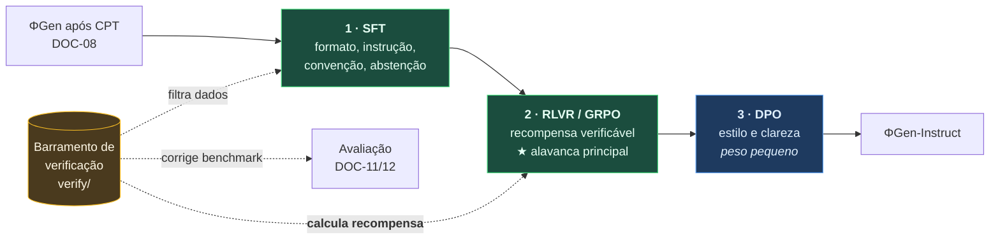

# DOC-09 — Pós-treino: SFT, Preferência, RLVR e Destilação

**Projeto:** ΦFM — Phi Foundation Models para Física
**Status:** `RASCUNHO v0.1` — aguardando revisão do Stage-Gate 8
**Cobre:** entregáveis solicitados **8** (fine-tuning) e **10** (RL); instruction tuning, RLHF, DPO e knowledge distillation
**Depende de:** [DOC-00 §2](../00-foundations/DOC-00-project-charter.md), [DOC-01 §1 (P3)](../00-foundations/DOC-01-system-architecture.md), [DOC-06 §5](../01-data/DOC-06-mistura-curriculo-dados-sinteticos.md), [DOC-08](DOC-08-pretraining-cpt.md)
**Data:** 2026-08-03

---

## 1. A tese: por que RLHF é a técnica errada para Física

Este é o documento onde o barramento de verificação deixa de ser infraestrutura de dados e vira **função de recompensa**. É o retorno do princípio **P3**, e a razão de ele estar no centro da arquitetura desde o DOC-01.

O RLHF convencional treina um modelo de recompensa a partir de preferências humanas. Aplicado a Física, ele tem um defeito que não é de implementação, é de conceito:

> **A preferência humana é um péssimo proxy de correção física.** Anotadores preferem respostas confiantes, bem formatadas e plausíveis. Uma derivação errada, escrita com segurança e bem diagramada, vence uma resposta correta e hesitante. Uma citação inventada com DOI verossímil vence um "não encontrei referência para isso".

Ou seja: **RLHF em Física otimizaria diretamente para os modos de falha F6 (alucinação de citação) e F10 (extrapolação confiante)**, que o DOC-00 §2 identificou como centrais. Não é que RLHF ajude pouco — é que ele empurra na direção errada nesses dois eixos.

A alternativa não é filosófica, é mecânica:

| | RLHF | **RLVR** (Reinforcement Learning from Verifiable Rewards) |
|---|---|---|
| Sinal de recompensa | Modelo treinado em preferência humana | **Verificador executável** |
| Custo por rótulo | US$ 0,10–2,00 (anotação humana) | **~US$ 0** (CPU) |
| Ruído | Alto — desacordo entre anotadores | **Zero** — a equação está certa ou não |
| Hackeável por | Confiança, formatação, comprimento | Degenerescência algébrica (§5.4) |
| Sinal em Física | Fraco e enviesado | **Direto** |

Física está entre os pouquíssimos domínios em que a resposta pode ser conferida mecanicamente. **Não explorar isso e usar preferência humana seria desperdiçar a única vantagem estrutural que o domínio oferece.** É a lição da linhagem DeepSeek-R1 e da série o, e aqui ela se aplica com força ainda maior do que em matemática pura, porque temos análise dimensional e casos-limite além de equivalência simbólica.

**Onde preferência ainda tem lugar:** clareza pedagógica, qualidade de explicação, formatação. São coisas reais e não verificáveis mecanicamente — e recebem peso pequeno, num estágio final (§6).

---

## 2. A cadeia de pós-treino



**Por que RLVR depois de SFT, e não direto do modelo pós-CPT.** O DeepSeek-R1-Zero demonstrou que RL puro a partir da base funciona — ao custo de computação enorme e com saídas de formatação errática. O R1 usou SFT de partida a frio justamente por isso. No nosso orçamento, RL a partir de um modelo que ainda não segue instruções desperdiçaria a maior parte dos rollouts em respostas malformadas que o verificador nem consegue analisar. **SFT primeiro não é convenção — é o que torna o RLVR pagável.**

---

## 3. Estágio 1 — SFT / instruction tuning

### 3.1 Fontes de dados

| Fonte | Volume alvo | Custo | Observação |
|---|---|---|---|
| StackExchange de Física (respostas bem pontuadas) | ~150 k | US$ 0 | Já no corpus; formato pergunta→resposta explicativa |
| Problemas de livros abertos com solução | ~20 k | US$ 0 | OpenStax, LibreTexts CC BY |
| **Sintético verificado** (G1–G5, G7 do DOC-06) | ~200 k | US$ 0 | Solução correta por construção |
| **Traços de derivação** (G2) | ~50 k | US$ 0 | Passo a passo verificado |
| **Localização de erro** (G8) | ~30 k | US$ 0 | Ataca F1 |
| **Traços de uso de ferramenta** | ~50 k | ~US$ 10 | §3.2 |
| **Amostragem por rejeição verificada** | ~100 k | ~US$ 30 | §3.3 — o mecanismo central |
| Semente escrita à mão | ~500 | manual | Ancora o formato e o tom |

### 3.2 Traços de uso de ferramenta

Para que o ΦGen aprenda a chamar SymPy em vez de calcular de cabeça (DOC-07 §9), ele precisa ver exemplos disso. Geração:

1. Tomar um problema com resposta conhecida.
2. Fazer um modelo produzir uma solução **que chama a ferramenta** — formular a expressão, invocar o CAS, interpretar o retorno.
3. **Executar de verdade** a chamada, em sandbox.
4. Manter o traço apenas se o resultado final for verificado.

O passo 3 é o que separa isso de dado sintético comum: as chamadas de ferramenta nos traços de treino são **reais e executadas**, não inventadas. Um traço com chamada que falharia em execução ensinaria o modelo a alucinar APIs.

### 3.3 Amostragem por rejeição — o mecanismo que dispensa anotação

Também chamado STaR (Zelikman et al., 2022):

```
para cada problema com resposta verificável:
    gerar k = 8 soluções com o modelo atual
    manter apenas as que passam no barramento de verificação
    deduplicar por caminho de raciocínio
    treinar sobre as sobreviventes
```

É auto-melhoria, e normalmente auto-melhoria colapsa. **Aqui não colapsa, porque a verificação é o portão.** O modelo só treina naquilo que um verificador externo e mecânico confirmou. É a diferença entre auto-melhoria e realimentação de alucinação — e é possível justamente porque construímos o barramento de verificação primeiro.

Rende dados de instrução de alta qualidade a custo de inferência, sem nenhum anotador.

### 3.4 Duas capacidades que só existem se forem projetadas

**Condicionamento por convenção (ataca F7).** Exemplos em que o prompt de sistema fixa a convenção — *"use assinatura métrica (−,+,+,+)"*, *"use unidades gaussianas"*, *"não assuma ℏ = 1"* — e a resposta a respeita consistentemente. Os rótulos de convenção vêm de graça do DOC-03 §4, e a variante contrária (mesma Física, convenção oposta) é gerada mecanicamente.

**Treino de abstenção (ataca F10).** Exemplos em que a resposta correta é recusar:
- Dados insuficientes para determinar a resposta
- Pergunta que exige extrapolar além do regime de validade da teoria invocada
- Pergunta cuja premissa física é falsa
- Pedido de referência que não se pode verificar

> **Um modelo nunca aprende a se abster por acidente.** Todo o treino empurra para produzir uma resposta. Se exemplos de abstenção não forem construídos deliberadamente e recompensados, o critério **G2.5** (calibração e mecanismo de abstenção funcional) falha por omissão de projeto, não por falha de otimização.

---

## 4. Estágio 2 — a escolha do algoritmo de RL

| Algoritmo | Modelo de recompensa | Crítico | Modelos em memória | Veredito |
|---|---|---|---|---|
| **PPO** | Sim | **Sim** | 4 (política, referência, recompensa, crítico) | ❌ Memória proibitiva no nosso orçamento |
| **DPO** | Implícito | Não | 2 | ✅ Para preferência de estilo (§6) |
| **GRPO** (Shao et al., 2024) | **Não — verificador** | **Não** | **2** | ✅ **Selecionado para RLVR** |
| RLOO | Não | Não | 2 | Equivalente ao GRPO; menos ferramental |

**GRPO selecionado.** Ele dispensa o crítico usando a **média das recompensas de um grupo de respostas amostradas para o mesmo prompt** como linha de base. Para o mesmo problema, gerar 8 respostas e usar a média do grupo substitui inteiramente a rede de valor.

A economia é decisiva aqui: sem crítico, o RLVR do ΦGen-1,5B cabe numa única H100. Com PPO, precisaria de pelo menos duas, e o custo dobraria.

---

## 5. Estágio 3 — RLVR: desenho da recompensa

### 5.1 Componentes

| # | Componente | Verificador | Peso | Ataca |
|---|---|---|---|---|
| R1 | **Correção da resposta final** por equivalência simbólica em CAS | `verify/symbolic` | **1,00** | F1 |
| R2 | Consistência dimensional | `verify/dimensional` | 0,15 | **F2** |
| R3 | Redução em caso-limite | `verify/limits` | 0,15 | **F3** |
| R4 | Concordância numérica por substituição aleatória | `verify/numeric` | 0,10 | F1, F4 |
| R5 | Leis de conservação satisfeitas | `verify/conservation` | 0,10 | F1 |
| R6 | Formato analisável | parser | 0,05 | — |
| R7 | Abstenção correta quando apropriado | rótulo do conjunto | 0,20 | **F10** |

> **Por que R1 domina e os auxiliares são pequenos.** Um auxiliar com peso alto o suficiente para ser buscado isoladamente vira alvo de *reward hacking*. Com peso 0,15, o modelo não consegue compensar uma resposta errada acumulando consistência dimensional — mas ganha o suficiente para que, entre duas respostas igualmente corretas, prefira a dimensionalmente coerente.

**Correção por equivalência de CAS, nunca por casamento de string.** `2\pi\sqrt{L/g}` e `2\pi(L/g)^{1/2}` são a mesma resposta. Corrigir por string subestima sistematicamente a acurácia e — pior no contexto de RL — **treina o modelo a imitar a formatação do gabarito em vez de a física**.

### 5.2 Supervisão de processo: a vantagem que temos e os outros pagam caro

Recompensa de resultado (só a resposta final) é esparsa: uma derivação de 20 passos recebe um único bit de sinal. Recompensa de processo (por passo) atribui crédito muito melhor — mas exige rótulos em nível de passo, que normalmente custam caro. O PRM800K (Lightman et al., 2023) foi construído com anotação humana em larga escala.

> **Nós geramos rótulos de passo mecanicamente e de graça.** O gerador **G2** produz derivações com cada passo verificado por equivalência simbólica com o anterior. O gerador **G8** injeta erros em posições conhecidas. Em ambos os casos, **sabemos exatamente qual passo está certo e qual está errado**, sem nenhum anotador.
>
> É uma vantagem estrutural do domínio combinada com a decisão arquitetural do DOC-01 §1 (P3). Em Física, supervisão de processo é gratuita; em quase todo outro domínio, é o item mais caro do orçamento de pós-treino.

Isso habilita treinar um **PRM (Process Reward Model)** próprio, usado como recompensa densa no GRPO. Especificação no DOC-10.

### 5.3 Configuração do GRPO

| Parâmetro | Valor |
|---|---|
| Grupo (amostras por prompt) | 8 |
| Prompts por passo | 128 |
| Temperatura de rollout | 1,0 |
| Comprimento máximo de geração | 4.096 (32.768 em execuções de raciocínio longo) |
| Coeficiente de KL contra a referência | 0,001–0,01 — **a varrer** |
| Motor de rollout | vLLM ou SGLang colocado (veRL) |
| Passos | ~1.000 |

**O coeficiente de KL é o segundo hiperparâmetro mais perigoso do programa**, depois da LR de CPT. Baixo demais: a política se afasta e perde fluência e capacidade geral. Alto demais: nada acontece. Varredura curta obrigatória.

### 5.4 Reward hacking específico de Física

Formas concretas pelas quais o modelo pode enganar nossos verificadores:

| Ataque | Como funciona | Mitigação |
|---|---|---|
| **Degenerescência algébrica** | Produzir `0 = 0` ou identidade trivial que o CAS aprova | Verificador rejeita respostas triviais e sem as variáveis do problema |
| **Omissão de unidades** | Não escrever unidades faz o teste dimensional passar vacuamente | Ausência de unidades = falha, não neutro |
| **Exploração de tolerância numérica** | Achar resposta dentro da tolerância mas conceitualmente errada | Múltiplas substituições aleatórias independentes; tolerância apertada |
| **Inflação de cadeia de raciocínio** | Gerar passos longos que ganham recompensa de processo sem convergir | R1 domina; PRM só pontua passos que avançam para a resposta |
| **Abstenção oportunista** | Abster-se sempre para colher R7 | R7 só é positivo em itens rotulados como devendo-abster; abstenção indevida é penalizada |

**Mitigação estrutural — verificador reservado:**

> Manter **uma implementação independente de verificador fora do laço de treino**, usada apenas na avaliação. Se a acurácia medida pelo verificador de treino subir e a medida pelo verificador reservado não acompanhar, houve *reward hacking* — e o diagnóstico é imediato em vez de aparecer meses depois como resultado que não replica.

Isso custa apenas a disciplina de manter dois caminhos de código (por exemplo, equivalência por SymPy no treino e por substituição numérica de alta precisão na avaliação), e é o instrumento mais confiável contra hacking sutil.

---

## 6. Estágio 4 — DPO para o que não é verificável

Clareza pedagógica, estrutura da explicação e escolha de notação são reais e não são mecanicamente verificáveis. DPO trata disso — **por último, com peso pequeno e restrição de KL apertada**, para não desfazer o que o RLVR construiu.

| | |
|---|---|
| Dados | Pares de preferência sobre **qualidade de explicação**, entre respostas **ambas verificadas como corretas** |
| Origem | Amostra pequena com julgamento humano ou LLM-juiz, ~5–10 k pares |
| β (KL) | Alto — mudanças conservadoras |
| Custo | ~US$ 20–40 |

**A restrição decisiva:** só entram no par de preferência respostas que **já passaram na verificação**. A preferência escolhe entre explicações corretas — nunca entre correto e incorreto. Isso desarma o defeito conceitual do §1: o julgamento humano nunca é consultado sobre correção física.

---

## 7. Destilação

O briefing pede knowledge distillation. Três variantes, com utilidade muito diferente aqui:

| Variante | Aplicabilidade | Veredito |
|---|---|---|
| **Amostragem por rejeição a partir de modelo forte** | Gerar soluções com um modelo aberto forte, manter só as verificadas, treinar o ΦGen | ✅ **Já é o §3.3.** É destilação, e a verificação a torna segura |
| **Destilação de sequência ΦGen-8B → ΦGen-1,5B** | Depois que o 8B existir | ✅ Tier 2 tardio; barata e eficaz |
| **Destilação de logits** | Requer tokenizer idêntico — temos, dentro da família ΦGen | ✅ Viável; melhor que sequência, exige inferência do professor em paralelo |

> **Nota de honestidade sobre nomenclatura.** "Destilar de um modelo forte" e "gerar dados sintéticos com um modelo forte" são a mesma operação com nomes diferentes. Chamar de destilação não muda o risco de colapso — o que muda é a **verificação**. Os tetos do DOC-06 §6 continuam valendo: nada entra sem passar pelo barramento.

Destilação de fronteira comercial não é considerada — os termos de uso da maioria dos provedores vedam usar saídas para treinar modelos concorrentes, e o programa não constrói sobre base jurídica frágil (ADR-0001).

---

## 8. Orçamento

| Etapa | Modelo | Recurso | Custo |
|---|---|---|---|
| Geração de dados de SFT (rejeição + ferramentas) | 1,5 B | GPU alugada | **~US$ 40** |
| SFT | 1,5 B | 1× H100, ~8 h | **~US$ 25** |
| Varredura de coeficiente de KL (4 valores, curtos) | 1,5 B | ~US$ 25 | **~US$ 25** |
| **RLVR / GRPO** (1.000 passos) | 1,5 B | 1× H100, ~40 h | **~US$ 115** |
| DPO de estilo | 1,5 B | 1× H100, ~4 h | **~US$ 30** |
| **Subtotal — pós-treino do ΦGen-1,5B** | | | **~US$ 235** |
| SFT + RLVR do ΦGen-8B *(opcional, T2c)* | 8 B | 4–8× H100 | **US$ 900–2.200** |

> **Revisão ao DOC-17A §8.2.** Aquele documento estimou o degrau T2b (SFT + RLVR no 1,5 B) em **US$ 100–200**. Detalhado aqui, o número é **~US$ 235**, principalmente pela varredura de KL e pela geração de dados de SFT, que não estavam contabilizadas. O DOC-17A será corrigido. O total até um modelo generativo de Física funcional passa de **US$ 255–560** para **~US$ 300–600**.

---

## 9. Riscos

| Risco | Prob. | Impacto | Mitigação |
|---|---|---|---|
| **Reward hacking** não detectado | **Alta** | **Alto** | Verificador reservado fora do laço (§5.4); auditoria manual de 200 rollouts de alta recompensa |
| Coeficiente de KL mal calibrado degrada capacidade geral | Média | **Alto** (G2.3) | Varredura obrigatória; avaliação de regressão a cada 100 passos de RL |
| RLVR sobreajusta aos tipos de problema verificáveis | **Alta** | Médio | Problemas verificáveis enviesam para algébricos. Manter fração de SFT conceitual; avaliar em questões conceituais não verificáveis |
| Abstenção vira desculpa para não responder | Média | Médio | R7 só positivo em itens rotulados; medir taxa de abstenção indevida |
| Rollouts dominam o custo e estouram o orçamento | Média | Médio | Teto rígido de passos; monitorar custo por passo; parar cedo se a curva saturar |
| DPO final desfaz ganhos do RLVR | Baixa | Médio | β alto; reavaliar todos os portões após o DPO |

> **O terceiro risco merece atenção.** Recompensa verificável enviesa naturalmente para problemas **verificáveis** — algébricos, numéricos, com resposta fechada. Física conceitual ("por que o céu é azul", "o que acontece com a entropia neste processo") não tem verificador mecânico. Um modelo otimizado só por RLVR pode ficar excelente em resolver e medíocre em explicar. **Mitigação: manter peso substancial de dados conceituais no SFT, e incluir questões conceituais explicitamente no PhysBench (DOC-11) como eixo separado de avaliação.**

---

## 10. Critérios de aceite do Stage-Gate 8

- [ ] **I1** — Verificador reservado implementado e independente do de treino; divergência monitorada
- [ ] **I2** — Varredura de coeficiente de KL concluída; escolha justificada por medição conjunta
- [ ] **I3** — Auditoria manual de 200 rollouts de alta recompensa sem evidência de hacking
- [ ] **I4** — Todos os traços de uso de ferramenta no SFT **executados de verdade** em sandbox
- [ ] **I5** — Condicionamento por convenção verificado: mesma questão, convenções opostas, respostas consistentes
- [ ] **I6** — Abstenção funcional: taxa correta em itens de abstenção **e** taxa de abstenção indevida abaixo do limiar (**G2.5**)
- [ ] **I7** — Nenhuma regressão > 2 pontos em benchmarks gerais após toda a cadeia (**G2.3**)
- [ ] **I8** — Correção por equivalência de CAS usada em todo lugar; zero uso de casamento de string
- [ ] **I9** — Avaliação em questões **conceituais** (não verificáveis) medida antes e depois do RLVR

---

## 11. Questões em aberto

| ID | Questão | Destino |
|---|---|---|
| OQ-35 | PRM denso compensa o custo frente a recompensa de resultado? | DOC-10 — ablação |
| OQ-36 | Quantos passos de GRPO antes de saturar? | Monitorar curva; parar cedo é economia direta |
| OQ-37 | Vale destilar ΦGen-8B → 1,5 B, ou o 1,5 B com RLVR próprio já basta? | Depois do T2c |
| OQ-38 | Como avaliar Física conceitual sem verificador? LLM-juiz é confiável aqui? | DOC-12 — protocolo de juiz e concordância humana |

---

## 12. Referências

1. Shao, Z. et al. (2024). *DeepSeekMath: Pushing the Limits of Mathematical Reasoning in Open Language Models* (GRPO). arXiv:2402.03300.
2. Rafailov, R. et al. (2023). *Direct Preference Optimization: Your Language Model is Secretly a Reward Model.* NeurIPS.
3. Zelikman, E. et al. (2022). *STaR: Bootstrapping Reasoning With Reasoning.* NeurIPS.
4. Lightman, H. et al. (2024). *Let's Verify Step by Step.* ICLR.
5. DeepSeek-AI (2025). *DeepSeek-R1: Incentivizing Reasoning Capability in LLMs via Reinforcement Learning.* arXiv:2501.12948.
6. Ouyang, L. et al. (2022). *Training language models to follow instructions with human feedback.* NeurIPS.
7. Ahmadian, A. et al. (2024). *Back to Basics: Revisiting REINFORCE-Style Optimization for RLHF* (RLOO). ACL.
8. Sheng, G. et al. (2024). *HybridFlow: A Flexible and Efficient RLHF Framework* (veRL). EuroSys.
9. Gao, L., Schulman, J., Hilton, J. (2023). *Scaling Laws for Reward Model Overoptimization.* ICML.

---

**Fim do DOC-09.** Revisão da §10 necessária antes do DOC-10 (Raciocínio, Verificação e Treino Integrado a Ferramentas).
