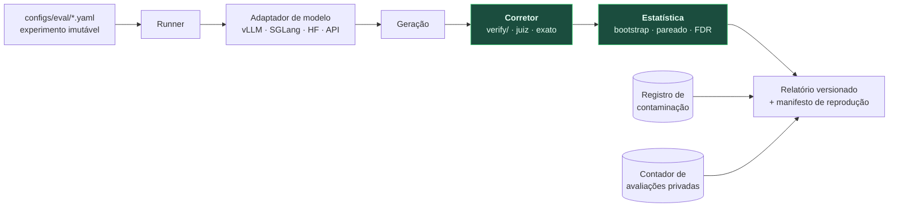

# DOC-12 — Harness de Avaliação e Protocolo Estatístico

**Projeto:** ΦFM — Phi Foundation Models para Física
**Status:** `RASCUNHO v0.1` — aguardando revisão do Stage-Gate 11
**Cobre:** entregável solicitado **11** (pipeline de avaliação); **encerra a Fase 3**
**Depende de:** [DOC-00 §6](../00-foundations/DOC-00-project-charter.md), [DOC-10](../02-models/DOC-10-raciocinio-verificacao-ferramentas.md), [DOC-11](DOC-11-physbench.md)
**Data:** 2026-08-03

---

## 1. A tese: o protocolo importa mais que os números

O DOC-11 define **o que** medir. Este define **como medir sem se enganar**.

A literatura de LLMs está cheia de comparações que não se sustentam: sementes únicas, ausência de intervalos de confiança, baselines convenientes, escolha post hoc da métrica que favorece, contaminação não reportada. Nada disso é fraude — é ausência de protocolo.

> Este programa faz alegações comparativas contra modelos publicados. **Uma alegação sem protocolo estatístico não é resultado, é anedota.** O DOC-00 §6 estabeleceu seis regras de integridade; este documento as torna executáveis e verificadas em CI.

---

## 2. Arquitetura do harness



Construído sobre o **lm-evaluation-harness** da EleutherAI, estendido com nossos corretores. Não reimplementamos infraestrutura de avaliação (P6) — estendemos a que a comunidade já audita.

**Requisito estrutural:** o corretor (`E`) é **o mesmo `verify/`** usado como recompensa de RLVR. É a imposição em código do princípio P3 e a razão de `eval.grading` importar de `verify` no DAG de módulos do DOC-01 §4.3.

---

## 3. Protocolo estatístico

### 3.1 O que é reportado, sempre

| Elemento | Obrigatório |
|---|---|
| Média pontual | ✅ |
| **IC bootstrap de 95%** sobre os itens (10.000 reamostragens) | ✅ |
| Número de itens `n` | ✅ |
| Número de sementes | ✅ ≥ 3 quando há amostragem |
| Versão do conjunto de teste | ✅ |
| Taxa de contaminação | ✅ |
| Taxa de `INCONCLUSIVE` | ✅ |
| Configuração de decodificação | ✅ |

**Um número sem intervalo de confiança não é publicado.** Nem em tabela interna, nem em slide, nem em paper.

### 3.2 Variabilidade: duas fontes distintas

| Fonte | Como capturar |
|---|---|
| **Variabilidade de item** — quais problemas caíram no conjunto | Bootstrap sobre itens |
| **Variabilidade de amostragem** — o modelo é estocástico | ≥ 3 sementes; reportar média e desvio |

São independentes e ambas precisam ser reportadas. Reportar só sementes esconde que o conjunto pode ser pequeno demais; reportar só bootstrap esconde que o modelo é instável.

**Decodificação:** temperatura 0 (`pass@1` determinístico) como número principal, mais `avg@8` com temperatura 0,7 para modelos de raciocínio, onde a variância importa. **A configuração é fixada antes de rodar**, nunca escolhida depois.

### 3.3 Comparações pareadas

Comparar dois modelos nos mesmos itens é um problema **pareado**, e tratá-lo como independente desperdiça poder estatístico e infla o `n` necessário.

| Tipo de métrica | Teste |
|---|---|
| Binária (certo/errado) | **McNemar** sobre pares discordantes |
| Contínua (escore de rubrica) | Bootstrap pareado da diferença |
| Ranqueamento (recuperação) | Wilcoxon pareado |

### 3.4 Múltiplas comparações

Dezesseis tarefas × vários modelos gera muitas hipóteses. Sem correção, **algo parecerá significativo por acaso** — com 16 tarefas e α = 0,05, a chance de ao menos um falso positivo é ~56%.

**Correção de Benjamini-Hochberg (FDR)** sobre a família de testes de cada alegação. Valores `p` brutos e corrigidos são ambos reportados.

### 3.5 Tamanho de efeito, não só significância

> Uma diferença de 0,3 ponto pode ser estatisticamente significativa com `n` grande e **irrelevante na prática**. Uma diferença de 8 pontos pode não atingir significância com `n` pequeno e ser **claramente real**.

Toda alegação reporta a **diferença absoluta com IC**, e o `p` corrigido é informação secundária. Diferenças com ICs sobrepostos são descritas como **não significativas**, nunca como vitória — regra 4 do DOC-00 §6.

### 3.6 Pré-registro

Mecanismo emprestado de ensaios clínicos, e o mais eficaz contra autoengano:

> **Antes de rodar qualquer avaliação de um marco, registrar em arquivo versionado:** quais tarefas são a manchete, qual o limiar de sucesso, quais baselines entram, e qual a hipótese. O commit precede a execução.

Isso impossibilita escolher post hoc a métrica que ficou boa. `configs/eval/preregistration/` guarda esses arquivos, e o relatório final aponta para o hash do pré-registro. Se uma métrica não pré-registrada for reportada, ela é rotulada **exploratória** — legítima, mas não confirmatória.

---

## 4. Correção

### 4.1 Verificável

Delegada ao `verify/` (DOC-10). Três regras:

1. **Equivalência de CAS, nunca casamento de string** (DOC-11 §4).
2. **`INCONCLUSIVE` sai do denominador** e é reportado separadamente — jamais contado como erro do modelo.
3. **Verificador reservado** (DOC-09 §5.4) roda em paralelo; divergência entre ele e o de treino é alerta de reward hacking.

### 4.2 Por juiz LLM

Só para o que não é verificável (`PB-Concept`, qualidade de explicação).

| Regra | Valor |
|---|---|
| Juízes | ≥ 3 modelos distintos |
| Rubrica | Explícita, com âncoras, escrita por física |
| Ordem | Randomizada; posições embaralhadas contra viés de posição |
| Cegamento | O juiz não sabe qual modelo produziu qual resposta |
| **Auto-preferência** | ★ **O ΦGen nunca julga a si mesmo, nem a outro ΦGen** |
| Calibração | Concordância com físicos humanos medida em 200 itens e **publicada** |

O viés de auto-preferência é documentado e forte: modelos preferem o próprio estilo. Usar o ΦGen como juiz do ΦGen inflaria os resultados de forma invisível.

---

## 5. Descontaminação e o relatório que a acompanha

Executada pelos três vetores do DOC-04 §6.2 — n-grama, embedding e **forma canônica de equação** — antes de qualquer alegação.

**O relatório de contaminação é publicado junto com os resultados**, contendo por benchmark: taxa de contaminação, número de itens removidos, e resultados **com e sem** os itens contaminados. Se a diferença entre as duas versões for grande, isso é a informação mais importante da tabela.

**A limitação herdada permanece declarada:** não é possível descontaminar o Qwen3-8B-Base. Por isso o critério **G2.1** — delta contra o próprio modelo base — é a métrica de manchete (DOC-04 §6.4).

---

## 6. Avaliação humana

O critério 6 do DOC-00 §6 exige físico no laço para qualquer alegação de capacidade.

| Elemento | Especificação |
|---|---|
| Amostra | 300 respostas, estratificadas por tarefa e subárea |
| Avaliadores | ≥ 3 físicos, com pelo menos um experimental |
| Cegamento | Duplo — avaliador não sabe o modelo; a ordem é randomizada |
| Instrumento | Rubrica com âncoras + campo livre para erros de Física |
| Concordância | **Alpha de Krippendorff** reportado; abaixo de 0,6 invalida a rodada |
| Portão | Nenhuma alegação de capacidade em Física é publicada sem esta etapa |

O campo livre é o mais valioso: erros que nenhuma métrica automática captura — uma hipótese física implícita e falsa, um raciocínio circular, uma resposta certa por motivo errado.

---

## 7. Avaliação durante o treino vs. avaliação final

| | Durante o treino | Final |
|---|---|---|
| Conjunto | **Público de dev** | **Privado de teste** |
| Frequência | A cada 1.000–5.000 passos | Em marcos |
| Custo | Subconjunto barato | Suíte completa |
| Uso | Diagnóstico, ajuste de mistura | **Alegações** |
| Contabilizado no contador do DOC-11 §8.3 | Não | **Sim** |

**Nunca ajustar hiperparâmetros olhando o conjunto privado.** Fazê-lo o converte em conjunto de validação e destrói sua função — silenciosamente, porque nenhum item vazou.

---

## 8. Reprodutibilidade de um resultado

Todo relatório carrega um **manifesto de reprodução**:

```yaml
result_id: blake3:9f2a...
preregistration: blake3:3c81...      # o pré-registro que precedeu a execução
model:      phifm-gen-1p5b-rlvr-a3f21c04-9b7e0d12-012000
code:       git 7a8c85b
harness:    lm-eval-harness 0.4.x + phifm.eval 0.1.0
benchmark:  PhysBench-v2026.2 (privado)
decoding:   {temperature: 0.0, max_tokens: 4096}
seeds:      [17, 42, 1337]
verifier:   phifm.verify 0.3.1
hardware:   1x H100 80GB SXM
command:    make eval EXPERIMENT=...
```

Um terceiro reproduz ou refuta a partir disso — princípio **P7** do DOC-01. O `verifier` versionado é essencial: uma mudança no barramento pode alterar escores, e resultados antigos nunca são silenciosamente reinterpretados (DOC-10 §10).

---

## 9. O formato padrão de relatório

Toda tabela publicada segue este formato. Exemplo ilustrativo:

| Modelo | PB-Verify | PB-Dim | GPQA-física | MMLU (regressão) |
|---|---|---|---|---|
| Qwen3-8B-Base *(baseline)* | 31,2 ±3,0 | 48,7 ±3,1 | 39,4 ±3,4 | 71,2 ±1,1 |
| **ΦGen-8B** | **52,8 ±3,2** | **74,1 ±2,7** | **48,9 ±3,4** | 70,6 ±1,1 |
| **Δ vs. base** | **+21,6** [17,2; 26,0] | **+25,4** [21,1; 29,7] | **+9,5** [4,8; 14,2] | **−0,6** [−1,9; +0,7] |
| Modelo geral forte ≤32B | 44,1 ±3,2 | 61,3 ±3,0 | 51,2 ±3,4 | 76,8 ±1,0 |

Quatro coisas que este formato força:

1. **A linha de delta contra a base é a manchete** — G2.1.
2. **A coluna de regressão está sempre visível** — G2.3 não pode ser esquecido.
3. **O baseline geral forte aparece**, mesmo quando nos vence (aqui vence em GPQA e MMLU) — regra 3 do DOC-00 §6.
4. **Todo número tem incerteza.**

> Note o exemplo: o modelo geral vence em GPQA-física. **Reportar isso é obrigatório.** Uma tabela em que o nosso modelo vence em tudo seria sinal de que os baselines foram escolhidos a dedo.

---

## 10. Custo

| Item | Custo |
|---|---|
| Execução da suíte completa (1 modelo) | ~US$ 8 |
| Baselines (5 modelos × suíte) | ~US$ 40 |
| Juízes LLM (calibração + `PB-Concept`) | ~US$ 25 |
| Avaliação contínua durante treinos | ~US$ 25 |
| **Total em computação** | **~US$ 100** |
| Avaliação humana | Tempo de especialista |

---

## 11. Riscos

| Risco | Prob. | Impacto | Mitigação |
|---|---|---|---|
| Escolha post hoc da métrica favorável | **Alta** | **Crítico para credibilidade** | Pré-registro versionado (§3.6) |
| Conjunto privado vira validação por uso repetido | Média | **Alto** | Contador publicado; §7 |
| Baselines fracos inflam nossos resultados | Média | **Alto** | Modelo geral forte obrigatório na tabela (§9) |
| Juiz LLM com viés de auto-preferência | **Alta** | Alto | ΦGen nunca julga ΦGen (§4.2) |
| Concordância humana baixa invalida `PB-Concept` | **Alta** | Médio | Krippendorff < 0,6 invalida a rodada; reportado como fraco |
| Bug no verificador afeta treino e avaliação juntos | Média | **Crítico** | Verificador reservado; DOC-10 §12 |

---

## 12. Critérios de aceite do Stage-Gate 11

- [ ] **L1** — Nenhum número publicado sem IC, `n`, sementes e versão do conjunto
- [ ] **L2** — Pré-registro implementado; CI rejeita relatório sem hash de pré-registro
- [ ] **L3** — Testes pareados e correção FDR implementados e usados
- [ ] **L4** — Corretor é literalmente `verify/`; verificado por teste de importação
- [ ] **L5** — Relatório de contaminação gerado automaticamente com todo resultado
- [ ] **L6** — Protocolo de avaliação humana executado, com Krippendorff ≥ 0,6
- [ ] **L7** — Manifesto de reprodução emitido para todo resultado; reprodução verificada por terceiro
- [ ] **L8** — Contador de avaliações contra o conjunto privado ativo e publicado
- [ ] **L9** — Tabela padrão inclui baseline geral forte, mesmo quando ele vence

---

## 13. Questões em aberto

| ID | Questão | Destino |
|---|---|---|
| OQ-47 | `avg@8` ou `pass@1` como métrica principal para modelos de raciocínio? | Fixar antes do primeiro pré-registro |
| OQ-48 | Krippendorff ≥ 0,6 é limiar adequado para julgamento de Física? | Calibrar com a primeira rodada humana |
| OQ-49 | Publicar um leaderboard público exigiria infraestrutura de submissão? | DOC-18 — decisão de release |

---

## 14. Referências

1. Dietterich, T. (1998). *Approximate Statistical Tests for Comparing Supervised Classification Learning Algorithms.* Neural Computation.
2. Benjamini, Y., Hochberg, Y. (1995). *Controlling the False Discovery Rate.* JRSS-B.
3. Efron, B., Tibshirani, R. (1994). *An Introduction to the Bootstrap.* Chapman & Hall.
4. Dwork, C. et al. (2015). *The reusable holdout.* Science 349.
5. Krippendorff, K. (2004). *Content Analysis: An Introduction to Its Methodology.*
6. Zheng, L. et al. (2023). *Judging LLM-as-a-Judge.* NeurIPS.
7. Panickssery, A. et al. (2024). *LLM Evaluators Recognize and Favor Their Own Generations.* NeurIPS.
8. Gao, L. et al. (2023). *A framework for few-shot language model evaluation* (lm-evaluation-harness).

---

**Fim do DOC-12.** Encerra a Fase 3.
