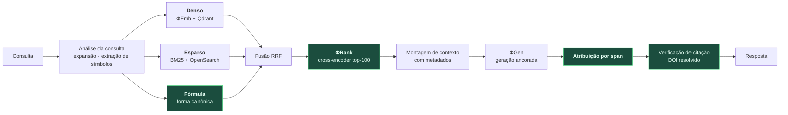

# DOC-13 — Recuperação, Embeddings e Stack de RAG

**Projeto:** ΦFM — Phi Foundation Models para Física
**Status:** `RASCUNHO v0.1` — aguardando revisão do Stage-Gate 12
**Cobre:** entregáveis solicitados **17** (RAG) e **18** (embeddings); abre a **Fase 4**
**Depende de:** [DOC-07 §3, §4](../02-models/DOC-07-familia-de-modelos.md), [DOC-11 §6](../03-evaluation/DOC-11-physbench.md)
**Data:** 2026-08-03

---

## 1. Por que RAG em Física não é RAG genérico

Três diferenças que invalidam a receita padrão:

| Diferença | Consequência |
|---|---|
| **Símbolos raros carregam a consulta** | `SU(3)`, `Λ`CDM, `ATLAS`, `Δm²₃₁` — recuperação densa é notoriamente fraca em tokens raros. Busca híbrida não é otimização, é requisito |
| **A unidade de sentido não é o parágrafo** | Uma equação sem seu contexto é ruído; uma derivação partida ao meio é pior que ausente. Chunking ingênuo destrói o conteúdo mais valioso |
| **Citação errada é falha catastrófica** | O DOC-00 §2 (F6) e o destino do Galactica. Precisão de citação é **portão**, não métrica |

E uma vantagem: o corpus é **nosso**, com proveniência, licença, taxonomia e equações canonicalizadas já no schema (DOC-01 §6). Um sistema de RAG genérico opera sobre texto opaco; o nosso opera sobre documentos estruturados.

---

## 2. Arquitetura



---

## 3. Chunking: onde a maioria dos sistemas erra

Chunking por número fixo de tokens é o padrão da indústria e é **destrutivo em Física**.

**Regras de fronteira, em ordem de precedência:**

| # | Regra |
|---|---|
| 1 | **Nunca partir uma equação** — nem um ambiente `align`/`equation` |
| 2 | **Nunca separar uma equação do seu contexto** — `context_before`/`context_after` do DOC-03 §2.5 acompanham |
| 3 | Preferir fronteiras de seção e subseção |
| 4 | Manter tabelas e legendas de figura íntegras |
| 5 | Só então respeitar o tamanho-alvo (~512 tokens, com sobreposição de 64) |

**Chunking hierárquico:** indexar em três granularidades — documento, seção e trecho — e recuperar no nível que a consulta pedir. Uma pergunta conceitual quer a seção; uma busca por fórmula quer o trecho; "que papers tratam disso" quer o documento.

Cada chunk carrega, herdado do `PhysicsDocumentRecord`: `doc_id`, seção, subárea, tipo de documento, nível, ano, **licença** e as equações canonicalizadas que contém.

---

## 4. Busca híbrida

### 4.1 As três pernas

| Perna | Motor | Boa em | Fraca em |
|---|---|---|---|
| **Densa** | ΦEmb + Qdrant | Similaridade semântica, paráfrase | Símbolos raros, casamento exato |
| **Esparsa** | BM25 (OpenSearch) | Termos raros, nomes próprios, siglas | Sinônimos, reformulação |
| **Fórmula** ★ | Índice de `canonical_latex` | **Recuperação por equação** | Só serve a consultas com fórmula |

A terceira perna é específica do domínio e só é possível porque o DOC-03 §3 produziu a forma canônica. É o que responde *"que papers usam esta equação?"* sob variação notacional.

### 4.2 Fusão

**Reciprocal Rank Fusion (RRF):** `score(d) = Σᵢ 1/(k + rankᵢ(d))`, com `k = 60`.

Escolhido sobre combinação linear de escores porque **escores de motores diferentes não são comparáveis** — normalizá-los exige calibração frágil que quebra quando a distribuição de consultas muda. RRF opera sobre ranks, é livre de parâmetros e é robusto.

### 4.3 Reranking

`ΦRank` (DOC-07 §4) reordena o top-100. Cross-encoder é ~100× mais caro por par que similaridade de vetores, e por isso só vê candidatos, nunca o índice.

**Interação tardia (ColBERT) como variante de alta precisão** — resolve **OQ-27**: multi-vetor preserva casamento em nível de token, que é exatamente a fraqueza da recuperação densa em Física. Custo: índice ~10–20× maior. Decisão empírica no §9.

---

## 5. Filtragem por metadados

Vantagem direta do schema. Filtros disponíveis nativamente:

`subárea` · `nível` (graduação/pós/pesquisa) · `tipo de documento` · `intervalo de anos` · **`licença`** · `tem journal-ref` · `contagem de citações` · `convenção` (assinatura métrica, sistema de unidades)

> **O filtro de convenção é único.** Um estudante pedindo eletromagnetismo em SI não deveria receber trechos em unidades gaussianas sem aviso — é o modo de falha F7 se manifestando na camada de recuperação. Com o campo `physics.conventions` do DOC-03 §4, o filtro é trivial. Sem ele, seria impossível.

O filtro de **licença** habilita um modo "só conteúdo redistribuível", em que toda citação pode ser mostrada na íntegra — útil para demonstrações públicas.

---

## 6. Geração ancorada e atribuição

### 6.1 O contrato

O ΦGen recebe os trechos recuperados com identificadores e deve **atribuir cada afirmação verificável a um span de origem**.

```
"A constante de estrutura fina vale aproximadamente 1/137 [C1],
 e sua variação temporal está limitada a |α̇/α| < 10⁻¹⁷ ano⁻¹ [C3]."

C1 → doc_id:9f2a…, seção 2, span [1240:1310], DOI 10.xxxx/…
C3 → doc_id:3c81…, seção 4, span [880:960],  DOI 10.xxxx/…
```

### 6.2 Verificação de citação — o portão

Antes de a resposta sair, cada citação passa por:

| Verificação | Falha significa |
|---|---|
| O `doc_id` existe no índice? | Alucinação de fonte |
| O span está dentro do documento? | Alucinação de localização |
| O DOI **resolve** no Crossref? | **DOI inventado — falha automática** |
| O span **sustenta** a afirmação? (entailment) | Atribuição incorreta |

**Meta: precisão de citação ≥ 0,95 (critério G2.4).** Uma citação que falha é removida, e a afirmação correspondente é marcada como não fundamentada — nunca apresentada como se tivesse fonte.

Isto é a resposta direta ao que retirou o Galactica do ar em três dias. **Não é pós-processamento cosmético — é uma restrição dura de saída.**

---

## 7. Caching

| Camada | O que guarda | Ganho |
|---|---|---|
| Embedding de consulta | Vetor por consulta normalizada | Alto — consultas repetem |
| Resultados de recuperação | Top-`k` por (consulta, filtros) | Alto |
| **Prefixo de KV** (SGLang RadixAttention) | Prompt de sistema + trechos comuns | ★ Muito alto em uso agêntico |
| Resolução de DOI | Respostas do Crossref | Reduz dependência externa |

O cache de prefixo é o mais relevante: em uso agêntico o mesmo prompt de sistema e os mesmos trechos reaparecem em muitas chamadas, e é a razão da escolha do SGLang no DOC-01 §5.6.

**Invalidação:** ligada ao snapshot Iceberg do corpus. Novo snapshot invalida caches de recuperação; caches de embedding sobrevivem enquanto o ΦEmb não mudar de versão.

---

## 8. Escala e infraestrutura

| Métrica | Valor estimado |
|---|---|
| Documentos | ~15–25 M |
| Chunks (nível de trecho) | ~150–250 M |
| Dimensão do vetor | 768, com Matryoshka para 256/128 |
| Índice denso em 768 dims (fp16) | ~350 GB |
| **Índice denso em 128 dims (Matryoshka)** | **~60 GB** |
| Índice BM25 | ~80 GB |
| Índice de fórmulas | ~15 GB |

> **O Matryoshka paga aqui.** Indexar em 128 dimensões reduz o índice de 350 GB para 60 GB — a diferença entre exigir um servidor dedicado e caber num VPS modesto. Estratégia: **índice em 128 dims para recuperação ampla, rerank com o vetor de 768 dims sobre o top-1.000**. Precisão quase inalterada, custo de armazenamento seis vezes menor.

**Perfil mínimo (desenvolvimento):** pgvector ou LanceDB, corpus reduzido, roda local, US$ 0.
**Perfil de produção:** Qdrant + OpenSearch, ~US$ 40–80/mês num VPS.

---

## 9. Avaliação

Contra as tarefas da Trilha C do DOC-11: `PB-Retrieve`, `PB-Cite`, `PB-Formula`.

| Métrica | Meta |
|---|---|
| nDCG@10 vs. **PhysBERT** | **+5 pontos** (critério G1.1) |
| nDCG@10 vs. melhor embedder geral | Superior com 1/10 dos parâmetros (**G1.2**) |
| Recall@100 (denso vs. híbrido) | Quantificar o ganho da busca híbrida |
| **Precisão de citação** | **≥ 0,95** (G2.4) |
| Taxa de DOI alucinado | **0** |
| Latência p95 ponta a ponta | < 2 s |

**Ablações obrigatórias**, porque cada perna precisa justificar seu custo: denso puro · esparso puro · híbrido sem rerank · híbrido com rerank · com e sem a perna de fórmula · 128 vs. 768 dims · com e sem interação tardia (**OQ-27**).

---

## 10. Riscos

| Risco | Prob. | Impacto | Mitigação |
|---|---|---|---|
| Chunking parte derivações apesar das regras | Média | **Alto** | Auditoria de 10.000 chunks; zero cortes em ambiente matemático |
| Recuperação densa falha em símbolos raros | **Alta** | Médio | Perna esparsa é obrigatória, não opcional |
| Precisão de citação abaixo de 0,95 | Média | **Bloqueia G2.4** | Verificação como restrição dura; afirmação sem fonte válida é marcada, não publicada |
| Índice de 350 GB inviável no orçamento | Média | Médio | Matryoshka em 128 dims (§8) |
| Cache serve resultado obsoleto após atualização de corpus | Média | Baixo | Invalidação por snapshot Iceberg |
| Interação tardia infla o índice sem ganho proporcional | Média | Baixo | Decisão empírica (§9) |

---

## 11. Critérios de aceite do Stage-Gate 12

- [ ] **M1** — Auditoria de chunking: zero cortes em ambiente matemático em 10.000 amostras
- [ ] **M2** — Busca híbrida supera cada perna isolada, com ganho medido
- [ ] **M3** — Perna de fórmula demonstrada em consultas por equação com variação notacional
- [ ] **M4** — Precisão de citação ≥ 0,95; DOI alucinado = 0 (**G2.4**)
- [ ] **M5** — Filtro de convenção funcional e verificado
- [ ] **M6** — Ablação de Matryoshka: degradação em 128 dims quantificada e aceitável
- [ ] **M7** — OQ-27 (interação tardia) decidida por medição
- [ ] **M8** — Portões G1.1 e G1.2 avaliados com o índice real

---

## 12. Referências

1. Cormack, G. et al. (2009). *Reciprocal Rank Fusion outperforms Condorcet and individual Rank Learning Methods.* SIGIR.
2. Khattab, O., Zaharia, M. (2020). *ColBERT.* SIGIR.
3. Kusupati, A. et al. (2022). *Matryoshka Representation Learning.* NeurIPS.
4. Lewis, P. et al. (2020). *Retrieval-Augmented Generation for Knowledge-Intensive NLP Tasks.* NeurIPS.
5. Gao, L. et al. (2023). *Enabling Large Language Models to Generate Text with Citations.* EMNLP.
6. Zheng, L. et al. (2024). *SGLang: Efficient Execution of Structured Language Model Programs.* NeurIPS.

---

**Fim do DOC-13.**
