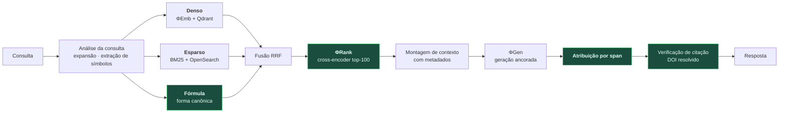

# DOC-13 — Recuperação, Embeddings e Stack de RAG

**Projeto:** ΦFM — Phi Foundation Models para Física
**Status:** `RASCUNHO v0.1` — aguardando revisão do Stage-Gate 12
**Cobre:** entregáveis solicitados **17** (RAG) e **18** (embeddings); abre a **Fase 4**
**Depende de:** [DOC-07 §3, §4](../02-models/DOC-07-familia-de-modelos.md), [DOC-11 §6](../03-evaluation/DOC-11-physbench.md)
**Data:** 2026-08-03

---

## 1. Por que RAG em Física não é RAG genérico

Três diferenças que invalidam a receita padrão:

| Diferença | Consequência |
|---|---|
| **Símbolos raros carregam a consulta** | `SU(3)`, `Λ`CDM, `ATLAS`, `Δm²₃₁` — recuperação densa é notoriamente fraca em tokens raros. Busca híbrida não é otimização, é requisito |
| **A unidade de sentido não é o parágrafo** | Uma equação sem seu contexto é ruído; uma derivação partida ao meio é pior que ausente. Chunking ingênuo destrói o conteúdo mais valioso |
| **Citação errada é falha catastrófica** | O DOC-00 §2 (F6) e o destino do Galactica. Precisão de citação é **portão**, não métrica |

E uma vantagem: o corpus é **nosso**, com proveniência, licença, taxonomia e equações canonicalizadas já no schema (DOC-01 §6). Um sistema de RAG genérico opera sobre texto opaco; o nosso opera sobre documentos estruturados.

---

## 2. Arquitetura


```mermaid
flowchart LR
    Q[Consulta] --> QA["Análise da consulta<br/>expansão · extração de símbolos"]
    QA --> D["<b>Denso</b><br/>ΦEmb + Qdrant"]
    QA --> S["<b>Esparso</b><br/>BM25 + OpenSearch"]
    QA --> F["<b>Fórmula</b><br/>forma canônica"]
    D --> FUS["Fusão RRF"]
    S --> FUS
    F --> FUS
    FUS --> R["<b>ΦRank</b><br/>cross-encoder top-100"]
    R --> C["Montagem de contexto<br/>com metadados"]
    C --> G["ΦGen<br/>geração ancorada"]
    G --> AT["<b>Atribuição por span</b>"]
    AT --> V["Verificação de citação<br/>DOI resolvido"]
    V --> OUT[Resposta]

    classDef key fill:#1b4d3e,stroke:#4ade80,color:#e6fff4
    class F,R,AT,V key
```

---

## 3. Chunking: onde a maioria dos sistemas erra

Chunking por número fixo de tokens é o padrão da indústria e é **destrutivo em Física**.

**Regras de fronteira, em ordem de precedência:**

| # | Regra |
|---|---|
| 1 | **Nunca partir uma equação** — nem um ambiente `align`/`equation` |
| 2 | **Nunca separar uma equação do seu contexto** — `context_before`/`context_after` do DOC-03 §2.5 acompanham |
| 3 | Preferir fronteiras de seção e subseção |
| 4 | Manter tabelas e legendas de figura íntegras |
| 5 | Só então respeitar o tamanho-alvo (~512 tokens, com sobreposição de 64) |

**Chunking hierárquico:** indexar em três granularidades — documento, seção e trecho — e recuperar no nível que a consulta pedir. Uma pergunta conceitual quer a seção; uma busca por fórmula quer o trecho; "que papers tratam disso" quer o documento.

Cada chunk carrega, herdado do `PhysicsDocumentRecord`: `doc_id`, seção, subárea, tipo de documento, nível, ano, **licença** e as equações canonicalizadas que contém.

---

## 4. Busca híbrida

### 4.1 As três pernas

| Perna | Motor | Boa em | Fraca em |
|---|---|---|---|
| **Densa** | ΦEmb + Qdrant | Similaridade semântica, paráfrase | Símbolos raros, casamento exato |
| **Esparsa** | BM25 (OpenSearch) | Termos raros, nomes próprios, siglas | Sinônimos, reformulação |
| **Fórmula** ★ | Índice de `canonical_latex` | **Recuperação por equação** | Só serve a consultas com fórmula |

A terceira perna é específica do domínio e só é possível porque o DOC-03 §3 produziu a forma canônica. É o que responde *"que papers usam esta equação?"* sob variação notacional.

> ⚠️ **Medido em 2026-09-18, e aceito em 2026-09-23 ([DOC-11 §6.3](../03-evaluation/DOC-11-physbench.md)):** a perna densa **não** é fraca em casamento de equação neste corpus. No PB-Formula, estrato que exige variação notacional, o ΦEmb do sistema faz recall@1 **0,8595** contra **0,7115** do BM25 sobre a equação inteira, e a vantagem cresce com a variação. A coluna "fraca em" da perna densa descreve a expectativa da literatura, não a medida daqui.
>
> A perna de fórmula, portanto, **não se justifica por esse número**: consultas que são equações verbatim de artigos o denso já resolve. Ela teria de se justificar por consultas que usuários escrevem — fórmula misturada com texto, ou forma canônica distante da grafia —, que não foram medidas. Até lá, o M3 fica sem evidência a favor, e a esparsa já saiu da composição pela regra do T1b2 (2026-09-08).

### 4.2 Fusão

**Reciprocal Rank Fusion (RRF):** `score(d) = Σᵢ 1/(k + rankᵢ(d))`, com `k = 60`.

Escolhido sobre combinação linear de escores porque **escores de motores diferentes não são comparáveis** — normalizá-los exige calibração frágil que quebra quando a distribuição de consultas muda. RRF opera sobre ranks, é livre de parâmetros e é robusto.

### 4.3 Reranking

`ΦRank` (DOC-07 §4) reordena o top-100. Cross-encoder é ~100× mais caro por par que similaridade de vetores, e por isso só vê candidatos, nunca o índice.

**Interação tardia (ColBERT) como variante de alta precisão** — resolve **OQ-27**: multi-vetor preserva casamento em nível de token, que é exatamente a fraqueza da recuperação densa em Física. Custo: índice ~10–20× maior. Decisão empírica no §9.

---

## 5. Filtragem por metadados

Vantagem direta do schema. Filtros disponíveis nativamente:

`subárea` · `nível` (graduação/pós/pesquisa) · `tipo de documento` · `intervalo de anos` · **`licença`** · `tem journal-ref` · `contagem de citações` · `convenção` (assinatura métrica, sistema de unidades)

> **O filtro de convenção é único.** Um estudante pedindo eletromagnetismo em SI não deveria receber trechos em unidades gaussianas sem aviso — é o modo de falha F7 se manifestando na camada de recuperação. Com o campo `physics.conventions` do DOC-03 §4, o filtro é trivial. Sem ele, seria impossível.

O filtro de **licença** habilita um modo "só conteúdo redistribuível", em que toda citação pode ser mostrada na íntegra — útil para demonstrações públicas.

---

## 6. Geração ancorada e atribuição

### 6.1 O contrato

O ΦGen recebe os trechos recuperados com identificadores e deve **atribuir cada afirmação verificável a um span de origem**.

```
"A constante de estrutura fina vale aproximadamente 1/137 [C1],
 e sua variação temporal está limitada a |α̇/α| < 10⁻¹⁷ ano⁻¹ [C3]."

C1 → doc_id:9f2a…, seção 2, span [1240:1310], DOI 10.xxxx/…
C3 → doc_id:3c81…, seção 4, span [880:960],  DOI 10.xxxx/…
```

### 6.2 Verificação de citação — o portão

Antes de a resposta sair, cada citação passa por:

| Verificação | Falha significa |
|---|---|
| O `doc_id` existe no índice? | Alucinação de fonte |
| O span está dentro do documento? | Alucinação de localização |
| O DOI **resolve** no Crossref? | **DOI inventado — falha automática** |
| O span **sustenta** a afirmação? (entailment) | Atribuição incorreta |

**Meta: precisão de citação ≥ 0,95 (critério G2.4).** Uma citação que falha é removida, e a afirmação correspondente é marcada como não fundamentada — nunca apresentada como se tivesse fonte.

Isto é a resposta direta ao que retirou o Galactica do ar em três dias. **Não é pós-processamento cosmético — é uma restrição dura de saída.**

---

## 7. Caching

| Camada | O que guarda | Ganho |
|---|---|---|
| Embedding de consulta | Vetor por consulta normalizada | Alto — consultas repetem |
| Resultados de recuperação | Top-`k` por (consulta, filtros) | Alto |
| **Prefixo de KV** (SGLang RadixAttention) | Prompt de sistema + trechos comuns | ★ Muito alto em uso agêntico |
| Resolução de DOI | Respostas do Crossref | Reduz dependência externa |

O cache de prefixo é o mais relevante: em uso agêntico o mesmo prompt de sistema e os mesmos trechos reaparecem em muitas chamadas, e é a razão da escolha do SGLang no DOC-01 §5.6.

**Invalidação:** ligada ao snapshot Iceberg do corpus. Novo snapshot invalida caches de recuperação; caches de embedding sobrevivem enquanto o ΦEmb não mudar de versão.

---

## 8. Escala e infraestrutura

| Métrica | Valor estimado |
|---|---|
| Documentos | ~15–25 M |
| Chunks (nível de trecho) | ~150–250 M |
| Dimensão do vetor | 768, com Matryoshka para 256/128 |
| Índice denso em 768 dims (fp16) | ~350 GB |
| **Índice denso em 128 dims (Matryoshka)** | **~60 GB** |
| Índice BM25 | ~80 GB |
| Índice de fórmulas | ~15 GB |

> **O Matryoshka paga aqui.** Indexar em 128 dimensões reduz o índice de 350 GB para 60 GB — a diferença entre exigir um servidor dedicado e caber num VPS modesto. Estratégia: **índice em 128 dims para recuperação ampla, rerank com o vetor de 768 dims sobre o top-1.000**. Precisão quase inalterada, custo de armazenamento seis vezes menor.

**Perfil mínimo (desenvolvimento):** pgvector ou LanceDB, corpus reduzido, roda local, US$ 0.
**Perfil de produção:** Qdrant + OpenSearch, ~US$ 40–80/mês num VPS.

---

## 9. Avaliação

Contra as tarefas da Trilha C do DOC-11: `PB-Retrieve`, `PB-Cite`, `PB-Formula`.

| Métrica | Meta |
|---|---|
| nDCG@10 vs. **PhysBERT** | **+5 pontos** (critério G1.1) |
| nDCG@10 vs. melhor embedder geral | Superior com 1/10 dos parâmetros (**G1.2**) |
| Recall@100 (denso vs. híbrido) | Quantificar o ganho da busca híbrida |
| **Precisão de citação** | **≥ 0,95** (G2.4) |
| Taxa de DOI alucinado | **0** |
| Latência p95 ponta a ponta | < 2 s |

**Ablações obrigatórias**, porque cada perna precisa justificar seu custo: denso puro · esparso puro · híbrido sem rerank · híbrido com rerank · com e sem a perna de fórmula · 128 vs. 768 dims · com e sem interação tardia (**OQ-27**).

### 9.1 A medida do assistente — ACEITA em 2026-09-24, escrita antes de qualquer item

> Escrita antes de qualquer item existir. Os limiares são do dono: **0,90** para o gerador
> (ele recusou os 0,75 da primeira versão) e **0,05** para a busca, aceitos em 2026-09-24.
> A implementação é `phifm.eval.assistente`; as constantes de lá são estas.

**A pergunta.** O assistente (`scripts/perguntar.py`: Qwen3-8B aberto + a nossa busca) erra
por causa de **quem**: da busca, que não traz o artigo certo, ou do modelo que escreve, que
não o usa bem? O ΦGen — pré-treino continuado de um modelo em Física, US$ 120–240 no 1,5 B —
mexe **só no segundo**. Se o gerador aberto já acerta com a fonte certa na mão, o ΦGen
não tem onde ganhar no assistente, e o dinheiro vai para a busca ou para lugar nenhum.

**O que ela NÃO decide.** O ΦGen como resolvedor de problemas — os benchmarks fechados do
G2 (GPQA-física, OlympiadBench…), sem artigo nenhum no prompt. Para isso a medida é o G2.1,
e ela exige treinar. Esta mede o assistente de literatura, que é o produto que existe.

#### Os itens — gabarito de graça, com o instrumento validado antes

| | |
|---|---|
| fonte | artigo **P** sorteado das 20.372 âncoras de validação (semente fixa), fora do treino do encoder e dentro do índice |
| pergunta | **o Claude (Opus 5.5)** lê **só o resumo de P** — sem o título — e escreve, em português, uma pergunta que um físico faria e cuja resposta é um fato do resumo, mais o **gabarito** curto; `NENHUMA` se o resumo não tiver fato verificável. As regras são as do `SISTEMA_PERGUNTA` de `phifm.eval.assistente` |
| por que não o Qwen | *decisão do dono, 2026-09-24, antes de qualquer braço.* Três versões escritas pelo Qwen3-8B, nos artigos de desenvolvimento (excluídos do conjunto formal), deram ~20 de 40 válidas na minha triagem: perguntas que dependem do artigo ("previsto pelo modelo") e gabaritos que não respondem ("é grande"). Com raciocínio e um crítico, 38 s por pergunta (~17 h no total) e o crítico aprovou gabarito vazio |
| guarda contra cópia | descartada se ≥ 50% das palavras de conteúdo da pergunta estiverem no título de P |
| **primário** | **500 itens** — o mínimo do DOC-11 §8.2; IC de ±2,6 pontos perto de 0,90 |
| estrato de contaminação | **+150** dos 449 artigos criados a partir de 2025-06, depois do lançamento do Qwen3 — o modelo não pode tê-los lido; reportado à parte. O primário sorteia das âncoras de ANTES do corte, para os estratos não se sobreporem |
| privacidade | as perguntas e os gabaritos ficam no HD, fora do git (DOC-11 §8.1: o conjunto de teste não é publicado); versionam-se o manifesto com hashes e os resultados agregados |

**I1 · validade do instrumento, ANTES de qualquer braço rodar.** 40 perguntas sorteadas,
revisadas pelo dono: clara? respondível pelo resumo? gabarito certo? Se menos de **32 de
40** forem válidas, o gerador de perguntas é refeito e o sorteio repetido — e só então os
braços rodam. É o instrumento sendo conferido antes do número, como no PB-Formula. As 40
são as primeiras aceitas de cada permutação (31 do primário, 9 do pós-corte, na proporção
500:150) e **ficam no conjunto como estão**: consertá-las uma a uma deixaria a amostra
revisada melhor que o resto, e a taxa de validade deixaria de valer para o conjunto.

#### Os três braços — mesmo modelo, mesmo prompt, configuração do produto, semente fixa

| braço | o que o modelo recebe |
|---|---|
| **A · sistema** | o que o assistente faz hoje: consulta hipotética → busca → 6 fontes |
| **B · fonte garantida** | as mesmas 6; se **P** não veio, **P** entra no lugar da 6ª, em posição sorteada. Onde P veio, B = A |
| **C · sem fontes** | a pergunta sozinha, respondida de memória |

#### As métricas

**Julgada (a que decide):** a resposta contém o fato do gabarito, sem contradizê-lo?
`certo` · `parcial` · `errado` · `absteve`. Só `certo` conta como acerto. Juiz: o Qwen3-8B
**com o gabarito na mão**, sem saber o braço.

**I3 · o juiz é calibrado, ou o número não vale** (DOC-11 §5: número de LLM-juiz sem
concordância humana é opinião). 100 respostas sorteadas (50 de A, 50 de B, braço oculto)
julgadas pelo dono; publica-se a concordância. Se κ de Cohen < 0,6, o resultado é
**NÃO DECIDIDO pelo instrumento**, e o juiz é consertado antes de qualquer leitura.

**Mecânicas (sem juiz):** P entre as 6 fontes (A); P citada quando presente (A, B);
citações inventadas removidas pelo portão; abstenção em item respondível.

**R · a revisão dos erros de B — o que tira o instrumento da conta do gerador.** Toda
resposta de B que o juiz não marcar `certo` vai ao dono, que a classifica: **o modelo
errou** · **o juiz errou** (a resposta estava certa) · **o item é inválido** (pergunta
mal feita ou gabarito errado). Se forem mais de 100, revisam-se 100 sorteadas, e as
proporções entram no bootstrap. Sem isso, pergunta ruim e juiz errado contariam como erro
do modelo — até 5–10 pontos — e uma barra alta reprovaria um gerador bom por culpa do
instrumento, empurrando para o caminho caro.

#### A regra — IC 95% por bootstrap pareado por item, lado inteiro do limiar ou não decide

- **acerto_B** = acertos de B ÷ itens válidos de B, depois de R (`juiz errou` conta como
  acerto; `item inválido` sai do denominador).
  **Gerador BASTA** se o IC inteiro ≥ **0,90**; **LIMITA** se o IC inteiro < 0,90.
- **lacuna_da_busca** = acerto_B − acerto_A **pelo juiz, nos dois braços** — sem R. A
  revisão só existe em B; usá-la de um lado só inflaria a lacuna. Com o mesmo juiz nos dois,
  o ruído do instrumento é o mesmo e se cancela na diferença.
  **Busca LIMITA** se o IC inteiro > **0,05**; **NÃO LIMITA** se o IC inteiro < 0,05.
- Fora disso: **NÃO DECIDIDO** naquele eixo, e o número vai para o ESTADO como está.

| | busca NÃO limita | busca LIMITA |
|---|---|---|
| **gerador BASTA** | assistente pronto para uso; **o ΦGen não se justifica pelo assistente** | investir na busca (trechos do texto completo, §3; reranqueador), não no ΦGen |
| **gerador LIMITA** | ΦGen é candidato — **mas antes o teste barato**: braço B com um modelo geral maior (Qwen3-14B). Se ele fechar a maior parte da diferença, o remédio é escala, não pré-treino em Física | os dois limitam: a busca primeiro (US$ 0) e medir de novo |

Por que 0,90 (decidido pelo dono): em B a resposta está num dos seis resumos do prompt —
é leitura com o texto na mão, não memória. A primeira versão propunha 0,75, e deixaria
passar um leitor medíocre. A barra alta só é justa porque R tira da conta os erros do
instrumento. Com 500 itens, o ponto medido precisa estar em ~0,92–0,93 para o IC inteiro
ficar acima. Por que 0,05: são os 5 pontos que o DOC-11 §8.2 usa como a diferença que a
suíte precisa distinguir de ruído.

**I2 · os itens precisam da literatura.** Se acerto_C ≥ acerto_B − 0,10 (os dois pelo
juiz, sem R), as perguntas
se respondem de memória e a medida não mede o que diz: o resultado é **inválido**, não
negativo.

#### Secundárias — relatadas, não decidem

acerto_A − acerto_C (quanto a busca vale); os três braços no estrato pós-corte (se C cai
e B se mantém, a resposta vem da fonte, não da memória); P entre as 6; citação de P
quando presente; abstenção indevida; tempo por pergunta.

#### Custo e limites

- **US$ 0.** GPU local, ~9 h estimadas (650 itens × ~50 s), medidas nos 20 primeiros e
  retomável. Do dono: 40 revisões de pergunta (~15 min) + 100 julgamentos (~50 min) +
  a revisão R dos erros de B (~25 min se o gerador for bom; no máximo 100 itens, ~50 min).
- ⚠️ **Quem escreve as perguntas é outro modelo.** O Qwen responde e julga; o Claude
  escreve. Isso tira o viés de o modelo responder perguntas que ele mesmo formulou, mas
  as perguntas têm o estilo do Claude, não o de um usuário real — mais completas e bem
  formadas que a média. Infla os três braços por igual, não a diferença entre eles.
- ⚠️ O gabarito vem só do resumo. Outro artigo pode responder certo com outro número; o
  juiz marcaria errado. Afeta A mais que B, e portanto infla a lacuna da busca.
- **Não medido aqui:** se a fonte citada **sustenta** a frase (o *entailment* do G2.4).
  Continua sendo o limite declarado do portão.

#### Como roda — escrito antes da primeira resposta existir (2026-09-24)

`phifm.eval.assistente_bracos` e `scripts/medir_assistente.py`. O que o texto acima não
fixava, e ficou fixado aqui antes de qualquer braço rodar:

- **C** usa o prompt de A sem as fontes, com a mesma licença de dizer "não sei" — nem mais
  nem menos. Um C que se abstém por instrução deixaria I2 passar de graça.
- **B igual a A** onde a busca já trouxe P: a resposta de A é reaproveitada, não gerada de
  novo. P entra em B numa posição sorteada **por item** (semente da regra + id).
- **O juiz** lê pergunta, gabarito e a resposta **sem as marcas [n]** — com elas saberia que
  houve fontes. Não vê braço, fontes nem artigo. Temperatura 0, uma frase de motivo antes
  do veredicto, sem o modo de raciocínio do Qwen3 (≈2 s por julgamento, contra ~20 s). Se
  I3 reprovar, ligar o raciocínio é o primeiro conserto.
- **I3** decide pelo κ da variável que decide — **certa × o resto** —, porque só `certo`
  conta como acerto e trocar `parcial` por `errado` não muda número nenhum. O κ nas quatro
  categorias é publicado junto. *Interpretação minha do "κ de Cohen < 0,6"; o dono pode
  trocá-la antes de julgar.* As 100 vêm de 100 itens diferentes dos 650 (50 respostas de A,
  50 de B), embaralhadas, e o dono vê o mesmo que o juiz.
- **R** é no estrato primário, o que decide, e vem **depois** de I3: se o juiz não valer,
  a lista dos erros de B muda.
- **Os acertos pelo juiz não são impressos antes de I3.** A regra manda consertar um juiz
  reprovado "antes de qualquer leitura"; o que sai antes são só as métricas mecânicas
  (P entre as 6, P citada, citações removidas, tempo) em `assistente_bracos.json`.

#### ⚠️ Desvio de 2026-10-04: o dono não julga — I3 e R passam ao Claude

Decisão do dono, registrada **antes de qualquer número do juiz ser lido**: ele não faz os
100 julgamentos de I3 nem a revisão R. Entre três saídas (o Claude julga no lugar dele ·
ler o juiz sem calibrar · parar no que é mecânico), escolheu a primeira.

**O que muda:** I3 e R são feitos pelo Claude (Opus 5.5), não por uma pessoa.

- **I3 às cegas de verdade.** O Claude recebe as 100 respostas como um arquivo com
  pergunta, gabarito e resposta sem as marcas [n], numeradas — **sem o braço e sem o id**
  (`--exportar-i3`) — e não abre o cache do juiz antes de entregar os veredictos. O
  limiar é o mesmo (κ ≥ 0,6), na leitura já escrita acima: **certa × o resto** decide.
- **R** segue como estava, com o Claude classificando: ele vê o veredicto do juiz, como
  o dono veria.

**O que isso enfraquece, e fica dito em todo lugar onde o resultado aparecer:**

1. **O juiz fica calibrado contra outro modelo, não contra uma pessoa.** O DOC-11 §5 pede
   concordância humana; o que se terá é a concordância de dois modelos de famílias
   diferentes (Qwen3-8B e Claude). Erros que os dois cometem juntos não aparecem.
2. **Conflito de interesse em R.** Quem classifica "o item é inválido" é quem escreveu as
   perguntas e os gabaritos. O que segura: I1 foi HUMANA (40 de 40 válidas); cada "item
   inválido" e cada "juiz errou" sai com a justificativa escrita; e o resultado é
   publicado **com R e sem R** — se a decisão depender de R, isso fica à vista.
3. **Um só julgador nas duas pontas.** O Claude escreveu os itens, calibra o juiz e
   revisa os erros. Nenhum humano olhou uma resposta do assistente nesta medida.

O resultado sai rotulado **"calibrado contra o Claude, sem revisão humana"**. Para a
pergunta do ΦGen (US$ 120–240), isso sustenta uma leitura clara nos extremos e pede
cautela perto do limiar.

#### I3, rodada 1 (2026-10-04): o juiz NÃO PASSOU — κ 0,52

100 respostas julgadas pelo Claude às cegas, antes de abrir o cache do juiz
(`avaliacao/assistente_i3.json`): κ em certa × resto **0,5195** (mínimo 0,6); nas quatro
categorias, 0,4419. Nenhum acerto de braço foi lido.

| | juiz: certo | juiz: outro |
|---|---|---|
| **Claude: certo** (83) | 67 | 16 (15 `parcial`, 1 `errado`) |
| **Claude: outro** (17) | 2 | 15 |

Os 16 em que o juiz negou um `certo`, pelo motivo que ele mesmo escreveu:

- **5 — informação a mais**: "adiciona informações não presentes no gabarito". O prompt
  dizia que isso não conta.
- **4 — a forma**: "trapaça" por aprisionamento virou `errado`; ordem invertida;
  "across o potencial"; "alguns × 10⁻⁷" lido como vago.
- **7 — complemento do gabarito que a pergunta não pede**: o tempo de treino quando se
  perguntou a amplitude; a exceção perto do ponto crítico quando se perguntou a lei.
  ⚠️ Estes são meus também: escrevi gabaritos com mais do que a pergunta pedia, e a
  regra "todos os elementos essenciais" não dizia quem decide o que é essencial.

#### O conserto do juiz — escrito antes de validar

- **O que muda:** o prompt (`SISTEMA_JUIZ`, versão 2). A pergunta decide o que é
  essencial — o NÚCLEO do gabarito —, e o juiz escreve esse núcleo antes do veredicto;
  uma lista explícita do que não baixa o veredicto (forma, ordem, arredondamento,
  complemento ausente, informação a mais); `errado` e `absteve` definidos nos casos de
  fronteira. A v1 fica no código (`SISTEMA_JUIZ_V1`) e o cache dela, intacto.
- **Por que o prompt e não o modo de raciocínio**, que era o primeiro conserto escrito:
  os erros são de aplicação da rubrica, e o raciocínio custaria ~11 h de GPU nos 2.055
  textos contra ~2 h. Se a v2 não passar, o raciocínio é o próximo.
- **As 100 da rodada 1 viram DESENVOLVIMENTO.** O prompt foi escrito olhando para elas, e
  concordar com elas não prova nada. No máximo três versões do prompt, todas registradas.
- **A validação é uma rodada 2:** outras 100 respostas (50 de A, 50 de B), dos 100 itens
  SEGUINTES na mesma permutação — disjuntos dos da rodada 1 —, julgadas pelo Claude às
  cegas **antes** de a v2 rodar nelas. Mesmo limiar: κ ≥ 0,6 em certa × resto.
- Os veredictos do Claude na rodada 1 não mudam depois de vistos os do juiz.

#### I3, rodada 2 (2026-10-04/05): o juiz consertado PASSOU — κ 0,76

Uma só versão do conserto (a v2), κ 0,82 nas 100 de desenvolvimento. Na validação — 100
respostas de itens disjuntos, julgadas pelo Claude às cegas, com o sha256 dos veredictos
no repositório antes de o juiz rodar nelas (`assistente_i3_selo_r2.json`, commit
`ee7e21d`) —, κ em certa × resto **0,7647** (mínimo 0,6); nas quatro categorias, 0,6639.

| | juiz v2: certo | juiz v2: outro |
|---|---|---|
| **Claude: certo** (85) | 82 | 3 |
| **Claude: outro** (15) | 3 | 12 |

⚠️ Por braço o κ engana: em B quase tudo é certo, e o κ lá dentro sai perto de zero com
93% de concordância bruta (96% em A), nas duas rodadas. O que importa para a regra: em
**3 de 95** respostas de B que o juiz v2 deu como certas, o Claude não deu (3,2%). R não
vê esses casos — só revê o que o juiz reprovou.

#### O RESULTADO (2026-10-07) — gerador BASTA, busca LIMITA

`avaliacao/assistente_resultado.json`. Primário, 500 itens, IC 95% por bootstrap pareado.
**Calibrado contra o Claude, sem revisão humana** — ver o desvio acima.

| braço | acerto pelo juiz | |
|---|---|---|
| **A · sistema** | **0,700** [0,660; 0,740] | certo 350 · parcial 43 · errado 87 · absteve 20 |
| **B · fonte garantida** | **0,944** [0,924; 0,964] | certo 472 · parcial 18 · errado 10 · absteve 0 |
| **C · sem fontes** | **0,168** [0,136; 0,202] | certo 84 · parcial 137 · errado 277 · absteve 2 |

| eixo | medida | limiar | desfecho |
|---|---|---|---|
| **gerador** · acerto_B depois de R | **0,976** [0,962; 0,988] | IC inteiro ≥ 0,90 | **BASTA** |
| **busca** · acerto_B − acerto_A | **0,244** [0,206; 0,282] | IC inteiro > 0,05 | **LIMITA** |
| I2 · acerto_C < acerto_B − 0,10 | 0,168 < 0,844 | | válida |
| I3 · κ certa × resto | 0,765 | ≥ 0,6 | passa (rodada 2) |

**Pela tabela da regra: investir na busca — trechos do texto completo (§3), reordenador —,
não no ΦGen.** Com a fonte certa no prompt, o Qwen3-8B aberto acerta 19 de cada 20; o
que derruba o assistente para 70% é a busca não trazer o artigo em 31% das perguntas.

**R, os 28 erros de B** (todos revistos pelo Claude, com justificativa em
`assistente/classes_r_claude.json`): 12 o modelo errou · 15 o juiz errou · 1 item
inválido (dois artigos do ISTRA+ com limites diferentes para o mesmo decaimento). Mesmo o
juiz consertado ainda baixou pelo menos 5 respostas por "informação a mais".

**O quanto o resultado depende de quem julgou — três contas:**

| se… | acerto_B | passa de 0,90? |
|---|---|---|
| R como apurada | 0,976 [0,962; 0,988] | sim |
| **sem R nenhuma** (só o juiz; `gerador_sem_R`) | 0,944 [0,924; 0,964] | **sim** |
| R com os 3 `juiz errou` de fronteira contados contra o modelo | 0,970 | sim |
| R, e descontando os 3,2% de falsos `certo` do juiz medidos em I3 | ≈ 0,945 (piso do IC ≈ 0,93) | sim |

O desfecho do gerador não depende de R nem das chamadas de fronteira: passa só com o
juiz. O da busca é pelo juiz nos dois braços, sem R, e a lacuna é cinco vezes o limiar.

**Pós-corte** (150 itens, artigos que o Qwen3 não pode ter lido): A 0,747 · B 0,967 ·
C 0,133. B se mantém e C cai — a resposta vem da fonte, não da memória.

**Secundárias:** A − C = 0,532 [0,484; 0,580]: a busca atual já vale 53 pontos sobre a
memória. P entre as 6 fontes em 0,686; em 343 de 500 itens B é a própria resposta de A.
O acerto de A (0,700) fica um pouco acima disso: às vezes outra fonte responde.

**Limites que ficam:** (1) nenhum humano julgou uma resposta do assistente; (2) as
perguntas têm o estilo do Claude e saem de um fato do resumo — leitura de resumo, não
raciocínio sobre o artigo; (3) o portão de citações não mede se a fonte sustenta a
frase; (4) isto decide o ΦGen **para o assistente de literatura**, não para o resolvedor
de problemas do G2.

### 9.2 Melhorar a busca do assistente — ACEITA em 2026-10-01, antes de o teste ser tocado

> Proposta em 2026-09-29, antes de qualquer candidato rodar. **Aceita pelo dono em
> 2026-10-01 com um limiar mais exigente que o proposto:** adota só se o IC de
> acerto_A′ − acerto_A ficar inteiro acima de **0,03** (a proposta era 0) — o ΦRank custa
> ~11 s a mais por pergunta, e um ganho que mal se distingue de zero não paga isso. Os
> outros números ficaram como propostos: 5 pontos no desenvolvimento, 60 s por pergunta.
> As constantes estão em `phifm.eval.assistente_bracos`.
>
> **Dois desvios da proposta, decididos pelo dono no aceite e registrados aqui antes de
> rodar:** (1) o braço A′ roda **antes** de a §9.1 dizer se a busca limita — o dono
> preferiu gastar as ~5 h de GPU já; (2) por isso roda **antes de I3**. Nada muda no que
> se LÊ: a comparação de A′ com A é pelo juiz, e só é aberta depois de I3 aprovar o juiz
> (`--comparar-reordenado` recusa antes disso). Se I3 reprovar, o juiz é consertado e as
> respostas de A′, já guardadas, são julgadas de novo junto com as outras.

**Quando roda.** ~~Só se a §9.1 não disser "busca NÃO LIMITA".~~ Ver o desvio (1) acima: o
braço roda já; a leitura espera I3.

**O que já se sabe** (`avaliacao/assistente_diagnostico_busca.json`, exploratório, no
conjunto de TESTE): P entre os 6 em 0,69; entre os 50 em 0,86. Das 157 falhas do
primário, 85 estão entre a 7ª e a 50ª posição. ⚠️ Os candidatos (a) e (c) abaixo vieram
de ler esse diagnóstico — é informação do teste. Por isso nenhum candidato é ESCOLHIDO no
teste: a escolha é no desenvolvimento, e o teste só confirma.

**O conjunto de desenvolvimento** — 200 itens (150 do primário, 50 do pós-corte), escritos
pelo Claude com as mesmas regras e guardas, na MESMA permutação do conjunto formal, depois
de tudo o que o teste tentou: disjuntos do teste e nunca lidos por quem escreveu o teste.
sha256 em `avaliacao/assistente_itens_dev_busca.json`; perguntas fora do git.

**Candidatos, sem treino nenhum:**

| | o quê | custo por pergunta |
|---|---|---|
| (a) | ler 10 fontes em vez de 6 | +~2 s de prompt |
| (b) | 3 resumos hipotéticos em vez de 1, média dos vetores (como no artigo do HyDE) | +~8 s |
| (c) | reordenar os 50 primeiros com um reordenador | depende do reordenador; um de prateleira exige download **[dono]** |

**No desenvolvimento** (métrica mecânica, sem juiz): recall de P entre as fontes que o
modelo lê. Vai para o teste o candidato de maior recall, se ganhar do sistema atual por
pelo menos **5 pontos [dono]** no desenvolvimento — abaixo disso, o IC de ±6,5 pontos
de 150 itens não separa ganho de ruído.

**No teste, uma vez só:** o braço A′ (A + ΦRank-PhysBERT nos 50 primeiros, a MESMA
consulta hipotética de A) nos 650 itens, julgado pelo MESMO juiz de I3, contra o braço A
que já existe. Decide no estrato primário (500 itens). **Adota** se o IC 95% de
acerto_A′ − acerto_A (bootstrap pareado por item) ficar inteiro acima de **0,03**, com
tempo mediano por pergunta até **60 s**. Fora disso, fica o sistema atual.

- *Tempo de A′*, definido antes de rodar: mediana do tempo de A (consulta + busca +
  resposta, já medido) **mais** a mediana do tempo de recuperação com o ΦRank medido no
  braço A′. Conta a busca simples duas vezes (~3 s): erra para o lado de reprovar.
- Onde as 6 fontes de A′ saem iguais às de A, na mesma ordem, o prompt é o mesmo e a
  resposta de A é reaproveitada.

**Custo:** o desenvolvimento, ~20 min de GPU por candidato; o teste, ~5 h de GPU (como o
braço A) mais ~1 h de juiz. Do dono: nada, se o juiz já passou em I3.

#### O desenvolvimento, rodado em 2026-09-29 (exploratório — não decide)

`scripts/explorar_busca_dev.py`, `avaliacao/assistente_busca_dev.json`. Recall de P entre
as fontes que o modelo lê; IC 95% por bootstrap pareado da diferença para o sistema atual.

| candidato | primário (150) | Δ primário | pós-corte (50) | ganha/perde (200) |
|---|---|---|---|---|
| hoje (6 fontes) | 0,733 | — | 0,760 | — |
| (a) 10 fontes | 0,760 | +0,027 [+0,007; +0,053] | 0,820 | +7/−0 |
| (b) 3 resumos hipotéticos | 0,753 | +0,020 [−0,020; +0,060] | 0,880 | +12/−3 |
| **(c) ΦRank-PhysBERT nos 50** | **0,827** | **+0,093 [+0,047; +0,140]** | 0,840 | **+19/−1** |
| (c′) ΦEmb GTE-base nos 50 | 0,767 | +0,033 [−0,013; +0,080] | 0,860 | +15/−5 |
| (c″) RRF base + GTE nos 50 | 0,773 | +0,040 [+0,007; +0,080] | 0,860 | +12/−1 |

- O ΦRank passa a barra proposta de 5 pontos, e com folga; nenhum outro passa no primário.
  O teto a 50 é 0,847: ele recupera ~80% do que a reordenação pode recuperar.
- É o reordenador que SAIU do sistema no G1 (T1e) — lá a tarefa era achar o que um artigo
  cita; aqui é achar o artigo a partir de um resumo hipotético dele, e ele serve.
- Os 19 resgates vêm de toda a faixa (posições 8 a 49): reordenar só os 30 primeiros
  perderia 5 deles.
- **Custo medido:** com o Qwen ocupando a GPU, o ΦRank roda na CPU — **~11,4 s** para 50
  pares de 384 tokens (6 threads). O braço A iria de ~31 s para ~42 s por pergunta.
- Nada disso tocou no teste. O próximo passo, se a §9.1 não disser "busca NÃO LIMITA" e o
  dono aceitar esta proposta, é a confirmação única do braço A' = A + ΦRank nos 650.
- **O braço A′ rodou nos 650 itens em 2026-10-01/02.** Lido sem o juiz
  (`avaliacao/assistente_bracos_A2.json`), primário: P entre as 6 fontes **0,818 contra
  0,686** (+0,132 [+0,098; +0,166], 73 resgatados e 7 perdidos); P em primeiro, 0,616
  contra 0,522; tempo pela regra **49,8 s ≤ 60 s** — o critério de tempo está cumprido.
  O critério de acerto (IC de acerto_A′ − acerto_A inteiro acima de 0,03) é pelo juiz e
  continua **lacrado até I3**: `--comparar-reordenado` recusa antes disso.
- **Já no código, desligado por padrão** (`phifm.rag.reordenador`, `--reordenar` no
  `perguntar.py` e no `servir_busca.py`). O caminho do produto reproduz a exploração em
  15 de 15 perguntas de desenvolvimento (8 delas resgates do ΦRank); recuperação mediana
  de ~14 s com ele, contra ~3 s sem.

---

## 10. Riscos

| Risco | Prob. | Impacto | Mitigação |
|---|---|---|---|
| Chunking parte derivações apesar das regras | Média | **Alto** | Auditoria de 10.000 chunks; zero cortes em ambiente matemático |
| Recuperação densa falha em símbolos raros | **Alta** | Médio | Perna esparsa é obrigatória, não opcional |
| Precisão de citação abaixo de 0,95 | Média | **Bloqueia G2.4** | Verificação como restrição dura; afirmação sem fonte válida é marcada, não publicada |
| Índice de 350 GB inviável no orçamento | Média | Médio | Matryoshka em 128 dims (§8) |
| Cache serve resultado obsoleto após atualização de corpus | Média | Baixo | Invalidação por snapshot Iceberg |
| Interação tardia infla o índice sem ganho proporcional | Média | Baixo | Decisão empírica (§9) |

---

## 11. Critérios de aceite do Stage-Gate 12

- [ ] **M1** — Auditoria de chunking: zero cortes em ambiente matemático em 10.000 amostras
- [ ] **M2** — Busca híbrida supera cada perna isolada, com ganho medido
- [ ] **M3** — Perna de fórmula demonstrada em consultas por equação com variação notacional
- [ ] **M4** — Precisão de citação ≥ 0,95; DOI alucinado = 0 (**G2.4**)
- [ ] **M5** — Filtro de convenção funcional e verificado
- [ ] **M6** — Ablação de Matryoshka: degradação em 128 dims quantificada e aceitável
- [ ] **M7** — OQ-27 (interação tardia) decidida por medição
- [ ] **M8** — Portões G1.1 e G1.2 avaliados com o índice real

---

## 12. Referências

1. Cormack, G. et al. (2009). *Reciprocal Rank Fusion outperforms Condorcet and individual Rank Learning Methods.* SIGIR.
2. Khattab, O., Zaharia, M. (2020). *ColBERT.* SIGIR.
3. Kusupati, A. et al. (2022). *Matryoshka Representation Learning.* NeurIPS.
4. Lewis, P. et al. (2020). *Retrieval-Augmented Generation for Knowledge-Intensive NLP Tasks.* NeurIPS.
5. Gao, L. et al. (2023). *Enabling Large Language Models to Generate Text with Citations.* EMNLP.
6. Zheng, L. et al. (2024). *SGLang: Efficient Execution of Structured Language Model Programs.* NeurIPS.

---

**Fim do DOC-13.**
