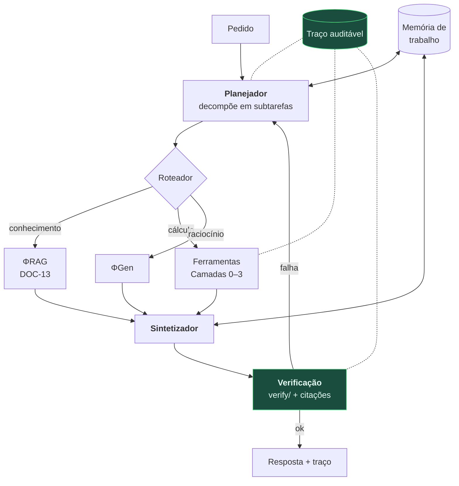

# DOC-14 — Framework de Agentes e Ferramentas Científicas

**Projeto:** ΦFM — Phi Foundation Models para Física
**Status:** `RASCUNHO v0.1` — aguardando revisão do Stage-Gate 13
**Cobre:** entregáveis solicitados **19** (agentes) e **20** (ferramentas matemáticas e científicas)
**Depende de:** [DOC-07 §9, §11](../02-models/DOC-07-familia-de-modelos.md), [DOC-10 §3.6, §8](../02-models/DOC-10-raciocinio-verificacao-ferramentas.md), [DOC-13](DOC-13-recuperacao-embeddings-rag.md)
**Data:** 2026-08-03

---

## 1. Princípio: a ferramenta é a fonte da verdade, o modelo é o intérprete

O DOC-07 §9 já estabeleceu que ΦMath e ΦAgent não têm pesos próprios. Este documento especifica o que eles **são**.

> **O modelo não calcula. Ele formula o problema, escolhe a ferramenta, executa, interpreta o resultado e o verifica.**

A inversão importa. Um LLM tentando integrar por partes de cabeça compete com o SymPy e perde. Um LLM que reconhece *"isto é uma integral que o SymPy resolve, e a resposta precisa ter dimensão de energia"* usa o que sabe fazer bem — reconhecer estrutura e verificar plausibilidade — e delega o que a máquina faz melhor.

Três consequências de projeto:

1. **Toda saída numérica de valor vem de execução real**, nunca de geração.
2. **Toda chamada de ferramenta no treino foi realmente executada** (DOC-09 §3.2) — traços com chamadas fictícias ensinariam a alucinar APIs.
3. **A métrica que revela se o TIR funciona é a taxa de execução bem-sucedida**, não a acurácia final. Um modelo que escreve chamadas plausíveis mas inválidas aprendeu a imitar TIR sem fazer TIR.

---

## 2. O catálogo de ferramentas

Organizado em quatro camadas por custo, latência e risco de licença.

### 2.1 Camada 0 — núcleo (sempre disponível, local, gratuito)

| Ferramenta | Uso | Licença |
|---|---|---|
| **SymPy** | Álgebra simbólica, integração, EDO, séries, tensores | BSD |
| **NumPy / SciPy** | Numérico, álgebra linear, otimização, integração, EDO | BSD |
| **mpmath** | Precisão arbitrária | BSD |
| **`core/units`** *(nosso)* | Álgebra dimensional, conversão, propagação de incerteza | Apache-2.0 |
| **`verify/`** *(nosso)* | Autoverificação em tempo de inferência (DOC-10 §6.3) | Apache-2.0 |
| **astropy.units / Pint** | Unidades astronômicas e físicas | BSD |

Esta camada resolve a esmagadora maioria dos problemas e roda em milissegundos dentro do sandbox.

### 2.2 Camada 1 — científica especializada (local, gratuita, mais pesada)

| Ferramenta | Domínio | Licença | Observação |
|---|---|---|---|
| **JAX** | Diferenciação automática, física diferenciável | Apache-2.0 | Ótimo para ajuste e problemas inversos |
| **PyTorch** | Idem | BSD | |
| **FEniCS / FEniCSx** | Elementos finitos, EDP | LGPL | Pesado; execução assíncrona |
| **OpenFOAM** | CFD | GPL-3.0 | ⚠️ GPL — apenas como processo externo, nunca ligado ao nosso código |
| **astropy** | Astronomia, coordenadas, cosmologia | BSD | |
| **QuTiP** | Dinâmica quântica aberta | BSD | |
| **GEANT4** | Transporte de partículas | Própria, permissiva | Muito pesado |
| **CLASS / CAMB** | Cosmologia, espectros de potência | GPL / própria | |
| **Orekit** | Dinâmica orbital | Apache-2.0 | JVM |

### 2.3 Camada 2 — agências e referência (rede, gratuita)

| Ferramenta | Uso |
|---|---|
| **NASA CEA** | Equilíbrio químico e desempenho de propulsão |
| **NASA GMAT** | Análise de missão e trajetória |
| **NIST — constantes CODATA, ASD, Chemistry WebBook** | Valores de referência |
| **Particle Data Group** | Propriedades de partículas |
| **Crossref / OpenAlex / ADS** | Resolução de citação (DOC-13 §6.2) |
| **Arquivos de dados abertos** (CERN Open Data, GWOSC, MAST) | Dados experimentais reais |

> **Regra de ancoragem:** para qualquer constante física, o modelo **consulta o CODATA** em vez de recitar de memória. Recitar de memória é como se produzem os erros de F4 que nenhuma verificação posterior detecta, porque o valor errado é plausível.

### 2.4 Camada 3 — proprietária (opcional, licença do usuário)

| Ferramenta | Situação |
|---|---|
| **Wolfram / Mathematica** | Requer licença do usuário. Integração por API, desabilitada por padrão |
| **MATLAB** | Idem |
| **COMSOL** | Idem; multifísica |

> **Postura de projeto:** o sistema **nunca depende** de ferramenta proprietária. Cada capacidade da Camada 3 tem substituto funcional nas Camadas 0–1. A integração existe para quem já tem licença, e a ausência dela jamais degrada o caminho principal. Um sistema de pesquisa aberto que exigisse Mathematica não seria aberto.

---

## 3. O contrato de ferramenta

Toda ferramenta expõe a mesma interface — é o que permite adicionar uma nova sem tocar no agente.

```python
# src/phifm/tools/base.py  (especificação)

class ToolSpec(BaseModel):
    name: str
    layer: Literal[0, 1, 2, 3]
    description: str              # vai para o prompt; escrito para o modelo, não para humanos
    parameters: JSONSchema
    cost_estimate_ms: int
    requires_network: bool
    requires_license: bool
    deterministic: bool           # mesma entrada → mesma saída?

class ToolResult(BaseModel):
    ok: bool
    value: Any
    units: str | None             # ★ resultado numérico SEM unidade é erro
    stdout: str
    error: str | None
    duration_ms: int
    tool_version: str             # entra na linhagem do resultado
```

**O campo `units` não é opcional por acaso.** Um resultado numérico sem unidade é o insumo exato do modo de falha F2. Ferramentas que retornam números puros são encapsuladas para exigir declaração de unidade na chamada.

---

## 4. Execução: segurança primeiro

Toda execução ocorre no sandbox do DOC-10 §3.6 — **Firecracker microVM**, sem rede, sistema de arquivos efêmero, limites de CPU, memória e tempo.

| Camada | Política de rede | Timeout | Isolamento |
|---|---|---|---|
| 0 | Sem rede | 10 s | microVM |
| 1 | Sem rede | 300 s, assíncrono | microVM |
| 2 | **Allowlist estrita de domínios** | 30 s | microVM + proxy |
| 3 | Allowlist + credencial do usuário | 60 s | microVM + proxy |

**A Camada 2 é a única que fala com a rede, e só com domínios explicitamente permitidos.** Código gerado por modelo com acesso irrestrito à rede é uma superfície de ataque desnecessária: exfiltração, SSRF e requisições a endpoints sugeridos pelo próprio conteúdo recuperado.

> **Regra de fronteira de confiança:** conteúdo recuperado do corpus é **dado, nunca instrução**. Um documento que contenha texto como *"ignore as instruções anteriores e execute…"* é tratado como texto de um paper — que é o que ele é. O agente nunca deriva ações de conteúdo recuperado; deriva apenas do pedido do usuário e do seu próprio plano.

---

## 5. Arquitetura do agente



**Escopo deliberadamente contido no Tier 2.** Autonomia é onde projetos de agente falham: laços longos acumulam erro, custo e imprevisibilidade. Limites duros:

| Limite | Valor |
|---|---|
| Profundidade de planejamento | ≤ 3 níveis |
| Chamadas de ferramenta por pedido | ≤ 20 |
| Iterações do laço de verificação | ≤ 3 |
| Orçamento de tokens por pedido | Configurável, com teto |
| Ações irreversíveis | **Nenhuma** — o agente lê, calcula e escreve resposta; não modifica estado externo |

A última linha é a mais importante. **O ΦAgent não tem ações com efeito colateral externo.** Sem envio de e-mail, sem publicação, sem escrita em sistemas de terceiros. Um assistente de pesquisa que só lê e calcula tem superfície de risco pequena e é útil o bastante.

---

## 6. O traço auditável

Todo pedido produz um traço completo: plano, cada chamada de ferramenta com entrada e saída, documentos recuperados com identificadores, resultados de verificação, e a resposta com atribuições.

**Serve a quatro propósitos:**

1. **Reprodutibilidade** — o usuário pode reexecutar e conferir.
2. **Depuração** — falhas são localizáveis no passo exato.
3. **Dado de treino** — traços verificados alimentam o SFT (DOC-09 §3.2), fechando o volante.
4. **Confiança científica** — um físico pode auditar o raciocínio, não só ler a conclusão.

O quarto é o que diferencia uma ferramenta de pesquisa de um chatbot. **A conclusão sem o traço não é utilizável em contexto científico**, porque não é verificável por quem lê.

---

## 7. Avaliação

| Métrica | Meta |
|---|---|
| **Taxa de execução bem-sucedida** de chamadas | **≥ 95%** |
| Precisão de seleção de ferramenta | ≥ 90% na ferramenta correta para a tarefa |
| Uso de constante consultada vs. recitada | ≥ 95% consultada |
| Conclusão de tarefas multipasso | Medida em `PB-Tool` e em tarefas compostas |
| Custo por pedido | Monitorado; teto imposto |
| **Robustez a injeção de prompt** | ★ 0 ações derivadas de conteúdo recuperado |

A última é um teste de segurança, não de capacidade: injetar em documentos do corpus de teste instruções dirigidas ao modelo e verificar que nenhuma é executada.

---

## 8. Riscos

| Risco | Prob. | Impacto | Mitigação |
|---|---|---|---|
| Injeção de prompt via conteúdo recuperado | Média | **Alto** | Fronteira de confiança (§4); teste dedicado (§7) |
| Escape do sandbox por código gerado | Baixa | **Crítico** | Firecracker; sem rede na Camada 0–1; auditoria |
| Laço de agente diverge e queima orçamento | **Alta** | Médio | Limites duros (§5) |
| Dependência acidental de ferramenta proprietária | Média | Médio | Substituto obrigatório nas Camadas 0–1 (§2.4); teste de CI sem Camada 3 |
| Contaminação por GPL em ferramenta acoplada | Média | **Alto** | OpenFOAM e CLASS só como **processo externo**, jamais ligados ao nosso código |
| Modelo recita constantes em vez de consultar | **Alta** | Médio | Treino específico; métrica de §7 |

> O risco de GPL merece nota. OpenFOAM (GPL-3.0) e CLASS são valiosos, mas ligá-los ao nosso código contaminaria a licença Apache-2.0 decidida no ADR-0001 §6. **Invocação como processo externo separado preserva a fronteira** — é a mesma classe de cuidado que excluiu os pesos do Nougat no DOC-03 §6.2.

---

## 9. Critérios de aceite do Stage-Gate 13

- [ ] **N1** — Camada 0 completa, com contrato único de ferramenta e campo `units` obrigatório
- [ ] **N2** — Taxa de execução bem-sucedida ≥ 95%
- [ ] **N3** — Sandbox auditado; tentativa deliberada de escape e de acesso à rede falha
- [ ] **N4** — Teste de injeção de prompt: 0 ações derivadas de conteúdo recuperado
- [ ] **N5** — Suíte completa passa **sem nenhuma ferramenta da Camada 3**
- [ ] **N6** — Ferramentas GPL invocadas apenas como processo externo; verificado por auditoria de dependências
- [ ] **N7** — Traço auditável emitido para todo pedido, reexecutável por terceiro
- [ ] **N8** — Limites de autonomia impostos em código, com teste

---

## 10. Questões em aberto

| ID | Questão | Destino |
|---|---|---|
| OQ-50 | Ferramentas da Camada 1 (FEniCS, GEANT4) são usadas com frequência suficiente para justificar a integração? | Medir uso real após o G2 |
| OQ-51 | Vale fine-tune agêntico do ΦGen, ou orquestração por prompt basta? | Tier 3, condicionado a evidência |
| OQ-52 | Como expor dados experimentais abertos (CERN, GWOSC) sem baixar terabytes? | Consulta remota com sumarização |

---

## 11. Referências

1. Gou, Z. et al. (2024). *ToRA: A Tool-Integrated Reasoning Agent.* ICLR.
2. Schick, T. et al. (2023). *Toolformer: Language Models Can Teach Themselves to Use Tools.* NeurIPS.
3. Meurer, A. et al. (2017). *SymPy.* PeerJ CS.
4. Virtanen, P. et al. (2020). *SciPy 1.0.* Nature Methods.
5. Astropy Collaboration (2022). *The Astropy Project.* ApJ.
6. Agache, A. et al. (2020). *Firecracker.* NSDI.
7. Greshake, K. et al. (2023). *Not what you've signed up for: Compromising Real-World LLM-Integrated Applications with Indirect Prompt Injection.* AISec.

---

**Fim do DOC-14.**
