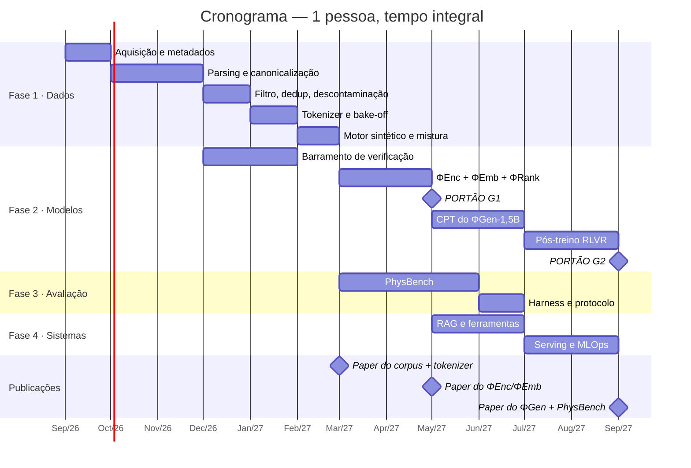

# DOC-17 — Orçamento Consolidado, Modelo de Custos e Cronograma Mestre

**Projeto:** ΦFM — Phi Foundation Models para Física
**Status:** `RASCUNHO v0.1` — aguardando revisão do Stage-Gate 16
**Cobre:** consolidação financeira e de prazos de todo o programa; abre a **Fase 5**
**Depende de:** todos os documentos anteriores; **estende** [DOC-17A](DOC-17A-orcamento-gpu-runpod.md)
**Data:** 2026-08-03

---

## 1. A tese: dinheiro não é a restrição — tempo de engenharia é

O DOC-17A mostrou que computação é barata neste programa. Consolidando os dezesseis documentos, a conclusão fica nítida e é preciso dizê-la sem rodeios:

> **O programa inteiro até o Portão G2 custa cerca de US$ 800–1.000 em computação e ~US$ 840/ano em armazenamento e operação. Mas exige 15–21 pessoa-meses de engenharia qualificada.**
>
> A US$ 1.000, o custo de computação é irrelevante para quase qualquer pesquisador. A 15–21 pessoa-meses, **o cronograma é o problema inteiro.**

Todo documento anterior otimizou custo em dólares. Este mostra que a otimização certa dali em diante é **de esforço humano** — e é por isso que o corte de escopo do DOC-07 §1 (quatro troncos treinados em vez de dez modelos) foi a decisão de maior valor financeiro do programa: não por economizar US$ 2.500 de GPU, mas por economizar **6–9 pessoa-meses**.

---

## 2. Orçamento consolidado — computação

Custos extraídos documento a documento, sem arredondar para baixo.

### 2.1 Fase 1 — Dados

| Item | Documento | Custo |
|---|---|---|
| Aquisição de corpus | DOC-02 | **US$ 0** |
| Parsing, LaTeXML, normalização | DOC-03 | **US$ 0** (local) |
| Anotação de valor pedagógico por LLM | DOC-04 §4.2 | US$ 5–50 |
| Classificador de qualidade (inferência) | DOC-04 §8 | ~US$ 4 |
| Deduplicação semântica | DOC-04 §5.4 | ~US$ 6 |
| Bake-off de tokenizer (6 variantes) | DOC-05 §11 | ~US$ 15 |
| Geração sintética G6 | DOC-06 §7 | ~US$ 16 |
| DoReMi — otimização de mistura | DOC-06 §7 | ~US$ 5 |
| Ablações de currículo | DOC-06 §7 | ~US$ 10 |
| **Subtotal Fase 1** | | **US$ 61–106** |

### 2.2 Fase 2 — Modelos (rota 1,5B)

| Item | Documento | Custo |
|---|---|---|
| ΦEnc-150M | DOC-08 §10 | US$ 25–90 |
| Ablação de mascaramento por equação | DOC-08 §10 | ~US$ 5 |
| ΦEmb (contrastivo) | DOC-07 §15 | US$ 10–20 |
| ΦRank (cross-encoder) | DOC-07 §15 | US$ 5–10 |
| Micro-benchmarks de MFU | DOC-08 §10 | ~US$ 30 |
| **Varredura de LR do CPT** | DOC-08 §5.3 | **~US$ 63** |
| Validação de transferência de escala | DOC-08 §10 | ~US$ 30 |
| ΦGen-1,5B — CPT | DOC-08 §10 | US$ 120–240 |
| Extensão de contexto | DOC-08 §10 | ~US$ 15 |
| Pós-treino do 1,5B (SFT + KL + GRPO + DPO) | DOC-09 §8 | ~US$ 235 |
| Treino do PRM + ablação | DOC-10 §11 | ~US$ 50 |
| **Subtotal Fase 2** | | **US$ 588–788** |

### 2.3 Fase 3 — Avaliação

| Item | Documento | Custo |
|---|---|---|
| Construção do PhysBench (juízes, harness) | DOC-11 §9 | ~US$ 50 |
| Execução da suíte + baselines + juízes | DOC-12 §10 | ~US$ 100 |
| **Subtotal Fase 3** | | **~US$ 150** |

### 2.4 Total por marco

| Marco | Computação acumulada |
|---|---|
| **T0 — corpus + tokenizer** *(publicável)* | **US$ 61–106** |
| **G1 — ΦEnc + ΦEmb + ΦRank** *(bate PhysBERT)* | **US$ 206–331** |
| **G2 — ΦGen-1,5B completo** | **US$ 800–1.045** |
| G2 + ΦGen-8B *(opcional, T2c)* | US$ 2.550–4.945 |
| + ΦOCR + ΦVis | + US$ 130–350 |

> **Correção ao DOC-17A §8.2.** Aquele documento reportou "US$ 300–600 até um modelo generativo funcional", contabilizando **apenas as horas de GPU dos treinos**. Somando processamento de dados, construção do verificador, avaliação e baselines, o número honesto é **US$ 800–1.045**. O DOC-17A é um extrato antecipado e parcial; **este documento é a referência financeira vigente.**

---

## 3. Custos recorrentes e não recorrentes

| Item | Tipo | Custo |
|---|---|---|
| HD externo 8–16 TB | Único | US$ 150–250 |
| Armazenamento frio (B2/R2) | Mensal | US$ 60–300 |
| Bucket de checkpoints | Mensal | US$ 1–3 |
| Serving serverless | Mensal | US$ 5–40 |
| Índices de recuperação | Mensal | US$ 0–80 |
| Rastreio, CI, monitoramento | Mensal | US$ 0–30 |
| **Recorrente mínimo (Tier 1)** | | **~US$ 70/mês** |
| **Recorrente com serving ativo** | | **~US$ 200–450/mês** |

### Custo total do ano 1, perfil mínimo realista

| | |
|---|---|
| Computação até G2 | US$ 800–1.045 |
| Recorrente (12 × US$ 70) | US$ 840 |
| Não recorrente (disco) | US$ 200 |
| **Total ano 1** | **US$ 1.840–2.085** |

**Menos de dois mil dólares para um foundation model de Física completo, com corpus, tokenizer, benchmark e infraestrutura de verificação.** É o resultado da soma de todas as decisões de escopo dos dezesseis documentos anteriores.

---

## 4. O orçamento que realmente importa: esforço de engenharia

Estimativa em pessoa-meses, para engenheiro sênior com fluência em ML e Física.

| Fase | Trabalho | Pessoa-meses |
|---|---|---|
| **1 — Dados** | Coletores, LaTeXML, canonicalizador, filtros, dedup, tokenizer, motor sintético | **4–6** |
| **2 — Modelos** | Treino, paralelismo, tolerância a falhas, RLVR, **barramento de verificação** | **5–7** |
| **3 — Avaliação** | PhysBench (16 tarefas), harness, protocolo estatístico, coordenação humana | **3–4** |
| **4 — Sistemas** | RAG, ferramentas, agente, serving, MLOps | **3–4** |
| **Total** | | **15–21** |

### O que isso significa em calendário

| Configuração | Prazo até G2 |
|---|---|
| **1 pessoa, tempo integral** | **15–21 meses** |
| **1 pessoa, meio período (20 h/semana)** | **30–42 meses** |
| 2 pessoas, tempo integral | 9–13 meses |
| 3 pessoas, tempo integral | 6–9 meses |

> **Esta é a informação mais importante do documento, e ela precisa ser confrontada em vez de contornada.** Um programa desta ambição, conduzido por uma pessoa em meio período, leva **três anos**. Isso não o invalida — mas invalida qualquer plano que assuma doze meses.

**Três respostas legítimas, e a escolha é do sponsor:**

| Resposta | Consequência |
|---|---|
| **A. Reduzir escopo a T0 + G1** | 7–10 pessoa-meses. Entrega corpus, tokenizer e encoders — **publicável e completo em si**. É o caminho recomendado para uma pessoa |
| **B. Buscar colaboradores** | Um projeto com dezessete documentos de projeto públicos é atrativo. As Fases 3 e 4 são as mais paralelizáveis |
| **C. Aceitar o prazo longo** | Viável, se a motivação for de longo prazo. O desenho em degraus independentes existe para isso |

O programa foi desenhado desde o DOC-00 §5 como uma escada de degraus independentes precisamente para tornar a resposta A viável sem desperdício.

---

## 5. Cronograma mestre

Assumindo **uma pessoa em tempo integral**. Multiplicar por 2 para meio período.

### Marcos e o que cada um entrega

| Marco | Mês (integral) | Entrega | Publicável? |
|---|---|---|---|
| **T0** | 6 | `PhysCorpus-Open`, tokenizer de Física, bake-off de tokenização | ✅ **Sim** — dois papers possíveis |
| **G1** | 8 | ΦEnc, ΦEmb, ΦRank; supera PhysBERT | ✅ **Sim** |
| **G2** | 12 | ΦGen-1,5B com RLVR; PhysBench completo | ✅ **Sim** — a contribuição principal |
| T2c | 15 | ΦGen-8B | Extensão |

> **Três oportunidades de publicação antes de existir um modelo generativo.** O corpus aberto, o estudo de tokenização e os encoders são contribuições independentes. Isso importa não por vaidade acadêmica, mas porque **um programa longo precisa de resultados intermediários** — para sustentar motivação, atrair colaboradores e justificar financiamento.

---

## 6. Caminho crítico e o que pode ser paralelizado

**Caminho crítico até G1:** `aquisição → parsing → filtro → tokenizer → ΦEnc → ΦEmb`. Seis etapas sequenciais, ~8 meses. Nada as encurta exceto mais pessoas nas etapas iniciais.

**Fora do caminho crítico, paralelizável:**

| Trabalho | Pode começar em |
|---|---|
| Barramento de verificação | Assim que houver equações parseadas — **e deve começar cedo**, porque tudo depende dele |
| PhysBench | Assim que o motor sintético existir |
| RAG e serving | Depois do G1 |
| ΦOCR | Depois do G1 (adiado por decisão, DOC-03 §1) |

> **O barramento de verificação é a peça que mais compensa antecipar.** Ele é insumo do filtro de dados, do motor sintético, do RLVR, do benchmark e do serving. Atrasá-lo bloqueia cinco frentes; antecipá-lo desbloqueia todas.

---

## 7. Gatilhos de decisão financeira

| Gatilho | Ação |
|---|---|
| Portão G1 reprovado | **Parar.** Diagnosticar antes de gastar no Tier 2. O custo afundado é ~US$ 330 — deliberadamente pequeno |
| Auditoria S3b reprova o RedPajama (DOC-02 §9) | Liberar US$ 100–180 para o bulk do arXiv |
| Spike da MI300X positivo (DOC-17A §5) | Redirecionar o CPT do 8B; economiza ~15% e elimina FSDP |
| Portão G2 aprovado | Avaliar buscar financiamento para o T2c e o Tier 3 |
| Colaborador se junta | Repriorizar para paralelizar Fases 3 e 4 |
| Custo recorrente > US$ 300/mês sem uso | Auditar armazenamento; mover para camada fria |

---

## 8. Comparação com o custo de referência da área

| Programa | Custo estimado de computação |
|---|---|
| **ΦFM até G2** | **~US$ 1.000** |
| Llemma-7B (CPT, 200B tokens) | ~US$ 100–200 mil |
| DeepSeekMath-7B | ~US$ 300 mil–1 M |
| Minerva-540B | Dezenas de milhões |
| **ΦFM até T2c (8B)** | **~US$ 5.000** |

A diferença não é mágica: é **escopo**. Não treinamos do zero (D-01), não treinamos MoE (OQ-1), não construímos dez modelos (DOC-07 §1), e usamos um corpus de 15–30 B em vez de centenas de bilhões.

**O que não abrimos mão:** rigor de proveniência, verificação mecânica, protocolo estatístico e descontaminação. **Esses custam tempo, não dinheiro** — e são exatamente o que separa um resultado publicável de uma demonstração.

---

## 9. Riscos financeiros

| Risco | Prob. | Impacto | Mitigação |
|---|---|---|---|
| **Cronograma de 15–21 pessoa-meses não é sustentado** | **Alta** | **Alto** | Degraus independentes; resposta A do §4 |
| Preços de GPU sobem | Média | Baixo | Base de custo pequena; múltiplos provedores |
| Armazenamento cresce além do previsto | Média | Médio | Processamento em fluxo (DOC-03 §8); camada fria |
| Execução longa perdida por falha | Média | Médio | Rollback automático (DOC-08 §6.1); custo máximo de uma execução ~US$ 240 no 1,5B |
| Escopo cresce por adicionar modelos | **Alta** | **Alto** | DOC-07 §1 é vinculante; ΦMath/ΦCode/ΦAgent não recebem pesos |

---

## 10. Critérios de aceite do Stage-Gate 16

- [ ] **Q1** — Custo real acompanhado contra este orçamento; desvios > 30% investigados
- [ ] **Q2** — Esforço real registrado em pessoa-horas por fase, para calibrar as estimativas
- [ ] **Q3** — Escolha do sponsor entre as respostas A, B e C do §4, registrada
- [ ] **Q4** — Gatilhos financeiros do §7 monitorados
- [ ] **Q5** — DOC-17A marcado como extrato parcial, com este documento como referência

---

**Fim do DOC-17.**
